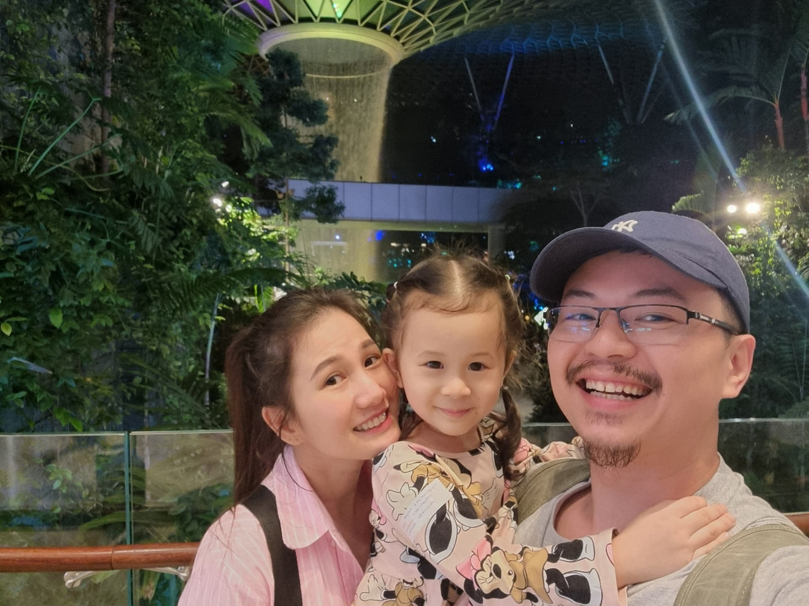

+++
title = "About Me"
author = ["Chop Tr (chop.dev)"]
summary = "Short introduction"
tags = ["about me"]
draft = false
cover = "img/choptr-avatar.jpg"
images = ["img/choptr-avatar.jpg"]
layout = "simple"
+++

Hi, Nice to meet you.

My name is Quang Tran `aka Chop Tr`.

I am a full-stack software engineer based in Ho Chi Minh City, Vietnam.

-   I design and code simple things and I really enjoy what I do

-   I love to learn new things and try out new knowledge

-   I'm a minimalist

## Skills {#skills}

-   Typescript/Javascript and Front-end Frameworks master (Vue, React, Angular)

-   Functional Programing and Domain-Driven Design practitioner

-   Cardano Stakepool operator

-   Firebase and Google Cloud customer

-   Haskell / Rust learner

-   Python scriptor

-   Hugo site user

-   Emacs / Vim hacker

## Personal life {#personal-life}

This year, 2024, I am 35 years old. I have a beautiful wife and a lovely daughter.

<figure class="max-w-5xl">
    
</figure>

I love to travel with my wife and my daughter. We had a great time in Singapore recently.

I love watching movies and contemplate the philosophy aspect of the art.

I have a Raspberry Pi and use Jellyfin as media server.

I run a Cardano relay on AWS.

I play Chess at 900 rating.

I play Starcraft 2 at Gold league.

