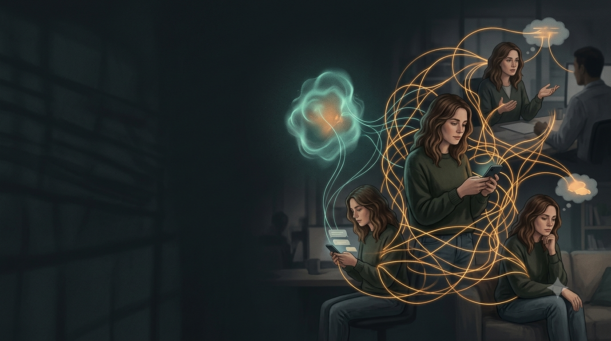

+++
title = "AI: Bạn không còn suy nghĩ một mình nữa"
author = ["Chop Tr (chop.dev)"]
summary = "AI is becoming a companion in how we work, think, communicate, and make decisions."
tags = ["ai", "productivity", "workflow", "thinking"]
date = 2026-07-10T00:00:00+07:00
draft = false
cover = "cover.png"
+++

## 1/

OK style của mình thì nhanh gọn, đi thẳng vấn đề. Nên mình sẽ trình bày trực tiếp nhất nội dung mà mình muốn truyền đạt trong buổi hôm nay.

Đó là tầm nhìn của mình về việc sử dụng AI sắp tới, trong công việc và cả cuộc sống:

"AI sẽ là companion - bạn đồng hành - của chúng ta trong mọi thứ."

Vâng, đơn giản vậy thôi.

Đồng hành trong công việc, trong cuộc sống, trong giao tiếp, bàn luận, giải quyết vấn đề, và trong cả cách chúng ta suy nghĩ.

Trong team mình thì mình vẫn hay đùa: "Anh em chờ đi, tương lai tụi mình sẽ đem AI ra chơi như đấu Pokemon vậy."

OK. Có ai hình dung được không?

(dừng 3s để kích thích suy nghĩ)

Chúng ta sẽ dùng AI để "đấu" với nhau. Đấu trong ngoặc kép nhe.

Từ đầu nguồn thì đấu xem đứa nào có model ngon nhất: OpenAI, Anthropic hay Google.

Level công ty thì đấu xem team nào xài AI hiệu quả nhất.

Level đồng nghiệp thì đem AI ra cãi xem tao code `for loop` performance vẫn ngon như mày code iterator, v.v.

Chưa hết nhé. Về nhà thì đem AI ra đấu với mấy đứa bạn, từ chuyện ông Mỹ, ông Iran ngứa gì mà đánh quài, tới chuyện sao mày mua xe điện chi vậy, xài xe xăng là yên tâm, blabla.

Trong tất cả những cuộc giao tiếp này, AI đang creep vào từ từ. Có thể chúng ta chưa để ý, nhưng nó đã bắt đầu rồi.

## 2/

Vậy thì tại sao AI lại có thể chen vào nhiều thứ như vậy?

Vì mình vẫn đang nhìn nó như một cái tool.

Trước giờ tool là gì? Là thứ mình lấy ra dùng khi cần. Cần tìm thông tin thì mở Google. Cần lưu code thì mở Git. Cần hỏi một câu gì đó thì vào Stack Overflow. Dùng xong thì đóng lại, rất rõ ràng.

Nhưng AI không giống vậy.

AI không chỉ đưa cho mình một kết quả. Nó có thể hỏi ngược lại, phản biện lại, đưa ra một hướng khác, thậm chí làm mình nghi ngờ cách mình đang suy nghĩ.

Ủa, vậy thì nó đâu còn là cái búa để mình cầm lên rồi đập nữa.

Nó giống như một người đứng kế bên và hỏi: "Ủa, sao mày làm vậy?"

Đương nhiên, người đứng kế bên này đôi lúc cũng nói bậy. AI có thể trả lời rất tự tin nhưng hoàn toàn sai. Cho nên companion không có nghĩa là giao hết quyền quyết định cho nó.

Companion có nghĩa là từ nay mình không còn suy nghĩ, làm việc và ra quyết định một mình nữa. Mình có thêm một đối tượng để đối thoại.

Và đây mới là thay đổi lớn nhất: AI không còn chỉ là thứ mình dùng. Nó bắt đầu trở thành thứ mình nói chuyện cùng.

## 3/

Nhưng nói AI là companion nghe hơi abstract đúng không?

Vậy thì mình thử nhìn xem nó đang đồng hành với mình ở những đâu.

Đầu tiên là trong công việc.

Chắc nhiều bạn ở đây đã dùng AI để viết code, review code, debug hoặc brainstorm rồi. Nhưng điểm quan trọng không chỉ là nó làm nhanh hơn một vài task. Điểm quan trọng là cách mình làm việc đã thay đổi.

Ngày xưa, khi stuck trong code, mình thường mở Google, mở mười cái tab, đọc vài bài Stack Overflow, rồi cố đoán xem solution nào hợp với case của mình. Có khi mất ba mươi phút chỉ để tìm đúng từ khóa.

Bây giờ mình có thể nói với AI:

"Đây là context của tao. Đây là những gì tao đã thử. Đừng viết code ngay. Hãy chỉ ra cho tao ba khả năng có thể đang sai."

Và nó trở thành một teammate để mình cùng debug, chứ không chỉ là một cái máy nhả code.

Tất nhiên teammate này không phải lúc nào cũng giỏi. Có lúc nó viết một đoạn code nhìn rất chuyên nghiệp, chạy rất tự tin, và sai từ dòng đầu tiên. Nhưng ít nhất mình có một đứa để cùng bắt đầu suy nghĩ.

Layer thứ hai là trong chính cách mình suy nghĩ.

Trước đây mình thường nghĩ một mình. Có một ý tưởng, mình tự phát triển nó trong đầu, tự tìm lý do để bảo vệ nó. Đến khi đem ra nói với người khác thì có khi đã đi quá xa rồi.

Bây giờ mình có thể đưa ý tưởng đó cho AI và hỏi:

"Hãy phản biện tao như một người không đồng ý với quan điểm này. Assumption nào trong suy nghĩ này là nguy hiểm nhất?"

Nó giống như một second brain. Hoặc chính xác hơn, giống như một đứa bạn rất hay cãi nhưng lúc nào cũng online.

Layer thứ ba là trong giao tiếp.

Hai người đang tranh luận. Một người nói: "Tao thấy solution này tốt hơn."

Người kia nói: "Không, AI của tao phân tích là solution kia tốt hơn."

Vậy là cuộc tranh luận không còn chỉ có hai người nữa. Nó có thêm những AI đứng phía sau, mỗi đứa đại diện cho một cách nhìn, một bộ dữ liệu, và đôi khi là một sự tự tin rất lớn.

AI trở thành một kiểu trọng tài, một cố vấn, thậm chí là một đồng minh trong các cuộc nói chuyện hàng ngày.

Và layer cuối cùng là trong những quyết định cá nhân.

Mua xe gì, chọn công việc nào, viết email ra sao, trả lời tin nhắn thế nào. Những quyết định tưởng như rất riêng của mình cũng bắt đầu có AI tham gia.

Mình có thể hỏi nó:

"Nếu tao chọn công việc này thì ba năm nữa có thể gặp những rủi ro gì?"

"Viết lại tin nhắn này sao cho vừa thẳng thắn, vừa không làm người kia khó chịu."

Và đây là điều mình muốn nhấn mạnh: companion không có nghĩa là AI sống thay mình. Nó chỉ có nghĩa là trong gần như mọi việc, mình sẽ có thêm một đối tượng để hỏi, để cãi, để kiểm tra lại suy nghĩ của mình.

Khi AI đã bước vào từng cuộc trò chuyện như vậy, câu hỏi tiếp theo không còn là "AI có thay thế mình không?" nữa.

Câu hỏi thực tế hơn là: AI của mình sẽ đấu với AI của ai?

## 4/

Nghe giống Pokemon đúng không? Mỗi người có một con Pokemon riêng, train riêng, rồi đem ra đấu.

Nhưng nếu nhìn kỹ hơn thì cuộc đấu này có ít nhất ba level.

Level đầu tiên là model đấu với model.

GPT đấu với Claude, Claude đấu với Gemini. Đứa nào reasoning tốt hơn? Đứa nào code sạch hơn? Đứa nào hiểu context nhanh hơn? Đứa nào bớt tự tin khi nó đang nói bậy hơn?

Không có con nào mạnh nhất trong mọi trận đấu. Chỉ có con phù hợp hơn với một loại trận đấu cụ thể.

Level thứ hai là team đấu với team.

Hai team có thể có cùng số người, cùng seniority, cùng một khoảng thời gian để làm việc. Nhưng một team biết dùng AI như teammate sẽ vận hành rất khác một team chỉ thỉnh thoảng mở AI lên hỏi một câu.

Một team dùng AI để phân tích requirement trước khi code, review design, kiểm tra test case, tìm edge case và challenge những assumption mà cả team đã quen từ lâu.

Khi đó AI không chỉ giúp một người code nhanh hơn. Nó thay đổi tốc độ của cả team.

Tương lai không chỉ là developer giỏi đấu với developer dở, mà là developer biết leverage AI đấu với developer không biết leverage AI.

Level thứ ba là cá nhân đấu với cá nhân.

Mỗi người sẽ có một AI stack riêng. Một workflow riêng. Một bộ prompt, một cách kiểm tra output, một cách lưu context, và một cách biến những thứ đó thành kết quả.

Hai người có thể cùng biết dùng ChatGPT. Nhưng điều đó không có nghĩa là họ đang dùng cùng một công cụ.

Người thứ nhất hỏi AI: "Viết cho tôi một cái API."

Người thứ hai đưa vào context của cả hệ thống, nói rõ constraint, yêu cầu AI chỉ ra những assumption, đề xuất vài phương án, viết test trước, rồi tự review lại output.

Trên giấy, cả hai đều đang "dùng AI". Nhưng thực tế, họ đang chơi ở hai league khác nhau.

Lợi thế không nằm ở việc mình có access vào model nào, vì ngày càng nhiều người sẽ có access vào gần như tất cả các model tốt.

Lợi thế nằm ở việc mình biết giao việc gì cho AI, cung cấp context nào, hỏi tiếp câu gì, và quan trọng nhất: biết kiểm tra kết quả của nó.

Pokemon của mình không mạnh chỉ vì nó là Pokemon hiếm. Nó mạnh vì mình biết lúc nào nên dùng chiêu nào, biết điểm yếu của đối thủ, và biết khi nào không nên đánh.

Vậy câu hỏi không còn là: "Mình có nên dùng AI không?"

Câu hỏi là: "Mình muốn xây companion của mình như thế nào?"

Vì nếu AI sẽ đi cùng mình trong công việc, suy nghĩ và các quyết định, thì việc dùng nó một cách ngẫu hứng sẽ không đủ nữa. Mình cần một cách làm việc có chủ đích.

## 5/

Theo mình thì có ba việc.

Việc đầu tiên: hãy đối xử với AI như một teammate, chứ không phải một cái tool.

Nếu mình xem AI là tool, mình sẽ chỉ đưa cho nó những câu lệnh rất ngắn: "Viết cho tôi cái này", "Tóm tắt cái kia", "Sửa đoạn code này".

Rồi mình nhận kết quả, thấy không đúng thì kết luận là AI dở. Nhưng nếu mình xem nó là teammate, cách nói chuyện sẽ khác. Mình sẽ đưa context, nói rõ mục tiêu, những gì đã thử, constraint là gì, và yêu cầu nó hỏi lại nếu thông tin chưa đủ.

Giống như khi giao việc cho một người trong team vậy. Mình không thể nói: "Làm cái này đi" rồi kỳ vọng người đó tự đọc được toàn bộ suy nghĩ trong đầu mình.

AI cũng vậy. Output tệ nhiều khi không phải vì model không đủ thông minh, mà vì mình giao việc quá tệ.

Việc thứ hai: mỗi người phải xây workflow riêng.

Đừng đi tìm một prompt thần kỳ, hay một công cụ thần kỳ có thể giải quyết tất cả mọi thứ. Không có một cách dùng AI đúng cho tất cả mọi người.

Điều quan trọng là mình phải quan sát cách mình làm việc và tìm ra những chỗ AI thật sự tạo ra leverage.

Ví dụ, trước khi code, mình nhờ AI làm rõ requirement. Trong lúc code, nó challenge design. Sau khi code xong, nó tìm edge case và viết test.

Đó không còn là chuyện "thỉnh thoảng hỏi ChatGPT một câu". Đó là một workflow.

Việc thứ ba, và theo mình là quan trọng nhất: luôn giữ quyền quyết định.

AI có thể đưa ra năm phương án trong vài giây. Nó có thể phân tích nhanh hơn mình, viết một email nghe rất thuyết phục, hoặc một đoạn code trông rất chuyên nghiệp.

Nhưng nó không chịu trách nhiệm thay mình.

Nếu email đó làm mất một mối quan hệ, người chịu hậu quả là mình. Nếu quyết định công việc đó là sai, người phải sống với lựa chọn đó vẫn là mình.

Cho nên AI có thể là người đưa lời khuyên tốt nhất trong phòng. Nhưng nó không phải người có quyền bỏ phiếu cuối cùng.

Đó là ranh giới mình phải giữ: dùng AI để mở rộng khả năng suy nghĩ, chứ không dùng nó để từ bỏ việc suy nghĩ; dùng nó để có thêm góc nhìn, chứ không dùng nó để trốn khỏi trách nhiệm quyết định.

Làm được ba việc này, mình sẽ không chỉ có một công cụ AI để mở lên khi cần. Mình sẽ có một companion thật sự: cùng làm, cùng cãi, cùng kiểm tra, nhưng cuối cùng mình vẫn là người cầm lái.

## 6/

Vậy nên mình muốn quay lại với câu nói lúc đầu:

"AI sẽ là companion - bạn đồng hành - của chúng ta trong mọi thứ."

Không phải trong một tương lai rất xa. Nó đã bắt đầu rồi.

Nó đang ở trong code của mình, trong những cuộc tranh luận, trong những email mình gửi, và trong những quyết định mà trước đây mình nghĩ là hoàn toàn cá nhân.

Khi đã nhìn thấy rồi, chúng ta không phải sợ nó ngay lập tức. Cũng không cần tin nó tuyệt đối.

Chúng ta chỉ cần đặt nó vào đúng vị trí.

Cho nó đủ gần để challenge mình.

Cho nó đủ quyền để giúp mình làm tốt hơn.

Nhưng nhớ một điều: nó không bao giờ sống thay mình. Chính bản thân chúng ta vẫn phải trau dồi và phát triển.

AI bản chất không phải là phép cộng mà là phép nhân. Nếu bạn giỏi, nó sẽ giúp bạn đi xa hơn rất nhanh. Nếu bạn hời hợt hay suy nghĩ tiêu cực, nó cũng sẽ khuếch đại sự hời hợt và tiêu cực đó.

Vì câu hỏi không phải là: "AI có thay đổi cuộc sống của bạn không?"

Câu hỏi là: "Bạn sẽ để nó đồng hành với bạn như thế nào?"
