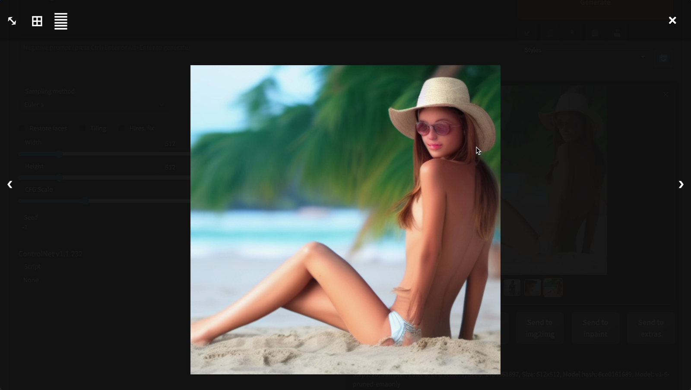

+++
title = "AI: Tạo influencer bằng AI được không?"
author = ["Chop Tr (chop.dev)"]
summary = "Generative AI hiện cũng đang phát triển khá mạnh về tạo hình ảnh. Tháng rồi mình có trải nghiệm thử việc dùng AI để làm 1 nhân vật. Thử đặt mục tiêu là làm influencer đồ. Video này mình chia sẻ trải nghiệm sử dụng AI để tạo hình ảnh và một hướng dẫn nhanh setup lên 1 cái Colab để sử dụng Stable Diffusion."
date = 2023-07-15T00:00:00+07:00
tags = ["ai", "openai", "chatgpt", "real world", "application", "marketing", "influencer", "setup", "colab", "stable diffusion", "generative ai", "beautiful girl"]
draft = false
+++

## Video



## Intro

Xin chào các bạn. Chop trở lại với một video mới. Video lần này là về AI.

Video lần này mình sẽ thử dùng AI để xử lý hình ảnh. Tạo nên một bạn influencer xem trải nghiệm như thế nào.

Từ Influencer mà mình đang dùng là chỉ mấy bạn nữ xinh xinh trên các trang social network như Facebook Instagram hay TikTok đồ.

OK frame lại expectation chút. Là mình là developer thôi nên đây là đang trình bày trên góc nhìn của một lập trình viên thôi ha.

Đương nhiên là mình hiểu influencer thì phía sau có 1 đội ngũ Content mạnh, Market team khủng đồ nữa. Chứ không đơn thuần là cọc cọc click click vài dòng code như mình.

Tiêu đề Clickbait vậy thôi chứ Video này mình sẽ demo việc sử dụng AI để tạo ra hình ảnh 1 cô gái ảo, không có thật ngoài đời. Nhưng mà xinh đẹp như một influencer mà các bạn hay thấy trên các trang mạng xã hội.

## Thử với Stable diffusion?

Ok thì công cụ AI mà mình sẽ sử dụng là Stable diffusion.

Thì stable diffusion là gì?

Nó chính là một thuật toán (cũng có áp dụng mô hình Transformer mà mình trình bày trong video trước). Nó có khả năng biến đổi các câu prompt thành hình ảnh.

Ví dụ, cho vài câu prompt để xem nó làm được hình gì ha:

"Cá heo bơi dưới biển" - "Dolphin in the ocean"


Ok nhìn cũng được ha. Ra được 4 hình cá heo. Hơi lạ mình prompt "in the ocean" dưới biển mà thành nhảy trên biển.

Ok thử lần nữa. "Chuột ăn gạo trong tô" - "Mouse eating rice in a bowl"


Hùm, cũng ra hình con chuột. Rồi tô cơm. Mà hơi xấu.

Ok. Giờ prompt một câu khó khó hơn chút ha.

"Kim tự tháp bên cạnh tháp Eiffel ở Pháp" - "Pyramid next to Eiffel tower in France"


OK cũng ra kim tự tháp. Mà kim tự tháp nhân sư. Kế bên cũng có tháp Eiffel.

Ùm ok cũng hay đó. Giờ thử vào mục tiêu chính.

Influencer thì phải là hình cô gái xinh xinh 1 chút để có nhiều người follow.

Mình thử với prompt: "Cô gái đẹp bên bãi biển" - "Beautiful girl at the beach"




Ui cha coi bộ không như mong đợi.

Sao mắt bị lệch. Còn cô này thì sao ốm nhom.

Ok rồi thì thực ra xài AI khó chứ hok dễ nha. Cái gì cũng phải học mới xài được. Lái xe cũng phải học rồi tập lái rồi thi bằng lái mà.

Anyway, lang mang một chút thôi. Chúng ta quay lại vấn đề chính. Thì thử sử dụng AI để gen hình một cô gái đẹp tới đây làm mình hơi thất vọng.

Nhưng mà sao trên mạng gen được hình đẹp vậy ta. Câu hỏi đó làm mình tiếp tục nghiên cứu thêm. Lần mò thêm vào vài forum và đọc vài cái tutorial nữa.

Gì chứ thông tin bây giờ đầy rẫy, các bạn có thể search Youtube là ra hết các tutorial hướng dẫn sử dụng Stable Diffusion.

OK thì sau khi research một hồi thì phát hiện ra là cái model Stable Diffusion v1.5 này mình đang sử dụng là một model phổ thông thôi.

Và sử dụng bộ dữ liệu General public nên hơi chung chung.

Có nghĩa là nó không được đào tạo cụ thể cho một tác vụ cụ thể nào đó. Nên kết quả sinh ra khó có thể đạt được chất lượng mong muốn như mục đích "beautiful girl on the beach" của mình.

## Community models

Bây giờ mình sẽ trình bày qua về Community models.

OK thì thuật toán Diffusion là một thuật toán được publish rộng rãi.

Stable Diffusion cũng là 1 dự án open source nên các model hiện nay được train rất nhiều dựa trên nó và được chia sẻ miễn phí.

Các bạn có thể thoải mái tải về từ các trang như Hugging Face, Civitai.

Mình sẽ sử dụng một model trên Civiai.com là Realistic Vision


Model này tại thời điểm mình làm video có 21k lượt like và 321k download. Khá nổi tiếng, luôn nằm trong top các model đang được chia sẻ.

Và cũng như ảnh minh hoạ. Hình gen ra rất giống với một hình thực tế chụp bằng máy camera.

OK Mình sẽ down về và thử gen ra một vài hình. Model này khoản 2GB.

Trong lúc download về thì mình có một cải tiến nhỏ nữa là prompt "beautiful girl on the beach" thì hơi bị chung chung.

Như các bạn cũng hình dung. Prompt chung chung thì kết quả cũng chung chung.

Video trước mình có trình bày về Prompt cho AI là gì và nhiệm vụ của Prompt Engineer là gì. Bạn nào muốn xem lại thì link ở description nha.

OK thì như trình bày ở video trước. Nhiệm vụ của Prompt engineer là phải hiểu model mình sử dụng tường tận và tạo ra các câu prompt nhằm khai thác tốt Model mà mình đang sử dụng.

Thì với các model được share thường có một vài hình ảnh sample. Trong này là 2 hình cô gái như các bạn thấy.

Chúng ta có thể mở hình ra thì góc phải bên dưới này có đoạn prompt mẫu.

Mình sẽ Copy đoạn prompt mẫu này để làm base và xây dựng câu prompt của mình theo nó.

Raw photo, a portrait photo of lalaa nè.

Thì mình sẽ modify lại theo như ý mình mong muốn thêm vào "beautiful girl on tropical beach thay cho nhân vật trong prompt mẫu.

```
RAW photo, a portrait photo of beautiful girl in bikini on tropical beach, natural skin, 8k uhd, high quality, film grain, Fujifilm XT3
[Negative]
(deformed iris, deformed pupils, semi-realistic, cgi, 3d, render, sketch, cartoon, drawing, anime, mutated hands and fingers:1.4), (deformed, distorted, disfigured:1.3), poorly drawn, bad anatomy, wrong anatomy, extra limb, missing limb, floating limbs, disconnected limbs, mutation, mutated, ugly, disgusting, amputation, UnrealisticDream, negative_hand-neg
```

OK thì đẻ hiểu toàn bộ câu Prompt này, tại sao lại có những từ trigger kia, sao có positive và negative prompts. Tìm hiểu về Sampling Methods, Sampling Steps đồ thì phải đào sâu nhiều kiến thức cho từng model.

Chắc không cover hết trong video này hết được. Mình phải quay lại việc tạo ra hình ảnh 1 influencer đẹp đẹp thôi :D

OK rồi bấm Generate thì kết quả như thế nào ha.


OK rồi thì hình gen ra có vẻ ổn hơn nhiều ha. Bắt đầu ra được một cô gái trên bãi biển.

Ai cha nhưng mà sao mặt bị biến dạng cong mắt cong mũi vầy.


Đúng là girl on a tropical beach nhưng mà mặt cô gái bị biến dạng mất tiêu.

OK thì nếu các bạn để ý ở đây là do Stable Diffusion đang sử lý trên 512 px thôi nên khi vùng genera ra khá nhỏ. Như trong tấm hình full body này thì gương mặt chỉ chiếm 1 phần khoản 5% tấm hình thôi.

Chúng ta có thể xử lý thêm 1 chút. Là upscale hình lên 1024 x 1024px thì Stable Diffusion sẽ có nhiều không gian hơn để xử lý khuôn mặt.

Giờ thì mình sẽ thử gen ra 2 hình mới.

OK khuôn mặt đã được xử lý ngon lành.


OK thử một hình nữa ha. Ui chà, cô này xinh hơn nhiều nè, da ngâm nâu, gương mặt thon hơn. Nhưng hình như da cô hơi không thực lắm. Da của cô hơi giống vẽ 3D.


Rồi thì mình bắt đầu tạo ra được hình các cô gái nhìn cũng OK rồi.

Nhưng mà có một vấn đề khác mà mình gặp phải là các khuôn mặt do mô hình tạo ra không được đồng nhất.

Cô thì nhìn có vẽ gốc âu, cô thì gốc trung đông hay châu á. Cô thì tóc vàng cô thì tóc đen. Mỗi một hình ra các gương mặt khác nhau.

Cũng dễ hiểu. Là do model được train trên nhiều mẫu khác nhau mà. Khi hình gen ra thì sẽ có khả năng ra nhiều hình ngẫu nhiên chứ không phải chung 1 người hay 1 nhân vật ha.

OK thì để cải thiện chúng ta có 2 giải pháp

Một là Better prompting, tinh chỉnh câu Prompt.

Hai là xài kỹ thuật LoRa, Low Rank Adaptation.

## Better prompting

Là tinh chỉnh đầu tiên. Vì như các bạn cũng hiểu prompt vào "Beautiful girl on the beach" thì model sẽ cho ra cô gái chung chung là đúng rồi.

Bây giờ thì mình sẽ mô tả nhân vật của mình kỹ hơn qua câu prompt:

"closeup shot, a portrait of Ashe, beautiful blue eyes, dark hair"

Ok thì câu prompt có một số keyword là một hình closeup shot là hình chụp gần.

Portrait là hình chụp chân dung, nhân vật có xu hướng nhìn vào camera.

Beautiful blue eyes: sẽ cho nhân vật mình có mắt màu xanh blue.

Dark hair cho tóc đen.

OK thì mô tả như vậy các bạn đã có thể thử hình dung ra nhân vật này trong đầu rồi. Chi tiết hơn cái câu "beautiful girl on the beach" nhiều.

## LoRa - Low-Rank Adaptation

OK nhưng mà chỉ với câu prompt không thôi thì cũng còn vô số thứ cần phải đồng bộ. Lông mày thì sao, khuôn mặt thì sao, mũi cao hay thon, tóc dày hay mỏng v.v

Vô vàng thứ kết hợp lên 1 nhân vật.

Và mình không thể nào sử dụng prompt để mô tả hết.

Thì để giải quyết vấn đề này thì mình phải tìm đến 1 giải pháp là LoRa.

Trích tài liệu được phát hành tháng 6 2021:

LoRA: Low-Rank Adaptation of Large Language Models

[https://arxiv.org/abs/2106.09685](https://arxiv.org/abs/2106.09685)

LoRa là viết tắt của "Low-Rank adaptation" hay "Low-Rank matrix approximation".

Thì ý tưởng của phương pháp này là train một model với các trọng số weight khác mà không đụng đến model gốc.

Trong lúc train chúng ta sẽ đóng băng các weight vector của model gốc sau đó mới train 1 tập các weight mới. Làm giảm công sức và chi phí train rất nhiều.

OK thì mình có thử nghiệm qua việc train Model gốc cũng dựa trên model Realistic Vision.

Mẫu thì mình sử dụng hình cắt của 1 loạt gương mặt của 1 model khác. Gương mặt này thì source mình lấy trên 1 model AI tên là Ashe.

OK thì có gương mặt mẫu, mình có thể train ra 1 LoRa đặt tên là Ashe ha.

Và dùng nó với câu prompt là nhét vào trong ngoặc nhọn như vầy thôi. <lora:Ashe2-8:0.9>

Ở đây 8 là epoch thứ 8 còn 0.9 là độ nặng của LoRa ha. Số này sẽ từ 0 đến 1. Càng gần 1 thì độ ảnh hưởng của LoRa với kết quả càng lớn.

OK thì giờ mình generate ra thử 1 loạt hình mới:


OK thì kết quả hình ảnh của mình train ra cô gái có các features như nhau và được tune thành 1 nhân vật như mục tiêu của mình.

Tóc đen, mắt xanh dương.

Thêm vào trong LoRa cho gương mặt và shape của lông mày nữa.

Nói sơ ngoài lề chút, thì cô này mình lấy ý tưởng từ tộc người Fremen trong tiểu thuyết Dune của Frank Herbert.

Sống trên sa mạc và do sử dụng chất Spice vũ trụ nhiều nên mắt màu xanh dương. Năm 2021 đạo diễn Denis Villeneuve đã chuyển thể thành 1 phim siêu hay, giành 6 Oscar.

Cuối năm nay sẽ ra phần 2 của phim.

Anyway, đi lang mang nữa rồi. Quay lại Stable Diffusion và LoRa thôi.

## Thì Stable Diffusion là gì?

Thì như nói ở trên, nó là một thuật toán có thể chuyển đổi văn bản thành hình ảnh được tạo ra.

Stable Diffusion không chỉ có khả năng tạo ra hình ảnh chi tiết dựa trên mô tả văn bản, mà còn có thể được áp dụng cho các nhiệm vụ khác như inpainting, out painting.

Stable Diffusion được phát triển bởi các nhà nghiên cứu từ Nhóm CompVis tại Đại học Ludwig Maximilian ở Munich và Runway.

Stable Diffusion là một mô hình phân kỳ ẩn, một loại Generative AI Neural Network.

Mã nguồn và trọng số mô hình của nó đã được công bố công khai, và nó có thể chạy trên các phần cứng phổ thông nên hiện đang được sử dụng khá nhiều để train các model cũng như tạo nên các hình ảnh bằng các máy tính có gắn GPU.

### Cách stable diffusion tạo ra hình ảnh?

Quá trình train bắt đầu bằng việc chọn một hình ảnh gốc, ví dụ như một con chó.

Thuật toán sau đó làm nhiễu ngẫu nhiên hình ảnh nhiều lần cho đến khi nó trở thành hình bị nhiễu hoàn toàn. Đây là giai đoạn "tiếp thị nhiễu" của quá trình.

Tiếp theo, AI được train để mà loại bỏ tất cả nhiễu này ra sao cho quay lại được hình ảnh gốc. Điều này được thực hiện thông qua một quá trình lặp đi lặp lại, trong đó AI dần dần "học" cách loại bỏ nhiễu từ hình ảnh.

Qua mỗi lần lặp, AI càng hiểu rõ hơn về cách hình ảnh gốc trông như thế nào và cách nó có thể được tái tạo từ dữ liệu nhiễu. Cuối cùng, AI có thể tạo ra một hình ảnh từ mô tả văn bản, ngay cả khi hình ảnh gốc đã bị nhiễu hoàn toàn.

Đây là một cơ chế tuyệt vời để huấn luyện AI, vì nó cho phép AI "học" từ dữ liệu đầu vào phức tạp và tạo ra dữ liệu đầu ra chất lượng cao.

Trước đó để xử lý hình ảnh thì thì thường sử dung GAN - Generative adversarial networks để xử lý.

GAN gặp nhiều vấn đề và khá là khó để train. Như bị mode collapse là tạo ra 1 gương mặt hoài, một kết quả hoài. Do bị rớt vô vùng cục bộ.

Kênh Computerphile có 1 video rất hay về Stable Diffusion.

[https://www.youtube.com/watch?v=1CIpzeNxIhU](https://www.youtube.com/watch?v=1CIpzeNxIhU)

Các bạn có thể xem qua trong link trong description ha.

## How to start?

OK bây giờ thì mình sẽ demo tutorial làm cách nào start up 1 cái workflow Stable Diffusion và LoRa ha.

Có nhiều cách để các bạn setup 1 workflow Stable Diffusion.

Có thể là Tự lắp máy để chạy. Mua máy tính về. Kiếm RAM và GPU khủng để có thể handle workload của Stable Diffusion.

Với setup này thì máy là của các bạn, vận hành thì chắc tốn tiền điện thôi. Các bạn có thể setup lên và chạy lúc nào cũng được.

Nhưng bị cái là phải biết phần cứng chút. Biết setup hệ điều hành, thường thì xài WIndows để có tích hợp tốt với GPU.

Ah lưu ý là giờ tương thích tốt thì nên xài GPU NVidia ha. Setup Stable Diffusion hiện đang kén GPU AMD.

OK, một setup nữa là các bạn có thể thuê máy trên Cloud. Hiện có các dịch vụ GPU cloud khá nhiều. Như Runpod.io hay Vast.ai

Các dịch vụ này thì thuê máy theo giờ, khoảng 30 cent 40 cent / giờ. Là khoản 8k ~ 10k / giờ.

Thì các máy này các bạn có thể thuê và setup theo tùy ý. Cũng có các Dockerfile để chạy lên ngay, cũng không cần setup gì nhiều.

Với mình thì để chạy workflow Stable Diffusion này trên Colab.

Link của colab thì mình share trong description ha.

Colab này được chạy trên Google Cloud và nối vào Google Drive của mình.

Các model hay hình output đều sẽ lưu trên Google Drive.

Và để sử dụng nó thì cá bạn cần đăng ký 1 tài khoản trên Ngrok.

Ngrok thì mình cũng đã đề cập ở Video trước là một dịch vụ tunneling khá tiện lợi.

Cho phép chúng ta mở kết nối với bất kỳ máy nào. Dù bị chặn Firewall hay đang đứng sau 1 cái Router hay network bất kỳ nào.


OK, các bạn sẽ phải đăng ký API key và copy paste key đó vào đây.

Username và password này là để làm basic authentication thôi. Sau khi server chạy lên sẽ hỏi, cũng không quan trọng lắm tại server sẽ tắt và chuyển địa chỉ liên tục.

Mình để quangtran password như vầy thôi.

OK, Bên dưới là một loạt các settings.


Đầu tiên là các model. Các model căn bản như là v1_4 v1_5 là model phổ thông của Stable Diffusion. Các bạn có thể sử dụng nó để tạo ra các hình phổ thông thử nghiệm

Còn để tạo hình ảnh người hay hình portrait người, các bạn có thể sử dụng DreamShaper này.

Còn Anything v3 là cho bạn nào thích Gen ra các hình Anime đồ.

OK dưới đây là Version 2 Stable Diffusion, các model này cũng khá tốt, có cái 768 này là được train trên 768 px thay vì 512px ở version v1_5.

Nhưng mà mình thử nghiệm thì cũng chưa được đẹp lắm. Model còn khá phổ thông. Và cộng đồng cũng chưa train nhiều LoRa hay checkpoint mới với các model V2 này.

Ngoài ra thì có extension như ControlNet thôi, nó là 1 công cụ để xử lý bối cảnh - composure - cho hình muốn tạo ra. Như dáng đứng của nhân vật.

Trích xuất độ sâu của hình ảnh - Image Depth đồ.

Extensions thì mình tạm chưa đi qua trong Video này ha. Vì thông tin hơi nhiều.

OK và mọi thứ ổn thì có thể nhấn Start để chạy setup.

Trước khi chạy thì Colab sẽ xin quyền vào Google Drive của mình. Để lưu hình ảnh output và các model vào.

Nhấn OK cấp quyền cho nó là sẽ bắt đầu setup.

Quá trình setup này mất khoản 5~10 phút. Chúng ta chờ thôi.

Ah có một lưu ý nữa, là Colab này sử dụng môi trường xài chip GPU của Google. Nên Google yêu cầu mua Compute Units để chạy ha.

Khoản 10$ cho 100 Units. Là khoản 240k.

OK thì sau 10 phút Colab sẽ chạy setup và start lên 1 cái url ngrok để chúng ta kết nối vào.

Nhấn vào, rồi enter username với password lúc nãy là vào được.

Thì đây là giao diện Stable Diffusion Web UI.

Do bác Automatic 11111 thực hiện. Link github của bác thì mình sẽ để ở bên dưới ha.

OK, Để gen ra hình thì đầu tiên mình sẽ input câu Prompt vào đây.

Thì giờ mình cho cô gái influencer đi đâu đây. Về lại Sài Gòn xưa ha :D

Đây là 1 cái LoRa mới trên Civitai.

Bùm vậy là cô Time Travel về Sài Gòn xưa.

## Conclusion

OK thì đó là quá trình mình trải nghiệm Stable Diffusion. Cũng khá thú vị.

Tiêu đề Video thì clickbait chút thôi chứ mình cũng không làm influencer gì. Sự là cũng đâu có kiến thức nhiều về Marketing hay bắt cành đú trend này nọ đâu mà đòi làm influencer.

Nhưng mà các bạn cũng có thể hình dung với team ổn thì việc sử dụng các công nghệ này để làm 1 influencer là hoàn toàn có thể.

Quay lại chia sẻ chút về quá trình mình sử dụng Stable Diffusion, thì cũng có một vài bất cập trong quá trình vận hành. Như cần phải cập nhật code liên tục.

Là vì các chương trình này còn khá mới, code chưa phải là bảng hoàn chỉnh nên thường các kỹ sư code update liên tục để sửa lỗi và cải tiến chương trình.

Mình phải lên mạng mò vào các thread hay forum để tìm cách cập nhật thêm thông tin.

Với kiến thức lập trình của mình thì việc này không khó nhưng mà có thể hiểu là người dùng phổ thông thì chưa thể sử dụng.

Vì vậy các công cụ như DALL-E hay Mid Journey hiện đang là giải pháp tốt cho những bạn nào muốn áp dụng thử. Nhưng mà tinh chỉnh nó cho ứng dụng thực tế thì còn xa.

Còn với Stable Diffusion thì chắc phải tìm đến một vài kỹ sư để chăm sóc hệ thống thì mới có thể vận hành được.

OK thì trải nghiệm thử khả năng của AI mình cũng thấy khá thú vị. Bây giờ thì hiểu tại sao một số quan điểm cho rằng nên có việc cấp bằng dùng với AI như cấp bằng lái xe.

Thì như các bạn cũng hiểu. Sức mạnh của nó thì có thể giả dạng người khác để lừa đảo đồ. Lái xe phải cẩn thận không tông người khác khi lưu thông.

Thì lái AI cũng phải cẩn thận không phạm luật bản quyền, luật về personal privacy đồ.

Bác Sam Altman, CEO của Open AI, cũng đang chém khá nhiều vụ cần các quy định cấp bằng hay giấy phép cho các đơn vị muốn sử dụng AI này.

Mình thì sceptical về vấn đề này nghe cho vui thôi.

Vì cũng không có hướng giải quyết vấn đề, không quản được thì cấm thì cũng không phải giải pháp, chỉ cản trở sự phát triển của công nghệ.

Chắc đây sẽ là vấn đề để mở để mọi người cùng suy nghĩ.

OK, cảm ơn các bạn đã theo dõi tới đây.

Xin chào và hẹn gặp lại. Chop out.
