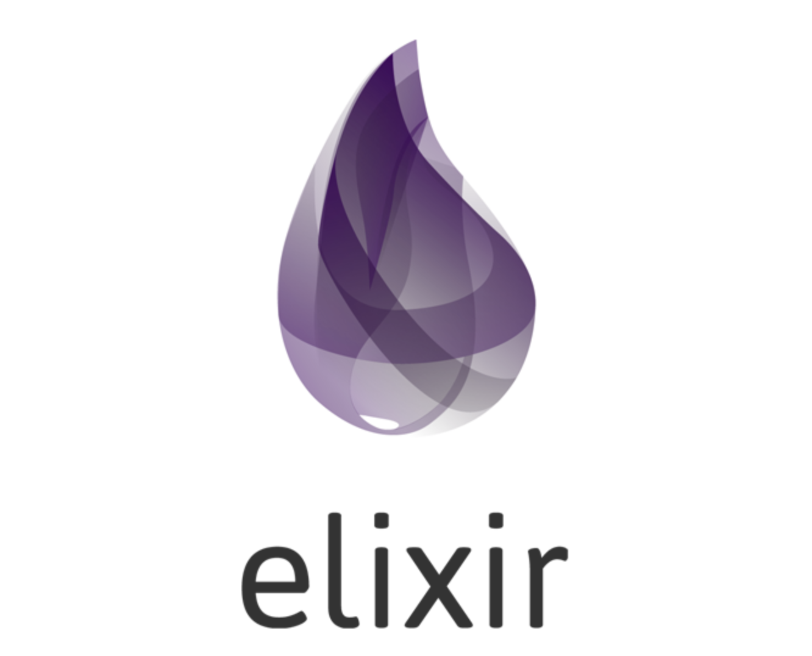
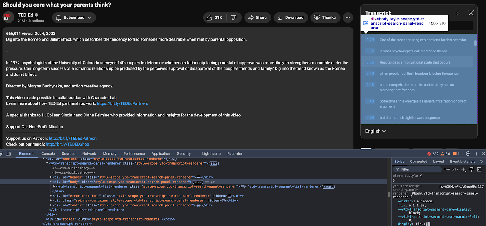
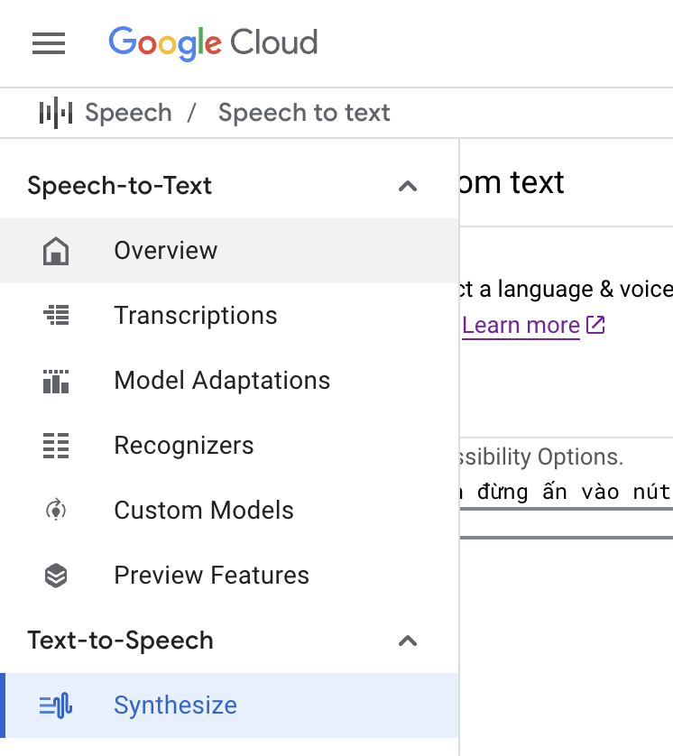
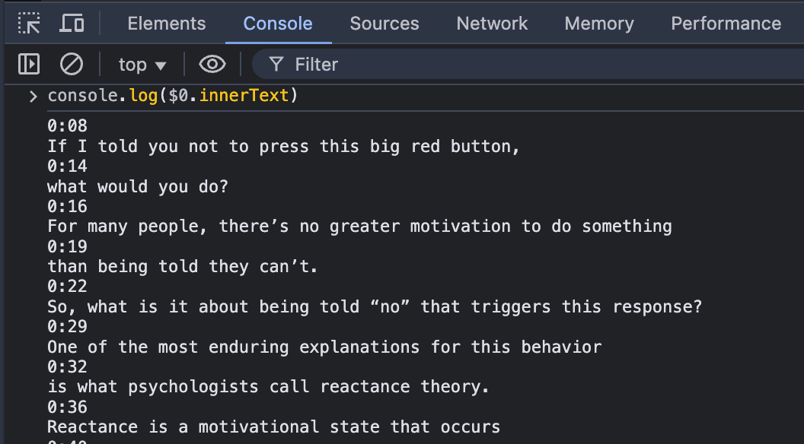
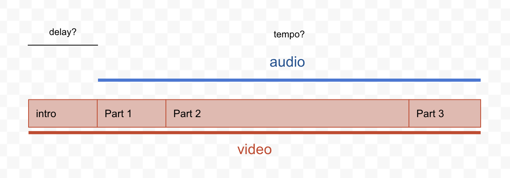
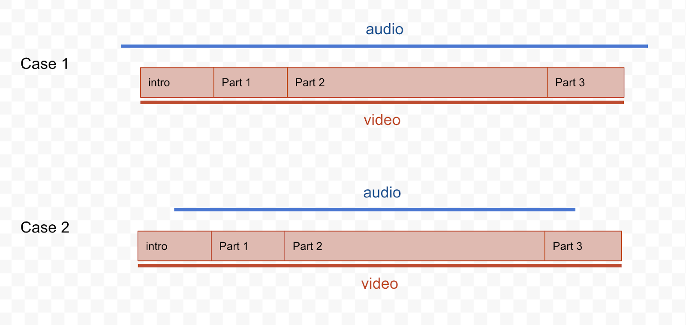

+++
title = "Elixir: YtChopDev demo with Livebook"
author = ["Chop Tr (chop.dev)"]
summary = "Cách học bằng các video youtube tiếng Anh được dịch tự động sang tiếng Việt. Chương trình dịch viết bằng ngôn ngữ Elixir và demo qua Livebook."
date = 2025-02-01T07:00:00Z
tags = ["elixir", "programing", "learning", "yt.chop.dev", "youtube", "translation", "project"]
draft = false
+++

Link: [yt.chop.dev](https://yt.chop.dev)

## Video

[https://www.youtube.com/watch?v=feb7fJceCjI](https://www.youtube.com/watch?v=feb7fJceCjI)

## Intro

Xin chào các bạn Chop trở lại với một video mới.

Video lần này là về một website mà mình mới viết trong năm qua. Thấy cũng đã tàm tạm ổn nên làm video chia sẻ trong lúc được nghỉ Tết.

Waoh cũng 1 năm nữa trôi qua rồi ta.

Năm vừa rồi mình cũng học được kha khá thứ, nhiều nhất là về AI và các mô hình Large Language Model, nhờ vậy mà được tham gia chương trình Accelerator của Google nè.

Rồi như chia sẻ trong video trước học thêm về Proxmox về hệ thống ảo hoá máy chủ rồi nạp thêm chút kiến thức về Kubernetes.

Nhưng vui nhất chắc là học một ngôn ngữ lập trình mới, ngôn ngữ Elixir. Ngôn ngữ củ hành tím này nè 😀

Siêu hay luôn.



Mình đã thử áp dụng Elixir vào một vài dự án nhỏ và thấy nó thực sự mạnh mẽ, đặc biệt là trong việc xử lý các tác vụ đồng thời. Mình rất ấn tượng với cách Elixir quản lý các process và khả năng mở rộng của nó.

Elixir là Functional Programming Language. Có nghĩa là nó tập trung vào việc sử dụng các hàm để xử lý dữ liệu, thay vì các vòng lặp và câu lệnh điều kiện như trong các ngôn ngữ lập trình truyền thống. Điều này giúp cho mã nguồn trở nên dễ đọc và dễ bảo trì hơn.

Một trong những điểm mạnh của Elixir là khả năng xử lý đồng thời, nhờ vào nền tảng Erlang VM. Điều này cho phép Elixir thực hiện hàng nghìn tác vụ cùng lúc mà không gặp vấn đề về hiệu suất.

Ngoài ra, Elixir còn có một cộng đồng rất năng động và nhiều thư viện hỗ trợ, giúp cho việc phát triển ứng dụng trở nên dễ dàng hơn. Mình đã sử dụng một số thư viện như Phoenix cho web framework và Ecto cho ORM, và thấy chúng rất mạnh mẽ và linh hoạt.

Nếu bạn đang tìm kiếm một ngôn ngữ lập trình mới để học thì Elixir là một lựa chọn rất hay. Nó không chỉ giúp bạn mở rộng kiến thức về lập trình hàm mà còn mang lại những trải nghiệm mới mẻ trong việc phát triển ứng dụng.

Ok thì quảng cáo chút về Elixir là vậy tại quá tâm đắc á mà.

Quay lại nội dung chính của video này là thời gian qua cũng có một vài bạn hỏi sao mà mình khám phá nhiều thứ và học nhanh vậy.

Thì cũng chia sẻ là cũng nhờ tính mình thích lần mò tìm hiểu nhiều thứ và đam mê với việc khám phá các công nghệ mới các kiến thức mới. Nhưng chắc lợi thế của mình là đọc hiểu tiếng Anh nhanh.

Mình thường xuyên xem các video về công nghệ và kiến thức trên Youtube. Một ngày chắc tiêu thụ tầm 5 tới 10 videos tổng thời gian khoản 1~2 tiếng 1 ngày. Tính cả ăn ngủ thì 2 tiếng cũng là gần 10% thời gian của ngày. Thay vì xem phim hay lướt facebook hay Tiktok thì mình xem Video kiến thức.

Rồi thực hành các kiến thức mà mình mới xem. Nếu là lập trình thì lấy máy ra gõ cọc cọc thử xem chương trình chạy đúng như video hướng dẫn không.

Nếu là mới xem video về vật lý học, tâm lý học hay triết học đồ thì giở Google ra search các thông tin liên quan mà mình chưa hiểu rõ để xem mình hiểu đúng không hay xác định lại video chém thông tin đúng không, có thông tin trái chiều nào không. Các nghiên cứu khoa học đôi khi cũng có nhiều thông tin chưa được chính xác và cần phải tập hợp nhiều nguồn để bổ xung cho nhau nha.

Vòng lặp xem rồi thực hành cứ vậy mà nạp vào đầu rồi có cơ hội áp dụng như lúc chia sẻ bàn luận với bạn bè thì nó ghi vào đầu, trở thành kinh nghiệm thực tế.

Thì cách thức là như vậy, nhưng như mình nói lợi thế của mình là tiếng Anh nữa, mình xem và hiểu nhanh được tiếng Anh nên có thể tiếp cận được nhiều thông tin kiến thức hơn các content tiếng Việt.

Ở đây đang không chê content tiếng Việt nhe, cộng đồng Youtube-er Việt Nam cũng làm content hay lắm. Ý mình là mở rộng được thêm, và có thông tin nhanh và nhiều hơn thôi.

Để các bạn Youtuber Việt Nam chia sẻ lại kiến thức bằng tiếng Việt thì cũng phải mất một khoản thời gian khá dài để các bạn dịch rồi cắt ghép lồng tiếng, cắt ghép rồi mới thành video tiếng Việt để phát hành lại được.

## Yt Chop Dev

Thấy vậy nên mình tự viết một chương trình để dịch các Youtube video tự động từ tiếng Anh sang tiếng Việt, thành 1 kho video kiến thức để có thể chia sẻ cho bạn bè mình. Chương trình tên là Youtube Translate, viết tắt là Yt.

Các bạn có thể sử dụng chương trình tại đường dẫn: yt.chop.dev

Chương trình này nhận vào một đường dẫn Youtube và dịch tự động thành tiếng Việt và lồng tiếng Việt được dịch ngược vào video luôn.

Demo phát thì nó sẽ như vầy:

Copy Youtube Link. Xong vào trang yt.chop.dev của mình, paste vào ô Youtube URL này. Enter.

OK và thông tin video được tìm thấy ở đây, tiêu đề cũng được dịch. Xong chọn thông tin "Yêu cầu dịch" thôi.

Ở đây chọn ngôn ngữ và giọng đọc nam hay nữ.

Rồi nhấn captcha và click "Yêu cầu dịch".

Một bảng dịch mất khoảng 5 phút cho mỗi 20 phút video gốc. Và vì xài AI và máy chủ để dịch tự động nên tốn nhiều chi phí mình có giới hạn số lượng dịch bằng cách xếp hàng các bản dịch và chỉ được xếp hàng tối đa 10 video.

Trước giờ chương trình này mình chia sẽ cho bạn bè của mình thôi nên lượng sử dụng không nhiều. Giờ mở public nên phải cẩn thận không thì cháy túi với chi phí 🥲

OK dịch xong thì quay lại video có thể Play được. Có nội dung bản phiên âm tiếng Anh và tiếng Việt luôn.



Nếu các bạn thấy hữu dụng thì có thể cho video này 1 like để mình thêm động lực ha.

## Demo Elixir Youtube translate

OK thì kênh của mình về lập trình nên mình sẽ chia sẻ một chút về cách lập trình lên chương trình dịch tự động này ha.

Mình sẽ không đi full 100% chương trình được ha vì để dựng lên website chương trình như mới demo thì còn rất rất nhiều thứ xung quanh như lập trình webserver, UI rồi quản lý deployment, quản lý server resource đồ nữa.

Chia sẻ các bước dịch một video Youtube bằng code thôi ha.

Chương trình cũng đơn giản thôi. Có 3 bước sau:

Đầu tiên là lấy transcript của Video về parse thành các câu nguyên vẹn xong dịch sang tiếng Việt. Bước này sử dụng AI để xử lý và dịch, tạo ra các câu văn tự nhiên và tốt hơn Google Translate hay các phần mềm dịch truyền thống.

Tiếp theo là xử lý chuyển hoá các câu đã dịch thành giọng nói. Bằng Text to Speech.

Rồi cuối cùng là dùng FFmpeg để ghép audio vào video gốc.

Và như các bạn cũng biết ngôn ngữ ưa thích hiện tại của mình là Elixir nên mình sẽ dùng Elixir để demo nha.

Elixir có một chương trình để thử nghiệm các đoạn code mà không cần phải cài đặt phức tạp. Đó là Livebook.

Nếu bạn nào có kinh nghiệm lập trình Python và từng sử dụng Jupyter notebook để học và thực hành các đoạn code python nhỏ thì chắc sẽ thấy Livebook này quen thuộc.

Các bạn install Livebook thì cứ làm theo hướng dẫn nhe. Rất dễ. Download installer về chạy thôi, tùy các bạn dùng Mac, Linux hay Windows mà cài.

### New notebook and dependencies

Bật lên thì chúng ta có thể tạo 1 notebook mới để code.

Đầu tiên sẽ phải liệt kê các third party package mình sẽ sử dụng trong chương trình này.

Chúng ta sẽ cần:

- Langchain 0.3.0-rc.2 - Là để tương tác với AI
- Req 0.5.5 - Là để gởi REST requests
- Kino 0.14.2 - Là để preview các file media mà chúng ta sẽ tạo ra, ngay trên notebook này.

Nhấn Add Package ở đây và thêm vào thôi.

Ngoài ra thì chúng ta sẽ cần OPEN API KEY, và Google Text to Speech Key nữa. Các bạn có thể tìm hiểu cách lấy các key này ở OpenAI và Google Cloud Console trong những video hướng dẫn khác của mình ha.

Xong vô phần Secret của Notebook rồi thêm nó vào đây.


### Getting the transcript and parse it

Ok tiếp theo mình sẽ chọn 1 video để dịch. Video nào đây? Video nào mà có transcript là được. Video nào ngắn ngắn để demo thôi, tầm 5 phút.

Mình rất thích video của Ted-Ed nên sẽ pick video này ha:

"Should you care what your parents think?" - "Bạn có nên quan tâm đến suy nghĩ của bố mẹ không?".

Mình đang làm ba của 1 bé 5 tuổi và chuẩn bị đón 1 bé nữa về nên mấy video tâm lý học này rất thú vị.

Rồi giờ chúng ta sẽ mở phần Transcript ra bằng cách nhấn vào nút Description và vào transcript ở đây.

Xong bật Browser Dev tool, rồi lên target vào element này. Đây là element transcript của Youtube. Nếu các bạn để ý trong này là toàn bộ thông tin của transcript cùng với timestamp của từng đoạn thoại.

OK, mình chỉ cần click để target vào element container mà có nhiều element ytd-transcript-segment này này rồi qua tab Console để làm 1 thao tác nữa. Clean up các HTML xung quanh để được đoạn text transcript thôi. Dễ xử lý.



Trong tab Console mình sẽ gõ $0.innerText sẽ được 1 cái string là innerText của element mà mới chọn. Nhớ là phải chọn đúng element nhe. Chứ không sẽ không ra string này đâu.

Và string này để format thì phải output ra bằng console log nữa. Mình sẽ console.log và đưa $0.innerText vào argument.



OK vậy là được nội dung transcript. Copy rồi quay lại Elixir Livebook để paste nó ra ha. Gán cho nó 1 cái biến transcript_raw.

Bây giờ thì bắt đầu code ha.

Nhìn vào format của transcript_raw các bạn để ý format sẽ là 1 dòng timestamp 1 dòng content. Giờ chúng ta sẽ parse nó bằng Elixir như thế nào đây.

```elixir
defmodule TranscriptProcessor do
  def parse(raw) do
    raw
    |> String.split("\n")
    |> Enum.filter(fn s -> Regex.match?(~r/^\d+:\d+/, s) == false end)
  end
end
```

Transcript output sẽ bằng raw pipe vào String.split("\n").

Ở đây Elixir có toán tử pipe. Viết bằng dấu gạch và dấu lớn hơn, như mũi tên nè |>.

Toán tử này sẽ dùng output của function trước thành input của function sau. Siêu tiện lợi.

Thay vì các bạn viết:

```
foo(bar(baz(123)))
```

Thì chúng ta có thể viết

```elixir
123
|> baz
|> bar
|> foo
```

Tức là làm theo từng bước từng bước. Dễ nhìn dễ hiểu.

OK tiếp tục lập trình. String split newline thì chúng ta sẽ nhận được 1 mảng xen kẽ timestamp và script.

Chúng ta xử lý đơn giản thôi ha. Filter hết các timestamp bằng regex cái nào match như dạng số rồi dấu : ở giữa này là loại.

```elixir
defmodule TranscriptProcessor do
  def parse(raw) do
    raw
    |> String.split("\n")
    |> Enum.filter(fn s -> Regex.match?(~r/^\d+:\d+/, s) == false end)
  end
end

transcripts = TranscriptProcessor.parse(transcript_html_raw)
```

Rồi. Thử parse rồi gán thành biến transcripts xem ra gì.

Ra các đoạn thoại thôi, không còn các timestamp ha.

### AI translate to sentences

OK rồi giờ chúng ta sẽ xử lý dùng AI để process và dịch lại thành tiếng Việt ha.

Chúng ta sẽ dùng langchain và ChatGPT để xử lý ha. Code để request ChatGPT cũng đơn giản mình copy example từ thư viện langchain thôi.

```elixir
defmodule AI do
  alias LangChain.ChatModels.ChatOpenAI
  alias LangChain.Chains.LLMChain
  alias LangChain.Message

  def translate_transcript(transcript) when is_binary(transcript) do
    {:ok, result} =
      LLMChain.new!(%{
        llm:
          ChatOpenAI.new!(%{
            model: "gpt-4o-mini",
            api_key: System.fetch_env!("LB_OPENAI_API_KEY")
          }),
        verbose: true
      })
      |> LLMChain.add_message(
        Message.new_system!("You are an expert translator. Translate English to Vietnamese.")
      )
      |> LLMChain.add_message(Message.new_user!(transcript))
      |> LLMChain.run()

    result.last_message.content
  end
```

Chạy thử script trên với câu "Hello, this is Chop. I'm a software developer."

```elixir
translated = AI.translate_transcript("Hello, this is Chop. I'm a software developer.")
```

Thì như mong đợi trả về câu "Chào, tôi là Chop. Tôi là một lập trình viên.". Ngon lành rồi.

Nhưng mà như các bạn thấy transcript là bảng phiên âm lại của video. Nên không có ngừng ngắt câu gì hết. Nên nếu chúng ta đem cả cục này đem ra dịch rồi đọc lại thì rất dở.

Chúng ta nên thêm 1 bước transform transcript thành từng câu thì khi dịch ra sẽ hay hơn và cũng là 1 thao tác chuẩn bị cho bước tiếp theo, là bước Text To Speech - bước dùng AI để chuyển văn bản thành giọng nói. Bước này có các câu nguyên vẹn sẽ xử lý tốt hơn nhiều.

Rồi chúng ta sẽ prompt AI như sau:

```
You will receive a transcript with text in sentence broken across multiple lines.
Your task is to combine those sentences into complete sentences, one on each line.
```

Ok, tới đây thì refactor 1 chút ha. Bara bum.

```elixir
  def run_llm(messages) do
    {:ok, result} =
      LLMChain.new!(%{
        llm:
          ChatOpenAI.new!(%{
            model: "gpt-4o-mini",
            api_key: System.fetch_env!("LB_OPENAI_API_KEY")
          })
      })
      |> LLMChain.add_messages(messages)
      |> LLMChain.run()

    result.last_message.content
  end

  def translate(transcript) when is_binary(transcript) do
    run_llm([
      Message.new_system!("You are an expert translator. Translate English to Vietnamese."),
      Message.new_user!(transcript)
    ])
  end

  def combine_sentences(transcript) when is_binary(transcript) do
    run_llm([
      Message.new_system!("You will receive a transcript with text in a continuous sentence across multiple lines. Your task is to combine the sentences into one complete sentence on each line."),
      Message.new_user!(transcript)
    ])
    |> then(fn result ->
      result
      |> String.split("\n", trim: true)
      |> Enum.filter(fn s -> s != "" end)
    end)
  end
```

Đối với combine_sentences chúng ta sẽ pipe result ra xử lý một chút, thành 1 array nhiều đoạn thay vì 1 cục text lớn, trong lúc xử lý cũng filter đi mấy element rỗng luôn. Việc này cũng góp phần cải thiện chất lượng công đoạn chuyển văn bản thành giọng nói.

Vậy là có 2 function để process transcript. Từng bước là combine xong rồi translate. Chúng ta sẽ làm 1 hàm translate_transcript chung để xử lý input transcript.

```elixir
  def translate_transcript(transcript) when is_binary(transcript) do
    transcript
    |> combine_sentences()
    |> Enum.map(fn sentence -> translate(sentence) end)
  end
```

Đọc vào chắc các bạn cũng sẽ dễ hình dung. Hàm này đầu tiên sẽ combine sentences. Xong với từng sentence sẽ dùng hàm enumerate map để loop qua và translate các sentence đó.

### Text to Speech

Ok vậy là chúng ta đã có bản dịch cho transcript rồi. Giờ tới bước Text to Speech, tức chuyển văn bản thành giọng nói.

Code để chuyển văn bản thành giọng nói thì cũng đơn giản thôi. Chúng ta sẽ sử dụng Google TTS để thực hiện việc này.

Ngoài Google TTS thì còn có option ElevenLabs mình cũng đã từng sử dụng qua.

ElevenLabs thì chất lượng đọc tốt hơn nhiều nhưng chi phí thì cũng cao hơn nhiều luôn. Tận gấp 2 gấp 3 lần. Chương trình này mình public để mọi người sử dụng nên mình phải giới hạn chi phí, xài Google TTS thôi.

OK, xài Google TTS thì dễ lắm. Các bạn vô Google Cloud Console, search Speech. Mở service này ra. Ai chưa từng sử dụng chắc sẽ phải enable service API này. Rồi kiếm mục Text-To-Speech > Synthesize này để thử nghiệm và xem cách sử dụng API.


Sử dụng thì các bạn nhấn nút Get Code. Xem sơ qua thì sẽ hiểu là chúng ta cần gởi một REST request lên endpoint [https://texttospeech.googleapis.com/v1/text:synthesize](https://texttospeech.googleapis.com/v1/text:synthesize) Cùng body data như mô tả là sẽ nhận kết quả thôi.



Triển khai trong Elixir chúng ta sẽ dùng thư viện Req để gởi API request.

```elixir
defmodule TTS do
  def text_to_speech(content) when is_binary(content) do
    key = System.fetch_env!("LB_GOOGLE_TTS_KEY")
    url = "https://texttospeech.googleapis.com/v1/text:synthesize" <> "?key=#{key}"

    body =
      %{
        input: %{text: content},
        voice: %{languageCode: "vi-VN", name: "vi-VN-Neural2-D"},
        audioConfig: %{audioEncoding: "LINEAR16"}
      }
      |> Jason.encode!()

    headers = [
      {"Content-Type", "application/json"}
    ]

    case Req.post(url, body: body, headers: headers) do
      {:ok, %{status: 200, body: response_body}} ->
        bytes = Base.decode64!(response_body["audioContent"])
        {:ok, bytes}

      {:ok, %{status: status_code, body: response_body}} ->
        {:error,
         "Request failed with status code #{status_code}: #{Jason.encode!(response_body)}"}

      {:error, exception} ->
        {:error, "HTTP request failed: #{exception.reason}"}
    end
  end
end
```

Cũng sim pừ ha. Thử nào.

```elixir
{:ok, output_1} = translated_sentences |> Enum.at(0) |> TTS.text_to_speech()
Kino.Audio.new(output_1, :wav)
```

Perfect.

Rồi giờ chúng ta map toàn bộ bản dịch thành các file âm thanh thôi.

Thêm hàm process trong module TTS

```elixir
  def process(sentences) do
    results = sentences |> Enum.map(fn s -> text_to_speech(s) end)
    if Enum.all?(results, fn r -> match?({:ok, _}, r) end) do
      results |> Enum.map(fn r -> elem(r, 1) end)
    else
      :error
    end
  end
```

Hàm này để loop qua các sentence với enumerate map. Mỗi sentence chạy hàm text_to_speech.

Có điều đặc biệt hay của Elixir mà mình đề cập thêm 1 chút. Là cách nó handle error. Giống Rust hay Golang, elixir handle error bằng cách trả nó về nơi gọi hàm. Tức là ai gọi nó sẽ nhận được kết quả là ok và kết quả hoặc không ok thì trả về :error và dữ liệu error, biết liền để xử lý.

Trong Golang thì dạng

```go
func ExampleFunc() int, error {
    return 1, nil
}

func main() {
     result, err := ExampleFunc()
     if err != nil {
         // handle the error
     }
     // use the result
}
```

Trong Rust thì

```rust
fn example_func() -> Result<i32, String> {
    Ok(1)
}

fn main() {
    match example_func() {
        Ok(result) => {
            // Use the result
        }
        Err(e) => {
            // Handle the error
        }
    }
}
```

OK, nhấn chạy process cho tất cả translated_sentences chúng ta sẽ có 1 loạt các audio bytes cho từng câu.

Để chuẩn bị cho bước tiếp theo chúng ta sẽ output chúng ra thành các file wav trong một thư mục tạm thời, temporary dir này ha.

```elixir
temp_dir = "/tmp/demo_yt"
File.mkdir_p!(temp_dir)
audios_byte
|> Enum.with_index()
|> Enum.each(fn {bytes, index} ->
  file_name = String.pad_leading(Integer.to_string(index), 2, "0") <> ".wave"
  File.write!("#{temp_dir}/#{file_name}", bytes)
end)
File.ls!(temp_dir)
```

Code này là tạo thư mục temp_dir xong loop qua list các audio bytes của từng đoạn cùng với index để làm tên file.

Tên file thì mình có thêm phần padding ở đầu, vì chúng ta sẽ phải giữ thứ tự của chúng để hồi nữa nối lại với nhau đúng thứ tự. Padding là thêm số 0 ở đầu thôi, ví dụ 1 sẽ thành 01, 2 thành 02, v.v

Như các bạn thấy tên file được lệnh File.ls list ra là 01.wav, 02.wav, v.v.

### FFmpeg combine audio and video

OK, đi cũng được 2/3 quãng đường rồi. Bước tiếp theo mới thú vị nè :D

Chúng ta sẽ dùng ffmpeg để nhập audio vào video.

Trước hết chúng ta sẽ cần nối các audio file lại với nhau. Làm sao đây, hỏi ChatGPT thôi.

"How to concat multiple audio files into one using ffmpeg"

Và câu trả lời như các bạn thấy có nhiều cách. Đến đây thì cũng chia sẽ là gần đây mình lập trình chủ yếu sử dụng LLM như trợ lý, dùng nó để gợi ý các cách thức xử lý vấn đề.

Thực ra cái nghiệp lập trình là xử lý vấn đề bằng code thôi, chủ yếu là lên mạng lần mò. Có con LLM này thì quá tiện rồi, gợi ý cách xử lý giùm.

Với các gợi ý thì mình sẽ kết hợp với kinh nghiệm để đưa ra giải pháp. Nhanh hơn nhiều việc Google rồi đọc các câu trả lời rời rạc trên Forum hay Github Issue hay Stackoverflow.

Cũng lưu ý là ý mình không phải là chê Google hay Stackoverflow nha. Các tình huống chuyên sâu hay phức tạp thì cũng sẽ phải tự mần mò trong các câu trả lời của các chuyên gia thôi. Nhưng với các trường hợp độ khó từ thấp đến trung bình thì LLM là giải pháp tốt.

OK quay lại giải pháp nối các đoạn audio lại thì mình sẽ sử dụng cách "file list txt". Đơn giản là list ra đường dẫn đến các file audio cần xử lý trong 1 file danh sách rồi dùng lệnh ffmpeg để xử lý chúng.

Convert code gợi ý của ChatGPT thành code Elixir thì như sau:

```elixir
defmodule VideoAudio do
  def concat_audio_files(audio_files, audio_file_dir, output_path) do
    audio_list_file = audio_file_dir <> "/audio_files.txt"
    :ok = audio_files
      |> Enum.map(fn filename ->
        "file " <> filename
      end)
      |> Enum.join("\n")
      |> then(fn output -> File.write!(audio_list_file, output) end)

    System.shell("/opt/homebrew/bin/ffmpeg -y -f concat -safe 0 -i #{audio_list_file} -c copy #{output_path}")
  end
end
```

Ở đây mình tạo file audio_files.txt bằng cách loop qua files rồi thêm chuỗi "file " ở đầu như hướng dẫn. Xong dùng ffmpeg cùng các flag -f concat -i audio_list_file -c copy ra cái output_path.

Và như vậy là xong function để concat audio files.

Lưu ý chỗ đường dẫn đến ffmpeg, mình sử dụng Mac và dùng homebrew để chạy. Nếu các bạn sử dụng OS khác, Windows hay Linux, thì đường dẫn sẽ khác ha.

OK và như vậy có thể chạy lệnh để process text to speech, combine audio files rồi.

```elixir
input_audio_file = temp_dir <> "/input_audio.wav"
File.ls!(temp_dir)
|> Enum.sort()
|> Enum.filter(fn file_name -> Regex.match?(~r/^\d+.wav/, file_name) end)
|> VideoAudio.concat_audio_files(temp_dir, input_audio_file)
input_audio_bytes = File.read!(input_audio_file)
Kino.Audio.new(input_audio_bytes, :wav)
```

Ở đây mình list file trong thư mục temp_dir ra, xong sort nó phát để các file theo thứ tự. Rồi filter để match file nào có pattern đúng như mình cần thôi.

Và cuối cùng là dung hàm concat_audio_files để xử lý. Rồi Kino Audio sẽ giúp mình play file kết quả.

Cùng nghe thử ha.

OK thành quả audio đã đạt được. Giờ chúng ta sẽ ghép nó vào video.

Chúng ta sẽ phải download video về. Download video chúng ta có tool là yt-dlp link sau ha: [https://github.com/yt-dlp/yt-dlp](https://github.com/yt-dlp/yt-dlp)

Một lần nữa, các bạn đọc hướng dẫn của tool để cài vô máy tuỳ hệ điều hành nhe.

Chúng ta sẽ cần video file không có âm thanh. Mình sẽ download video dùng lệnh sau.

```elixir
youtube_url = "https://www.youtube.com/watch?v=ABYBtcM2D28"
video_file = temp_dir <> "/input_video.mp4"
System.shell("~/bin/yt-dlp --force-overwrite -f \"bv\" \"#{youtube_url}\" -o #{video_file}")
Kino.Video.new(File.read!(video_file), :mp4)
```

Video này sẽ được download về thư mục temp mà chúng ta đã tạo ở trên. bv là option để down về best quality video only - tức là video chất lượng lớn tốt nhất, không có âm thanh.

Và chúng ta download thử nào.

OK vậy là cũng có video không âm thanh rồi. Tới bước cuối cùng.

### Audio tempo and align audio position

Giờ thì chúng ta sẽ ghép audio và video lại với nhau. Nhưng trước hết chúng ta thử suy nghĩ 1 chút. Làm sao khớp video với audio? Chúng chắc chắn sẽ bị lệch nhỉ.

Thì đúng rồi, tại công đoạn dịch và chuyển văn bản thành nói đâu biết gì về video đâu nên ghép vào sẽ bị lệch.

Để xử lý tình huống lệch thì muôn vàng vấn đề, mình đã giải quyết 1 phần lớn ở trong dịch vụ yt.chop.dev của mình. Các bạn có thể thử dịch và thấy audio được khớp với các timestamp để đạt chất lượng khớp lời thoại với hình ảnh nhất có thể.

Cũng chưa hoàn chỉnh lắm tại ngôn ngữ khác nhau nên câu dài ngắn khác nhau. Mình phải tăng giảm tốc độ đọc một số chỗ để ghép, và đôi khi bị overlap giữa các câu nữa. Chưa tốt lắm. Tương lai thì mình sẽ cải tiến thêm.

Còn với lập trình mẫu trên notebook này thì mình sẽ demo cách xử lý đơn giản thôi, là tính toán phần start của audio và điều chỉnh tốc độ đọc để khớp khớp tàm tạm với phần nội dung của video.

OK chúng ta sẽ xem diagram này trước ha.



File audio của chúng ta sẽ bị dài hơn. Hoặc ngắn hơn so với video. Như trình bày ở trên, do nhiều lý do, ngôn ngữ khác nhau. Tốc độ đọc nhanh chậm khác nhau.

Và mục tiêu của chúng ta là tính toán là làm sao khớp được audio start ngay sau khi intro kết thúc.


Chung ta sẽ cần tính toán 2 thứ để khớp audio với các phần chính của video.

Đó là thời gian delay audio bao nhiêu để khớp với phần nội dung của video ngay sau intro.

Và tốc độ đọc của audio là bao nhiêu để khớp điểm kết thúc của audio với điểm kết thúc của video.

Đối với delay bao nhiêu thì chúng ta có thể lấy từ timestamp của transcript. Chúng ta xem lại phần transcript raw thì sẽ thấy transcript bắt đầu từ giây thứ 8. Để parse phần này ra thì dễ thôi.

Dùng hàm sau:

```elixir
defmodule AudioVideoMatcher do
  def get_transcript_start_time(transcript_raw) do
    transcript_raw
    |> String.split("\n")
    |> Enum.at(0)
    |> then(fn line ->
      [min, sec] = String.split(line, ":")
      {min, _} = Integer.parse(min)
      {sec, _} = Integer.parse(sec)
      min*60 + sec
    end)
  end
end
```

Hàm này split string theo newline, lấy dòng đầu tiên, xong convert string minute và second thành số Integer và dùng công thức 60 giây 1 phút để xử lý thôi. Sim pừ.

Lưu ý là không phải lúc nào transcript đầu tiên cũng là start time của audio nhe. Một vài video có phần transcript cho Intro vì intro có lời, hoặc cả khi intro chỉ là nhạc Youtube cũng transcript thành [Music] ở đầu. Nên để xác định start time này tốt hơn thì đây là 1 chỗ mà các bạn có thể suy nghĩ thêm để cải tiến.

OK có start time rồi thì chúng ta cần xác định độ dài của audio và độ dài của video xem tỷ lệ của chúng là bao nhiêu.

Ví dụ:

Video dài 100 giây mà audio đọc chậm hơn mất 120 giây thì tỉ lệ là 100 / 120 = 0.8333

Tỷ lệ này cũng là tempo mà chúng ta cần điều chỉnh audio cho khớp với video.

Để xác định độ dài playtime của video và audio file thì chúng ta sẽ sử dụng một tool đi chung với ffmpeg là ffprope.

```elixir
  def get_media_play_length(file_path) do
    {output, _} =
      System.shell(
        "/opt/homebrew/bin/ffprobe -v error -show_entries format=duration -of default=noprint_wrappers=1:nokey=1 #{file_path}"
      )

    {length, _} = Float.parse(output)
    length
  end
```

Thử với audio và video file thì sẽ được thời gian theo giây đây.

OK đủ số liệu rồi mình làm một function để thực hiện việc tính toán tempo thôi.

```elixir
  def calculate_audio_tempo(video_file, audio_file, start_delay) do
    video_length = get_media_play_length(video_file)
    audio_length = get_media_play_length(audio_file)
    audio_length / (video_length - start_delay)
  end
```

Công thức cũng đơn giản ha

audio tempo = audio length / (video length - delay)

Thử output ra các kết quả xem ổn chưa ha.

### Merge audio and video

OK và chúng ta có các thông số rồi. Giờ qua phần merge chúng lại với nhau thôi.

Để merge thì chúng ta cần function để thay đổi tempo của audio. Như sau:

```elixir
defmodule VideoAudioMerge do
  def adjust_audio_tempo(audio_path, output_path, tempo) do
    System.shell(
      "/opt/homebrew/bin/ffmpeg -y -hide_banner -v error -i #{audio_path} -filter:a atempo=#{tempo} -vn #{output_path}"
    )
  end
end
```

Sau đó chúng ta sẽ cần function để merge video và audio với thông số start delay. Như sau:

```elixir
  def merge_audio_video(audio_file, video_file, start_delay, output_file) do
    System.shell(
      "/opt/homebrew/bin/ffmpeg -y -hide_banner -v error -i #{video_file} -itsoffset #{start_delay} -i #{audio_file} -c:v copy -map 0:v:0 -map 1:a:0 -shortest #{output_file}"
    )
  end
```

Rồi, process thôi. Chúng ta có đầy đủ các file và thông số. Chạy adjust audio tempo và merge.

```elixir
audio_file_tempo_adjusted = temp_dir <> "/input_audio_adjusted_tempo.wav"
VideoAudioMerge.adjust_audio_tempo(audio_file, audio_tempo, audio_file_tempo_adjusted)
output_file = temp_dir <> "/output.mp4"
VideoAudioMerge.merge_audio_video(audio_file_tempo_adjusted, video_file, start_delay, output_file)
Kino.Video.new(File.read!(output_file), :mp4)
```

Và thế là có 1 video youtube được dịch sang tiếng Việt.

## Conclusion

OK thì code của notebook này mình sẽ public qua link trong description ha.

Còn chương trình Youtube Translate của mình thì các bạn có thể vào link yt.chop.dev để thử nhiều video hơn nhe.

Hy vọng chương trình dịch tự động này của mình sẽ hỗ trợ các bạn tiếp cận thông tin kiến thức nhiều hơn, rộng rãi hơn.

Video cũng đã dài, mình sẽ dừng ở đây.

Chúc các bạn năm mới vui vẻ. Khởi đầu mới đầy niềm vui và động lực mới.

Cảm ơn các bạn đã theo dõi.

Xin chào và hẹn gặp lại. Chop out.
