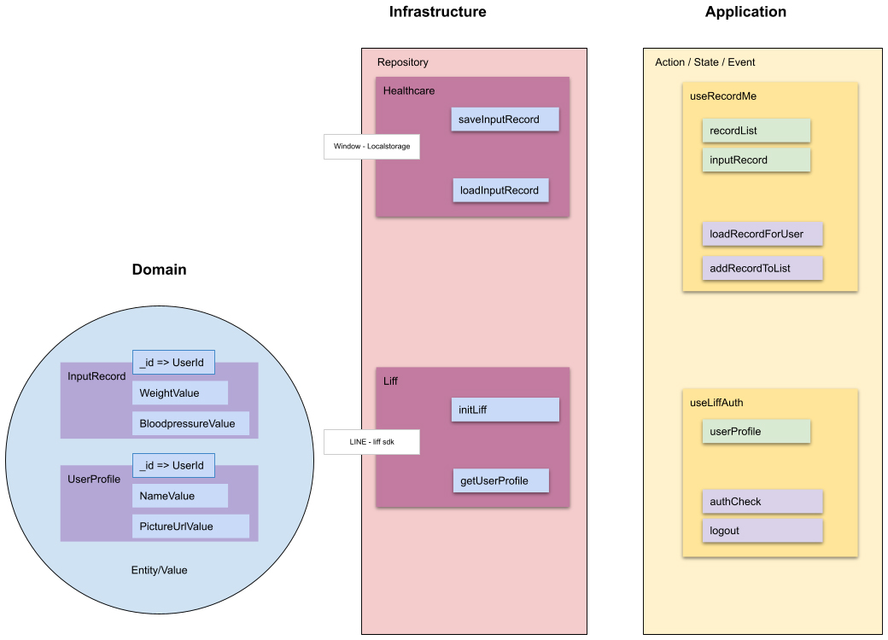

+++
title = "How To Structure App study note"
author = ["Chop Tr (chop.dev)"]
summary = "How To Structure App study note"
date = 2022-04-24T00:00:00+07:00
tags = ["howto", "structure", "app"]
draft = false
+++

## Inspiration and Reference {#inspiration-and-reference}

This talk is heavily inspired by many great other talks and examples about the DDD from over the years that I've study and practice it. There are 3 references that I would like to give credit to are

### Kat Zien talk: GopherCon 2018: Kat Zien - How Do You Structure Your Go Apps {#kat-zien-talk-gophercon-2018-kat-zien-how-do-you-structure-your-go-apps}

<https://www.youtube.com/watch?v=oL6JBUk6tj0>

### Reso Coder - Flutter Firebase &amp; DDD {#reso-coder-flutter-firebase-and-ddd}

<https://resocoder.com/2020/03/09/flutter-firebase-ddd-course-1-domain-driven-design-principles/>

### Domain Driven Design with Typescript {#domain-driven-design-with-typescript}

<https://khalilstemmler.com/articles/domain-driven-design-intro/>

## Git repository {#git-repository}

TODO Insert github link

## Demo app: A website for inputing user's health record {#demo-app-a-website-for-inputing-user-s-health-record}

So first let go through the App that we going to build. This will be the example for us to understand how I implement and the desion I make during my designing process for the architecture of the app.


-   User can login by Line Front End framework (LIFF)

-   User can input weight and bloodpressure

-   User can record an entry by time

-   User can list records

-   User can save data into Local Storage or Database

## Questions {#questions}

To start up I would like to lay out some questions that everyone would have when first starting a code base (taken from the Kat Zien talks) that we will have some minute to think about them at the end of this talk.

-   Should I put everything in the main package?

-   Should I start with one package and extract other packages over time?

-   How do I decide if something should be in its own package?

-   Should I just use a framework?

-   What's the programing paradigm should I follow?

## Good Structure Goals {#good-structure-goals}

So what is a good structure. We need to define some goals to make our decisions during the design process.

-   Consistent
    How many time you visit a code-base and see the code is done in one way and then in another way. Code consistency will help greatly when you revisit or need to implement new feature. Without hesistation of how or where you put your code.

-   Easy to understand, navigate and reason about ("make sense")
    Something you just get it when reading through the code. Everything is has its own place. There is no ambiguous element.

-   Easy to change, loosely-coupled
    When you need to change something. You do it with the safety of not effecting other parts of the program. The code should be have their boundery very well defined.

-   Easy to test
    By isolation (ie. loosely-coupled) testing become easy and a pleasant to write. No need to heavily mock everything for small test.

-   "As simple as possible, but no simpler." - Albert Einstein
    This is a great goal to have when designing the code base architecture and a great philosophy idea to think about. We should approach thing at its simplicity.

-   Design reflects exactly how the software works

-   Structure reflects the design exactly

    The last two points would be very well explain in Kat Zien talk and I really love her insights about the feeling I want when I code in a well designed code base.

> Good code structure will make your life easier as a programer.
>
> Should make coding a pleasure because you know where everything should go and where everything is.

### Holy Grail {#holy-grail}

How the software works

☝

Design

☝

Structure


I present to you the Holy Grail of software architecture design. As a software developer learning about architecture design, this has blown my mind away. The idea of really closely follow the design with the stucture of your software as the basic.

I took this to heart everytime I write some piece of code. The code should very well show the intention of the programmer. It would reflect on everything even how to name your variable, how you compose your functions and how you pass the results around.

The code should work for you not the other way around.

## Domain-Driven Design {#domain-driven-design}

Now let me introduce the work of Mr Eric Evan and a great book on this topic by Mr Vaughn Vernon - Implement Domain-Driven Design.

Popularized by Vaughn Vernon - Implement Domain-Driven Design. Foreword by Eric Evans.


### The idea {#the-idea}

-   Establish your domain and business logic

-   Define your bounded context(s), the models within each context and the ubiquitous language

-   Categorizing the building blocks of your system:
    -   Value Object
    -   Entity
    -   Domain Event
    -   Aggregate
    -   Service
    -   Repository
    -   Factory

Actually we don't need all of these in every projects and I will first explore the 2 basic concept of `Entities` and `Value Object` in the example project.

### Bounded Context {#bounded-context}

Before explaining about the Entities and VOs. We need to briefly defind the Context of our example app.

#### Example Context {#example-context}

-   `Context`: A web application for making health records

-   `Language`: record me, input records, weight, lower/upper bloodpressure ...

-   `Value Objects`: TimestampId, Weight, Bloodpressure, ...

-   `Entities`: InputRecord, ...

-   `Repository`: InputRecord repository

-   `Service/ Application`: Order adding, Account adding, Order listing, Account listing

-   `Domain Event`: Order added, Account added, Order already exists, Account not found, ...

### Entities and Value Objects {#entities-and-value-objects}

DDD can be divided into Strategic and Tactical Design where the Tactical Design is about the building blocks of DDD. The basic building blocks of DDD are Entities and Value Objects (VOs) besides Services and Domain Events.


#### Entities {#entities}

This is how `Entities` are introduced in the DDD book by Eric Evans:

> Many objects are not fundamentally defined by their attributes, but rather by a thread of continuity and identity.

This sentence already introduces the main characteristics of an Entity: continuity (also often referred to as having a lifecycle) and identity.

> An object primarily defined by its identity is called an Entity.

When you think of an `Entity`, imagine something that needs to be tracked over time and whose attributes are likely to change over time. In order to be able to keep track of something you need a way of identifying the object and answer the question "Is this the same object?" after time has passed. A very strong indicator for something being an Entity is something like a status attribute (like `pending`, `active`, or `inactive`) or attribute prefixes like `current` or `last`.

To implement an `Entity` we need to create an abstract class which hold it's properties types and ID types. Properties type would defined the values this entity contain and the ID type will defined the which type the ID is, may be it's a `positive` number, a `uuid` string, or a `timestamp` number or `datetime` string.

```typescript
export abstract class Entity<Props, ID extends ValueObject<any>> {
    constructor(
        protected props: Props,
        protected _id: ID
    ) {}

    public equals(object?: Entity<Props, ID>): boolean {
        return (
            !isUndefined(object) &&
            !isNull(object) &&
            isEntity(object) &&
            Boolean(this._id?.equals(object._id))
        );
    }
}
```

The point to pay attention to Entity is how to compare the 2 Entity Objects. They are compared by their `IDs`.

`UserProfile` Entity is then implemented with identity `UserId` . And 2 properties: `DisplayNameValue` and `UrlValue`, each will hold the value of, you guessed it, the name and the url of user profile.

```typescript
interface UserProfileProps {
    displayName: DisplayNameValue;
    pictureUrl: UrlValue;
}

export class UserProfile extends Entity<UserProfileProps, UserId> {
    constructor(props: UserProfileProps, _id: UserId) {
        super(props, _id);
    }

    get userId() {
        return this._id;
    }

    get displayName() {
        return this.props.displayName;
    }

    get pictureUrl() {
        return this.props.pictureUrl;
    }
}
```

#### Value Objects {#value-objects}

Many objects have no conceptual identity. These objects describe some characteristics of a thing.

`Value Objects` do not have an identity. They are defined by their value instead of an identifier. You can think of Value Objects as a complex value of an Entity.

> An object that represents a descriptive aspect of the domain with no conceptual identity is called a `Value Object`. Value Objects are instantiated to represent elements of the design that we care about only for `what` they are, not `who or which` they are.

The value object base class can be implemented like so

```typescript
export abstract class ValueObject<T> {
    protected abstract readonly name: string;
    protected abstract readonly schema: ZodSchema<T> | ZodEffects<ZodAny, T, any>;
    private _value?: Either<ValueFailure, T>;

    constructor(private _input: T) {}

    protected parse() {
        const _parsed = this.schema.safeParse(this._input);
        this._value = _parsed.success
            ? right(_parsed.data)
            : left(
                  new ValueFailure(
                      this._input,
                      _parsed.error.issues.map(e => {
                          return {
                              path: e.path.join('-'),
                              code: e.code,
                              message: e.message,
                          };
                      })
                  )
              );
        return this;
    }

    get val() {
        if (!this._value) {
            throw new NotParsedError();
        }
        return this._value;
    }

    get isLeft() {
        return isLeft(this.val);
    }

    get isRight() {
        return isRight(this.val);
    }

    get input() {
        return this._input;
    }

    getOrCrash() {
        return pipe(
            this.val,
            fold(v => {
                throw v;
            }, identity)
        );
    }

    fold<Result>(onLeft: (err: ValueFailure) => Result, onRight: (v: T) => Result) {
        return pipe(this.val, fold(onLeft, onRight));
    }

    equals(vo?: ValueObject<T>): boolean {
        return (
            !isUndefined(vo) &&
            !isNull(vo) &&
            this.isRight &&
            vo.isRight &&
            isEqual(this.getOrCrash(), vo.getOrCrash())
        );
    }

    clone() {
        return cloneDeep(this);
    }

    toString(): string {
        return `${this.name}(${JSON.stringify(this._value, null, 2)})`;
    }
}
```

I use Zod here as a Parser (can be read validating but not exactly) tool for the VOs. But you can easily write your own. The Parser should convert the receiving input value into a concreate `valid value` or to a `well-defined error`.

In the example application, it is the `ValueFailure` class. This parse either the built-in JS Error which is extendable into any error like `NotAuthenticatedError`, `APIError`, etc.

```typescript
export class ValueFailure extends Error {
  constructor(public val: any, public errors: ValueError[]) {
    // Use error.message if error is custom otherwise use error.code
    const errorStrs = errors?.map(e =>
      e.code === ZodIssueCode.custom ? e.message : e.code
    )
    super(errorStrs.join(','))

  toString() {
    return `[${this.val}: ${this.errors}]`
  }
}
```

`ValueObject` will handle parse and validate input then keep it as its value. This kind of value is the perfect usecase for `Either<Left, Right>` type. Which simply just means either a value (Right) or error (Left).

Then I have the ultility functions for identify the values `isLeft`, `isRight` or to "`fold`" by either case. And helper functions `equals`, `clone`, `toString`.

With the base ValueObject class we can implement the 2 example VOs

```typescript
export class DisplayNameValue extends ValueObject<string> {
    protected name = 'DisplayName';
    protected schema = z.string().max(DisplayNameValue.MAX_LENGTH());

    constructor(_input: string) {
        super(_input);
        this.parse();
    }

    static MAX_LENGTH() {
        return 30;
    }
}
```

```typescript
const urlRegex =
    /https?:\/\/(www\.)?[-a-zA-Z0-9@:%._\+~#=]{1,256}\.[a-zA-Z0-9()]{1,6}\b([-a-zA-Z0-9()!@:%_\+.~#?&\/\/=]*)/;

export class UrlValue extends ValueObject<string> {
    protected name = 'TimebasedId';
    protected schema = z.string().regex(urlRegex);

    constructor(_input: string) {
        super(_input);
        this.parse();
    }
}
```

Demo the app with usage of `getOrCrash` and `fold`. One can easily implement the front end to handle properly when the value also hold its fail state.

NOTE: Checkout more complex values like `WeightValue` and `BloodpressureValue`.

### Why should we care about the Entity and ValueObject {#why-should-we-care-about-the-entity-and-valueobject}

Because they are the things that get passed arround in our program. By taking care of it we ensure we have the correct value everywhere during it's lifetime.

We often does not taking seriously of handling these values inside the software. But when you imagine the program is like a factory and worker are at every stage in the conveyor belt working with data. If the data is carefully prepare in every step the less mistake can be occur down the line.

How many time you got passed a object with a string or number that supposed to be Date. Do you wish it to be a already converted to Date object upstream. Think about when you need to compare with another date for sorting or when you need to format it or to make some calculation for next week or next month etc.

On top of that, you need to known the validity of your data. A URL string is really url not just some string that other programer or bad result mistakenly assigned.

Furthermore, you can be sure what to look for when there something wrong or unexpected happen while coding.

-   If you identify it's the data, Look into Domain layer or Infrastructure layers.
-   If you suspect it something with the events or layout code, Look into the Application or Presentation layers.


## Hexagonal Architecture {#hexagonal-architecture}

The introduction of layers brings us to the next topic of how this example designed. I based it on the `Hexagonal Architecture`.


The idea of Hexagonal Architechure is everything communicate through `Ports` and `Adapters`. First introduced by Alistair Cockburn to avoid some `undesired dependencies` between layers and `contamination` of UI and business logic.

The priciple of this is to heavily favor the concept of loosely-couple. You can imagine them like Lego blocks.


Each components of a layer should be connected thorough a number of exposed "ports" (it can be plug and unplug easily). Perfect for testing or changing.

### Layers {#layers}

In this example I'm using a simple 4 layers architecture to demonstrate how they "snap" together. Those are: `Domain`, `Infrastructure`, `Application` and `Presentation`.


#### Domain {#domain}

This is the core of the application. It is the layer where all business rules related to the problem to be solved are included. Inside this layer you will see `entities`, `value objects` (mentioned above) and `aggregates`, `factories` and `interfaces`. As you see, this layer should be kept away from dependencies as much as possible, in the example I only use Zod for their awesome pharsing feature. This layer should not take other layers as a reference, ie. It is the base of your business logic and should not depends on any other other layers.

The constructor methods in this layer perform an important processes for DDD concept. With it, business rules belonging to the domain are run. As a result, the change of creating an inconsistent user object with invalid information is prevented.

In the domain layer, the focus is on simulating business processes. This layer is not concerned with data storage (Persistence Ignorance) or asynchronous events that happens during execution. On the other hand, since this layer is the layer where abstractions are made, the design of interfaces such as `ILiffRepo` that will perform registration operations for other layers (namely `Infrastructure` and `Application`).

#### Infrastructure {#infrastructure}

This layer is where the program accesses external services such as `database`, `messaging systems` and `device hardware` services. The `ILiffRepo` interface designed in the domain layer and `injected` in the `Application` layer will be implemented in this layer.

Pieces of code that will be executed to communicate with the outside world such as network, file system, hardware sensors are located in this layer.

The `Repository` is the main component of this layer. It handle the Retrievability and Persistence of data. The input and output of all the methods in this layer are directy parsed from the `Domain` layer and use `Data Mapper Pattern` to map the input and output to correspond type to be pass to either the program (usually named `Mapper.toDomain)` or to the outside world (usually named as `Mapper.toDTO`).

In this Layer, there also a concept of `Facade` but I will not apply it in this example. For a quick description, it is a small class to compose the implement of the existing library or tool such as `SDKs` for the infrastructures to apply nicely to your program. Example for things lays in this layer are Axios Middleware to add headers.

#### Application {#application}

This is very thin layer that handles the business process flows (ie. `Events` and `State`). All the actions from user can be observed from this layer then depending on the usage scenarios, topics such as `transaction management` are also resolved here. In this layer, execution of `commands` and `reactions` to domain events are implementd. In this example, by login the user from LINE Frontend Framework an UserProfile Entity that paresed from the `Domain` Layer and passed to up to the Application Layer.

This is the first time we got to the Front End stuff even though this is an Front End application :D

Here the perfect usage for Application layer is a store-like library, I use `Pinia` to handle it for this `Vue app`. It still have some issues as the library is not mature yet but it is the main focus of development of the Vue team so it would be the correct candidate for this layer.

#### Presentation {#presentation}

This layer is the part where interaction with the user happens. It acts as the arrangement of the visual component of the program. The `markup` and `design`.

The user will interact with the presentation in the form of events either by clicking a button or input a field. Those events will be sent to and handled by the `Application` layer.

Extra library can be add to handle the display such as visual `themes`, internalization or `i18n` for translation,

## Structure Demo app {#structure-demo-app}

### Layers: {#layers}

#### Domain {#domain}

-   Value Objects: WeightValue, BloodpressureValue, DisplayNameValue, UrlValue, ...

-   Entities: RecordInput, RecordList, UserProfile, ...

#### Infrastructure {#infrastructure}

-   Http

-   LocalStorage

#### Repository {#repository}

-   Healthcare Repo

-   Liff Repo

#### Application {#application}

-   LiffAuthentication

-   RecordMe

#### Presentation {#presentation}

-   Routers

-   Number Input

-   Time Input

-   Loading Bar

etc.

## Programing paradigms {#programing-paradigms}

Small mention about the Programing paradigms. As you can see from the code I introduced. I use both `Object-oriented` and `Functional` programing in this example design.

Depends on the situation each tool will shine their brightest.

### Object-oriented Programing {#object-oriented-programing}



The encapsulation of the data and domain logic is a great usecase for `OOP`. Where I make the base classes of `Entity` and `ValueObject` then extends those with ease. The interface of the `Repositories` in the `Infrastructure layer` is another example of OOP usage where the interface is an abstraction and the real implementation is coded elsewhere with really nice flexibility to `plug and play` those classes.

### Functional Programing {#functional-programing}


On the other hand, `Functional Programing` serves as the connection between the components. Where the data is transformed and moving around as a stream. Here the ability to `pipe`, `chain`, `fold`, `map`, etc. is great way to work with your data.

## Conclusion {#conclusion}

Back to the questions above. Like everything in life, the answer is `"it depends"`. Who you are and how you are growing in your software developer career, the answer get sharper and clearer.

-   Should I put everything in the main package? - Yes, when you first learn programing. Don't think about these stuff too much. Just put everything in the main package and focus into learning the basic.

-   Should I start with one package and extract other packages over time? - Yes, You start thinking about the architecture. Thinking about how to extract (or can be read as refactor) the common code will lead you toward the study of Software architecture.

-   How do I decide if something should be in its own package? - It depends on your design practices, I really like the logic of `Domain Driven Design` and practice it for some time and it help me a lot on how I design my architecture. It's not tie you to a framework or any programing paradigm or language.

-   Should I just use a framework? - Yes, frameworks can provide you with good example. How you using or applying them will grow your knowledge.

-   What's the programing paradigm should I follow? It depends on the task you woule like to solve. As demonstrate above. If it is to encapsulate logic, make everything simple and independent, Object Oriented is the way to go. If you need to focus on the Input and Output, handle stream of events and correctness between actions, Functional Programing is a great way to handle.


> "As simple as possible, but no simpler." - Albert Einstein

This introduction of Domain Driven Design and the Layers of Hexagonal Architechure hopefully ignite the fire in you to dive deep into this subject of Software architecture.

-   No single right answer

-   Maintain consistency

-   Experiment!

-   Share your ideas
