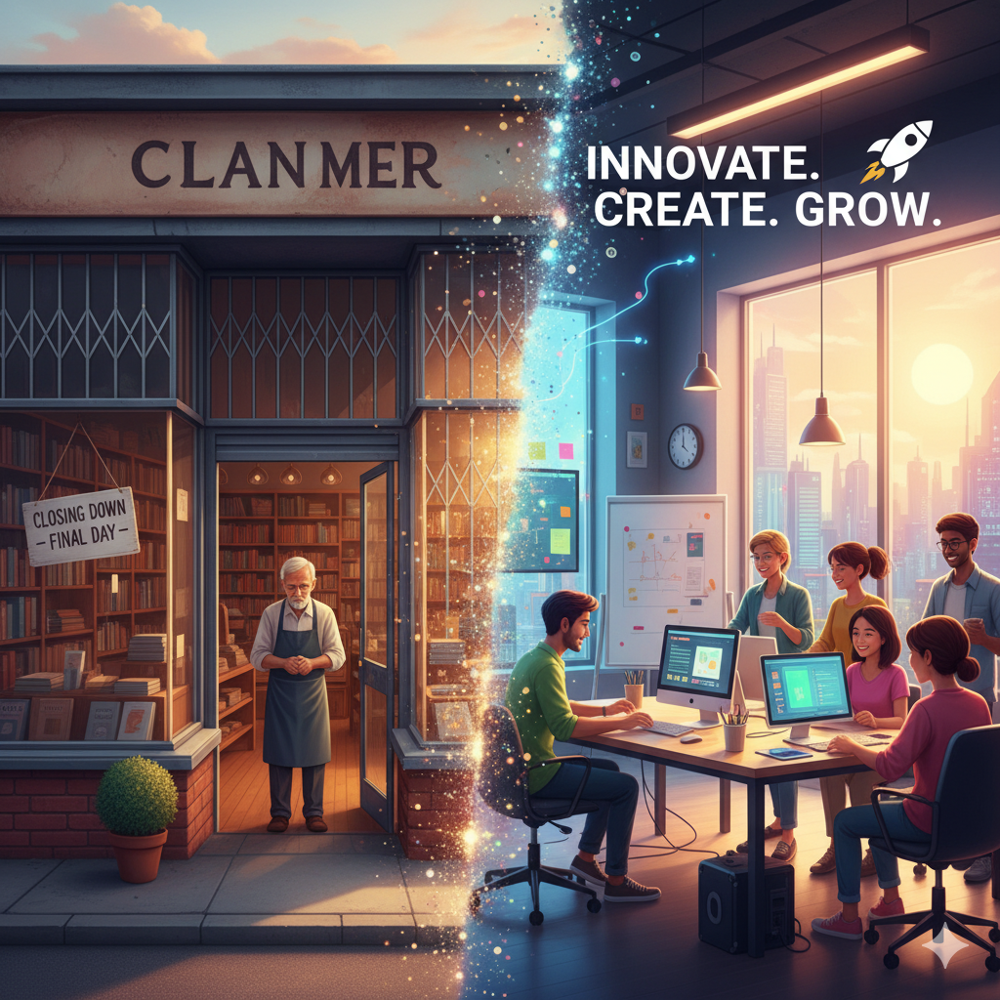
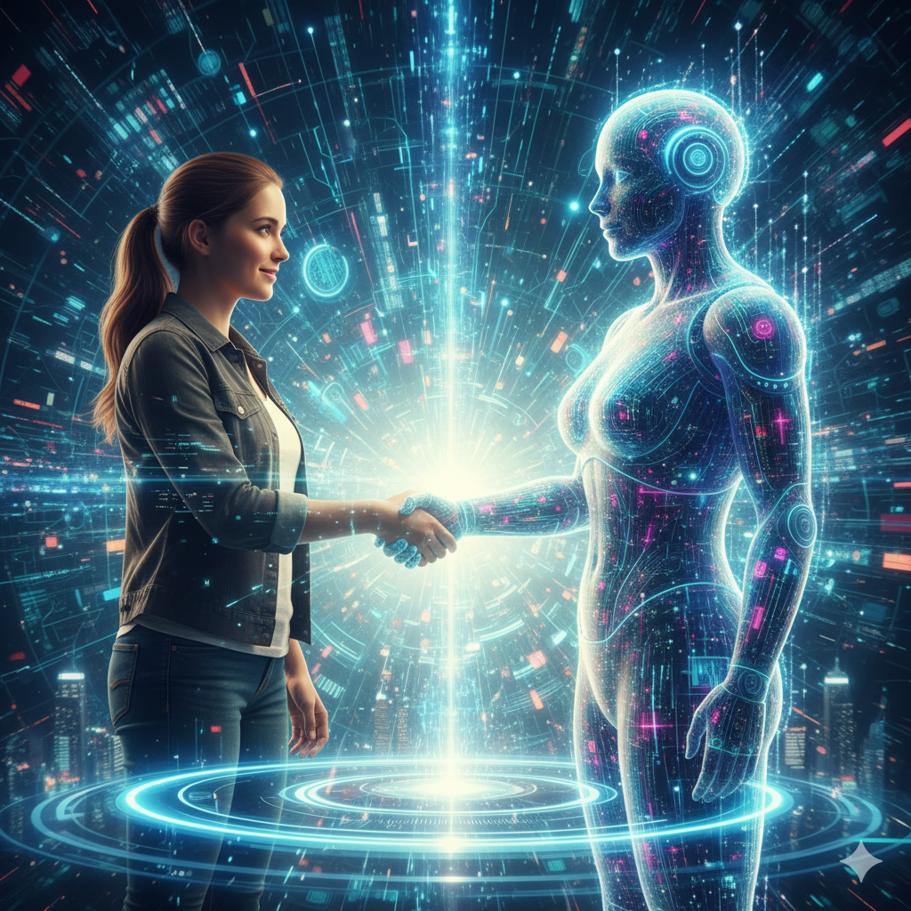
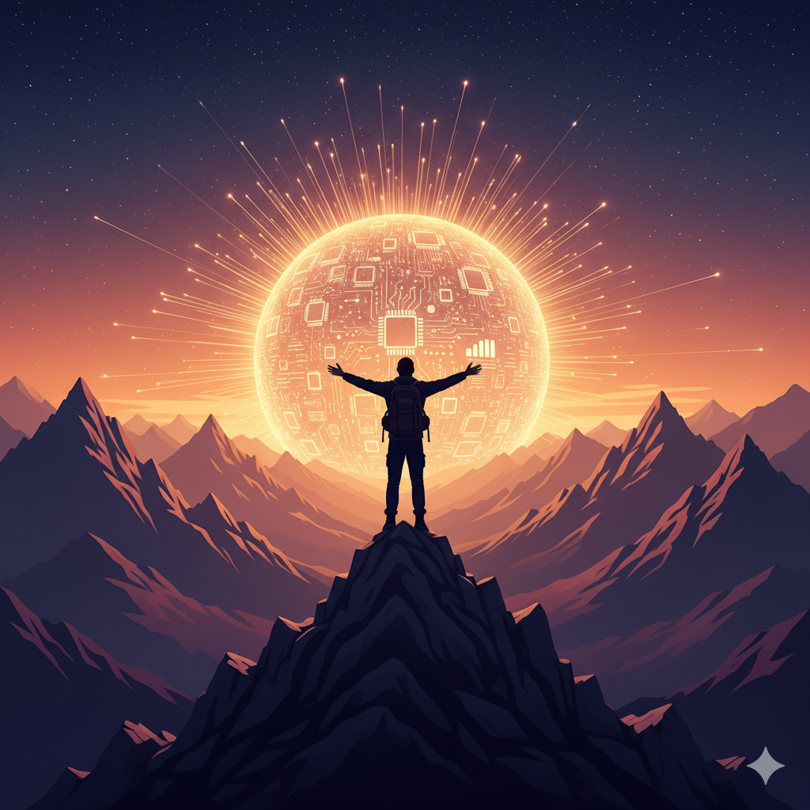

+++
title = "SỰ BẤT BIẾN TRONG THAY ĐỔI"
author = ["Chop Tr (chop.dev)"]
summary = "Điều khiến ta sợ không phải là công nghệ — mà là chính nỗi nghi ngờ bản thân mình"
date = 2025-10-21T00:00:00+07:00
tags = ["inspiration", "ai", "change", "inevitable", "no pain no gain"]
draft = false
+++

## Slides

[Slides](/slides/inspiration--change-is-inevitable/)

##

> Điều khiến ta sợ không phải là công nghệ — mà là chính nỗi nghi ngờ bản thân mình

_(Khoảng 5 phút – bài nói truyền cảm hứng cho kỹ sư)_

---

## Thay đổi luôn xuất hiện

Cứ vài năm lại có một làn sóng công nghệ mới xuất hiện —
và câu hỏi quen thuộc lại vang lên:
**“Cái này có thay thế mình không?”**

Ngày xưa khi internet ra đời, người ta hỏi như vậy.
Khi smartphone bùng nổ, lại hỏi như vậy.
Khi điện toán đám mây, tự động hóa xuất hiện — cũng vậy.
Và bây giờ, là thời đại trí tuệ nhân tạo.

Nhưng nếu thành thật, chúng ta không thực sự sợ công nghệ.
**Thứ ta sợ… là chính mình** — sợ rằng mình không theo kịp,
sợ rằng thế giới chạy quá nhanh và mình sẽ bị bỏ lại phía sau.

Nỗi sợ thật sự không nằm trong dòng code —
mà nằm trong niềm tin bản thân.

---

## Chu kỳ của thay đổi

Chuyện này không mới.
Mỗi thế hệ kỹ sư đều đã trải qua cảm giác này.

- Khi internet thay đổi cách kinh doanh, có người hoảng sợ — nghĩ rằng bán hàng sẽ chết. Nhưng có người học marketing online, thương mại điện tử và tạo ra cả một nền kinh tế mới.
- Khi mua sắm trực tuyến ra đời, các cửa hàng truyền thống tưởng như sụp đổ. Nhưng những ai biết thích nghi đã trở thành người dẫn đầu.

**Mọi cuộc cách mạng công nghệ đều bắt đầu bằng nỗi sợ,
và kết thúc với những người dám học điều mới.**

> Công nghệ chưa bao giờ là kẻ thù —
> nó chỉ là lời mời gọi để ta trưởng thành hơn, học nhiều hơn, và làm lại từ đầu.

---

## Bản chất thật của người kỹ sư

Chúng ta thường nghĩ công việc của mình là viết code, thiết kế hệ thống, sửa bug.
Nhưng đó không phải công việc thật sự.

**Công việc thật sự của kỹ sư là không ngừng học hỏi.**

Ngôn ngữ lập trình sẽ thay đổi.
Frameworks sẽ thay đổi.
Công cụ, nền tảng — tất cả đều thay đổi.

Nhưng luôn có một thứ không bao giờ thay đổi:
_Tinh thần sẵn sàng nhìn vào điều mình chưa biết và nói:
“Cái này tôi chưa biết… nhưng tôi sẽ học.”_

Đó mới là điều làm nên một kỹ sư thực thụ.

Nó giống như leo lên một ngọn núi ngày càng cao: Nếu ta dừng lại, sẽ tụt lại phía sau.
Nhưng mỗi bước đi, mỗi điều ta học thêm sẽ cho ta một tầm nhìn mới về thế giới.

---

## Nhìn lại AI

Vậy còn trí tuệ nhân tạo thì sao?

**AI không đến để thay thế chúng ta — AI đến để thử thách chúng ta.**
Nó như một tấm gương hỏi ta:
“Bạn có sẵn sàng học lại từ đầu không?”

Những kỹ sư thành công trong thời đại này
không phải là người biết hết mọi thứ,
mà là người không ngừng tò mò.

> Họ dùng AI như một người đồng đội,
> một công cụ giúp họ tiến nhanh hơn, thử nghiệm nhanh hơn, rút ra kinh nghiệm nhanh hơn —
> và sáng tạo nhiều hơn.

AI không làm ta yếu đi — nó giúp ta tự do hơn để sáng tạo.

---

## Điều bất biến trong thay đổi

**Điều không bao giờ thay đổi trong dòng chảy công nghệ
không phải là ngôn ngữ, không phải là framework, mà là con người.**

Là chính bạn.
Là tư duy, bản lĩnh, ý chí học hỏi của bạn.

> Đừng sợ công nghệ.
> Hãy sợ việc đứng yên một chỗ.
> Bởi thử thách thật sự của kỹ sư không nằm ở việc biết bao nhiêu,
> mà là bạn có dám học tiếp khi mọi thứ thay đổi hay không.

Chúng ta đã vượt qua nhiều lần rồi.
Và lần này — chúng ta sẽ làm được nữa.

**Vì tìm tòi học hỏi… chính là điều mà kỹ sư làm giỏi nhất.**

---

### 🎙️ Gợi ý khi nói

- Mở đầu nhẹ, chậm và gần gũi, giọng chân thành.
- Tăng nhịp, tăng cảm xúc khi nói đến phần “sợ không theo kịp”, rồi dần mạnh mẽ ở phần kết.
- Có thể nhấn giọng ở các câu ngắn:
    > “Đừng sợ công nghệ. Hãy sợ việc đứng yên một chỗ.”
- Kết bằng nụ cười và ánh nhìn tự tin:
    > “Vì tìm tòi học hỏi… chính là điều mà kỹ sư làm giỏi nhất.”
