+++
title = "Tech Share: Introduction Quantum Computer"
author = ["Chop Tr (chop.dev)"]
summary = "A tech sharing session in LINE Corporation for Front-End Team about Quantum Computer."
date = 2025-11-20T00:00:00+07:00
tags = ["line", "tech share", "quantum", "computer"]
draft = false
+++

## Slides

[Slides](/slides/tech-share--quantum-computer/)

Hi everyone, I'm Quang from the FE Dev 1 team at LINE Corporation. Welcome to
today’s talk.

Today, I would like to talk about **quantum computers**.

A bit of personal sharing first: I'm a software developer, but I've always been
very interested in physics. If I hadn't been so bad at math, I probably would
have chosen physics as my major.

Luckily, in university I had a close friend who studied physics. We shared many
common interests and were both deeply fascinated by the subject. That curiosity
has stayed with me ever since.

Back to our main topic. As you know, physics contains many different fields—
just like software development has backend, frontend, DevOps, data engineering,
etc. In physics, there’s mechanics, electromagnetism, astrophysics, and many
more specialized areas, each with its own theories and experimental approaches.

Today, I’d like to share a bit about **quantum computing**, so we should start
with **quantum physics** (or quantum mechanics). Fun, right?

## Introduction to Quantum Physics

When you hear “Quantum Physics,” you probably think of something like this,
right?

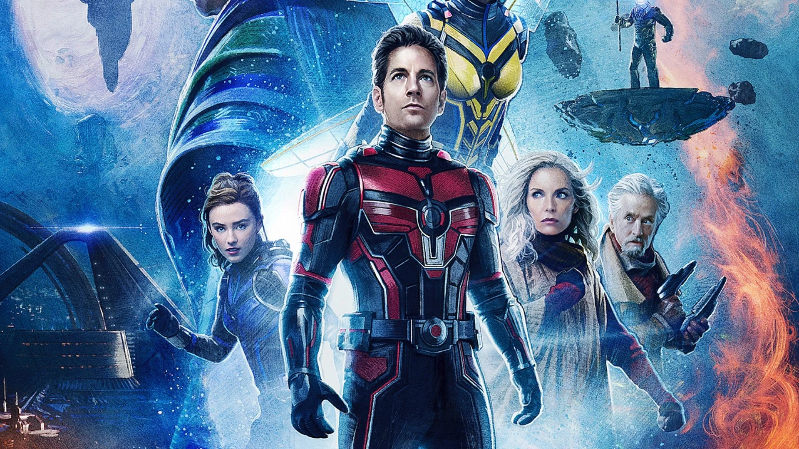

But the real world isn’t that romantic, filled with bright red, yellow, and
blue colors.

Let me show you a picture that’s a bit closer to reality.

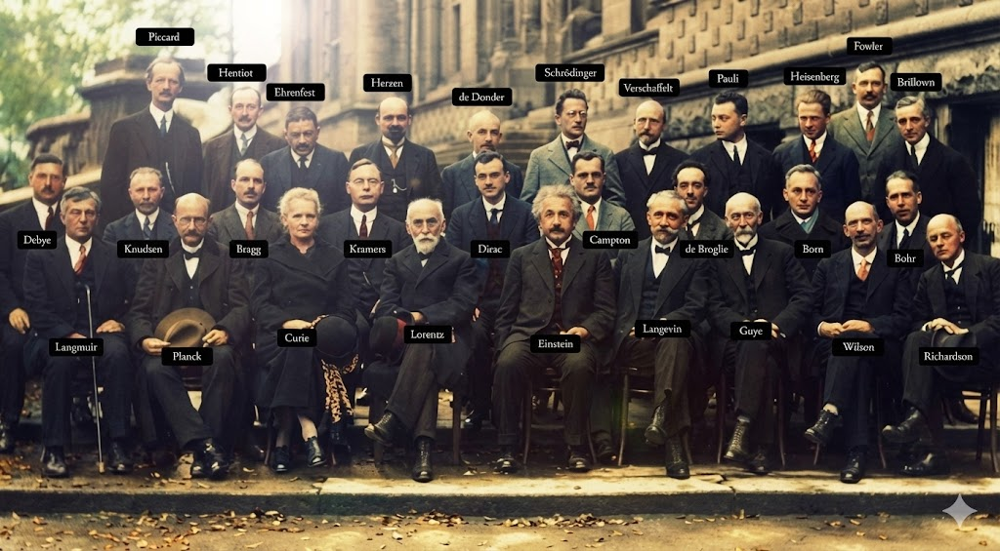

These are the scientists who laid the foundation for many of the technologies
we use today.

Let’s name a few of them. Among the most recognizable faces, you might spot
**Albert Einstein**, whose theories profoundly changed our understanding of the
universe, and **Marie Curie**, a pioneer in the study of radioactivity. Others
like **Max Planck**, **Niels Bohr**, and **Erwin Schrödinger** were
instrumental in developing the core principles of quantum mechanics, shifting
the entire paradigm of physics.

This photo was taken at the **Fifth Solvay International Conference on
Electrons and Photons**, held in October 1927 in Brussels, Belgium. This
gathering is widely considered a pivotal moment in the history of science, as
it brought together the greatest minds of the era to debate the newly emerging
quantum theory and its profound implications.

## The basic - Everything is exploring all possibilities all at once

(Even you are doing it right now.)

The **double-slit experiment** is a classic demonstration in quantum mechanics
that beautifully shows the wave–particle duality of matter and the
probabilistic nature of quantum behavior.

It famously reveals how particles behave like waves—interfering with
themselves—and then **collapse into definite particles** when observed.

Reference: [I did the double slit experiment at
home](https://www.youtube.com/watch?v=v_uBaBuarEM&t=77s)

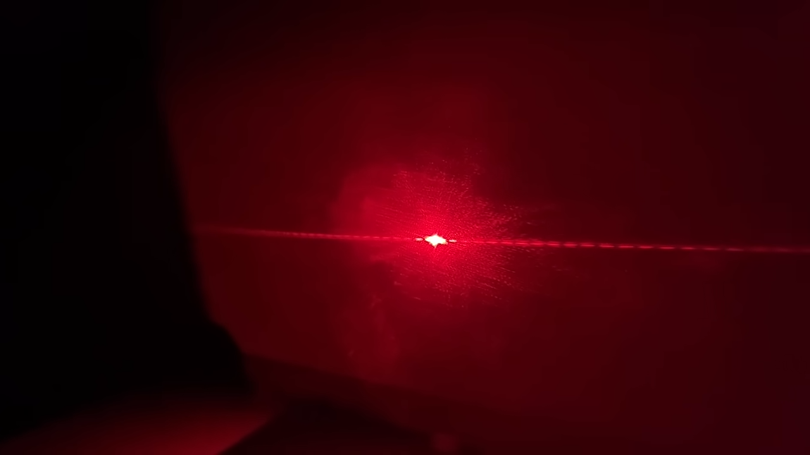
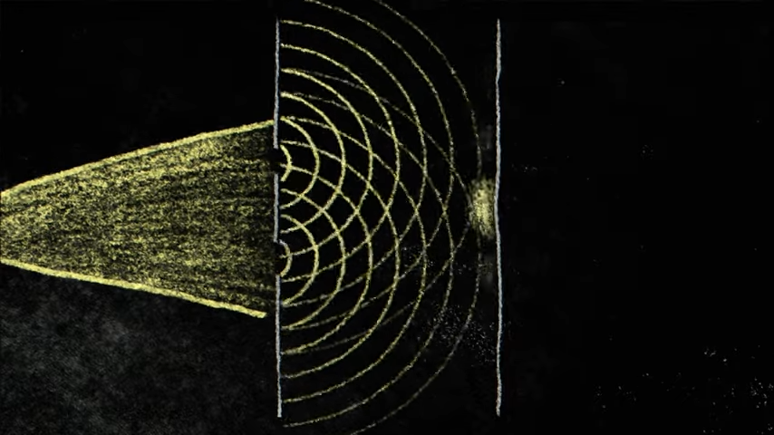
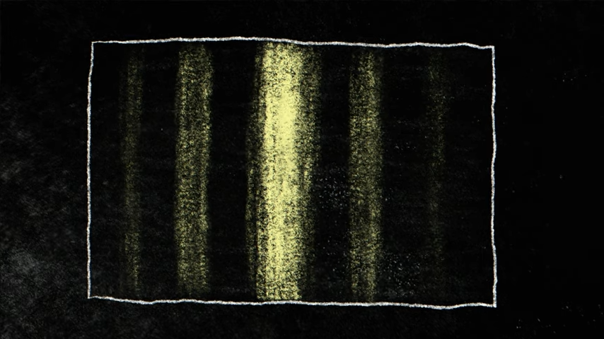

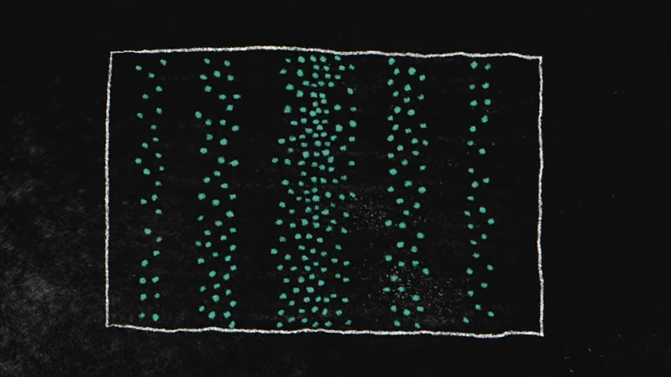

This experiment shows that particles—photons in this case—explore **all
possible paths** to reach the screen. Along the way, these paths interfere with
each other, creating an interference pattern even when the photons are sent
**one by one**.

This “single-particle interference” is especially mind-blowing. It suggests
that each photon, even when alone, explores all possible trajectories
simultaneously and effectively interferes with its **own** potential paths.

This is what creates the characteristic bright and dark fringes on the screen,
a pattern we normally associate with waves.

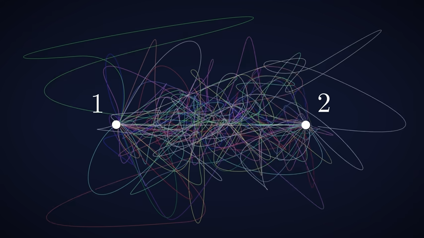

So now we understand that particles at the quantum level have this strange
property of exploring all possible paths **at the same time**.

How do we use that in computation?

We’ll think about that question shortly, but before diving into quantum
computers, I want to share two fascinating properties of quantum mechanics:
**superposition** and **entanglement**.

### Superposition

Superposition is one of the most surprising—and most important—concepts in
quantum mechanics. It states that a quantum object—like an electron, photon, or
atom—can exist in several states **at the same time** until it is measured.

In a normal computer, a bit can be either **0** or **1**. A quantum bit, or
**qubit**, can be **0**, **1**, or a combination of both 0 and 1 at once. It
isn’t just one _or_ the other; it can truly be both, each with a certain
probability.

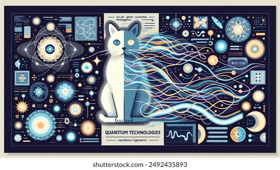

A famous thought experiment called **Schrödinger’s cat** helps illustrate this
idea. Imagine a cat in a sealed box with a device that has a 50% chance of
killing it. Until the box is opened, quantum theory says the cat is both
**alive and dead at the same time**.

Of course, real cats don’t behave this way—Schrödinger proposed this as a
paradox to show how strange quantum rules sound when applied to everyday
objects. But the idea reflects what actually happens with tiny particles in
superposition.

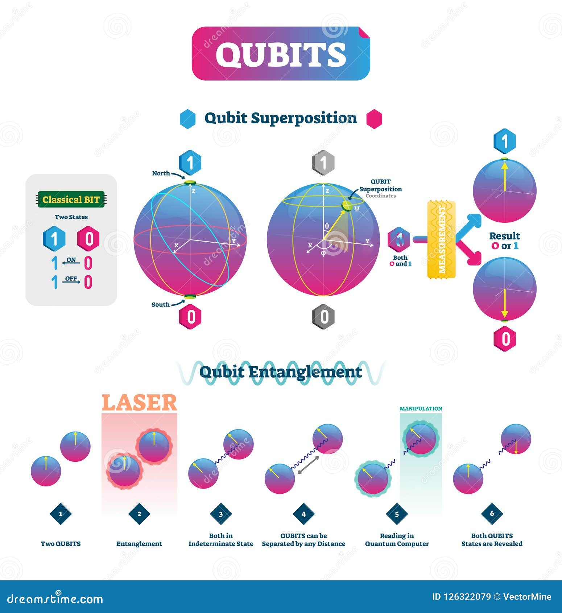

Another example is the double-slit experiment. A photon doesn’t just pass
through one slit or the other; in a sense, it goes through **both slits at
once** until we observe where it ends up.

This ability to exist in multiple states simultaneously is what enables quantum
computers to process enormous amounts of information in parallel.

### Entanglement

Entanglement is even stranger than superposition—but just as essential for
quantum computing.

Entanglement occurs when two or more quantum particles become so deeply
connected that their states are linked, no matter how far apart they are. If
you measure one entangled particle, you instantly know the state of the other
—even if they’re on opposite sides of the universe.

In a quantum computer, this means qubits can be “in sync” instantly—without
relying on electrical signals or physical communication the way classical
computers do. It’s not that qubits send messages faster than light; they
**cannot** be used to transmit information this way. Instead, they share a
correlation that classical bits simply cannot replicate.

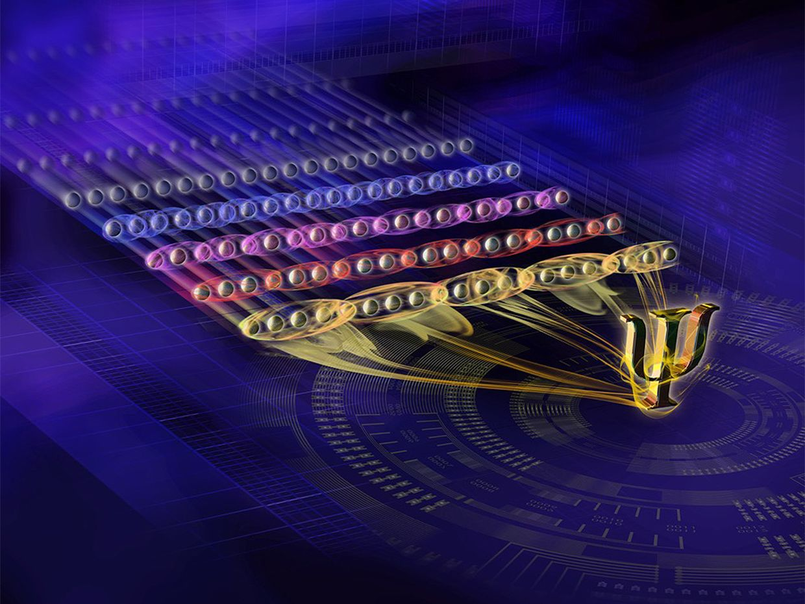

This unique connection allows groups of qubits to work together in powerful,
non-classical ways. Because their states depend on each other, a quantum
computer can perform complex operations that would be impossible with
independent classical bits.

This is one reason why some quantum algorithms can be exponentially faster,
especially for large search problems or simulations of complex physical
systems.

## Quantum computer

Okay, so we now have a good understanding of superposition and entanglement.
We’re comfortable with the idea of qubits and how they behave, right?

Before we dive deeper into how quantum computers actually work, I want to share
an analogy that helps explain what quantum computers are really trying to
solve.

Think about **math**. Computers were created to help us solve mathematical
problems.

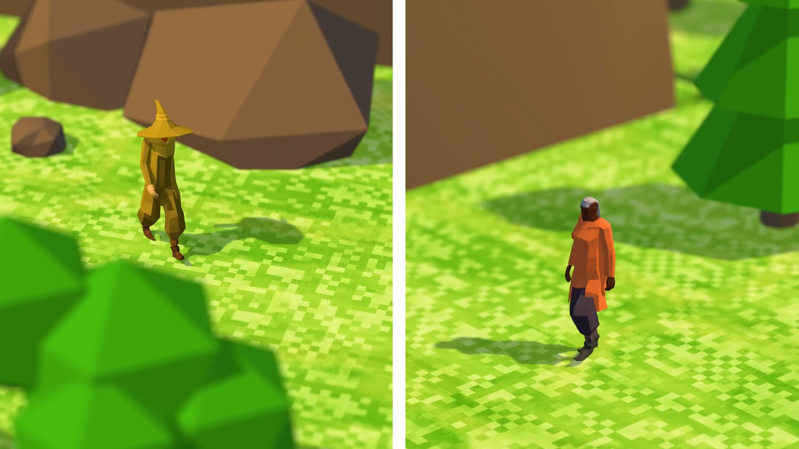

So imagine we’re in a video game world. At first, you have no computer—you only
have paper and a pen to calculate and solve problems. You move around the “math
map” like walking.

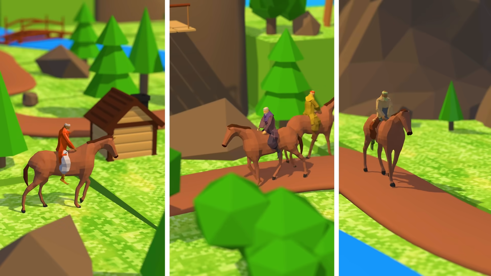

Then you get a horse, which is like a calculator. It helps you do harder
calculations—addition, multiplication, and so on—much faster.

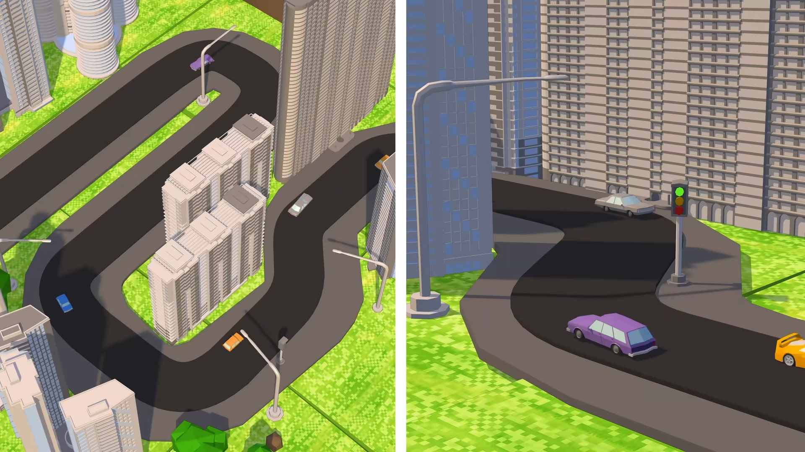

Next, you upgrade to a computer, which is like having a car. It’s fast, and
over time we’ve made it even faster. We've built infrastructure and created
entire cities on our “math map.”

But there are still areas we know exist but cannot explore yet—the vast water
beyond our mathematical cities.

To explore those regions, we need boats.

Quantum computers are, in this analogy, **boats**.

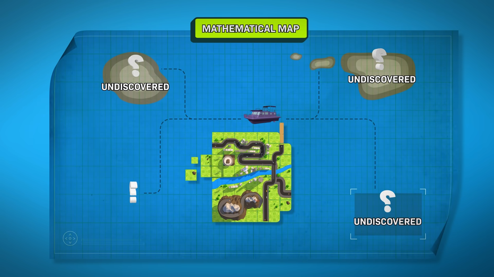

They let us explore areas that classical computers simply **cannot reach**.
They are not meant to replace classical computers—in fact, they **cannot** do
your spreadsheets or run your web browser.

Instead, quantum computers are designed for problems that are fundamentally
impossible, or would take an impossibly long time, for even the most powerful
classical supercomputers.

These are the deep, complex waters where traditional computing breaks down. For
example:

- simulating the interactions of molecules for **drug discovery**
- designing **new materials** with novel properties
- solving certain **optimization** or **search** problems efficiently

These frontiers are where quantum “boats” excel, opening entirely new
possibilities in science and technology.

## The State of Quantum Computing Today (2025)

Alright, so we know _what_ quantum computers are trying to do. But you might be
wondering:

### Where are we today? Are quantum computers real or still sci-fi?

Great question. Let's talk about that.

Over the past decade, quantum computing has moved from something only
physicists talked about in chalk-filled classrooms to something tech companies
are actually building, testing, and putting online for developers to use.

Let me walk you through the current landscape.

### The Big Players

Right now, several major companies are leading the charge in quantum computing.
Each of them is taking a different approach—like different boat designs trying
to explore the same ocean.

#### IBM

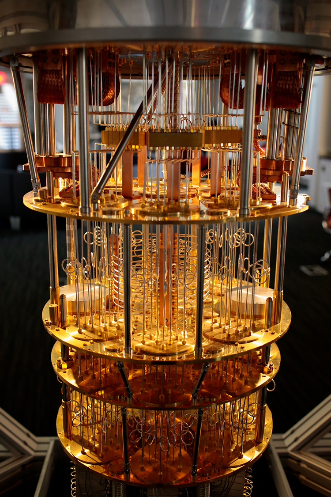

IBM is probably the most public-facing company in this space. They release a
**quantum roadmap** every year, and they've built systems with over **1,000+
physical qubits**.

Their flagship system looks like this sci-fi chandelier made of gold. You might
have seen it on social media — it looks like a boss level in Elden Ring.

IBM also provides cloud access to their quantum machines. So yes, you can
literally run quantum code from your laptop today.

#### Google

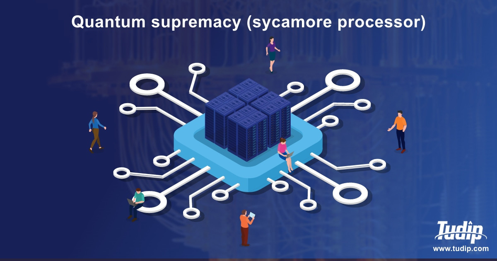

Google announced **“quantum supremacy"** in 2019 — where their quantum computer
solved a problem no classical supercomputer could. (Well… a problem that nobody
actually needed solved, but hey, it was still impressive.)

They're pushing hard on superconducting qubits and have shown progress in error
correction, which is one of the biggest challenges.

#### IonQ & Other Startups

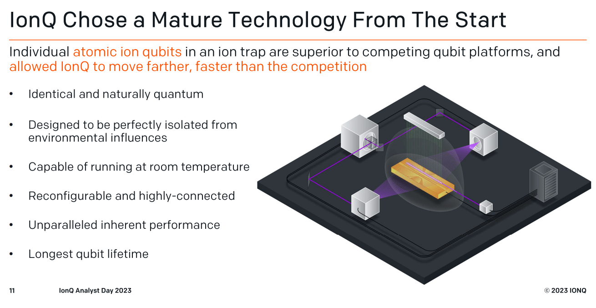

IonQ uses a completely different technology: **trapped ions**. Instead of tiny
electrical circuits, they trap individual atoms with lasers.

The cool thing about trapped ions is that they have very long coherence times —
meaning the qubits “stay quantum" longer before noise messes them up.

#### There are others too

- **Rigetti** – superconducting
- **D-Wave** – specializes in annealing quantum computers
- **PsiQuantum** – pushing photonic quantum chips

Each group is exploring the ocean with a different boat design.

## Where We Actually Are (Hint: Still Early)

Now, here's the honest part. Quantum computers **work**, but they're still
extremely limited.

Most current machines fall into what researchers call the **NISQ era**:

### NISQ = Noisy Intermediate-Scale Quantum

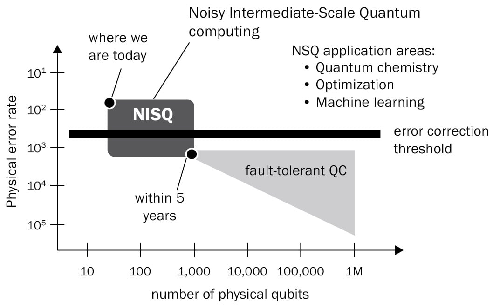

This means:

- We have dozens to hundreds of qubits
- But they're **noisy**, unstable, and error-prone
- And we cannot yet run long or complex algorithms

It's kind of like having early steam engines — they work, but they break down
if you run them too long.

Current quantum computers are mainly used for:

- research
- algorithm development
- experiments
- small simulations

Not real-world industrial applications… _yet_.

## The Challenges

### Error Correction

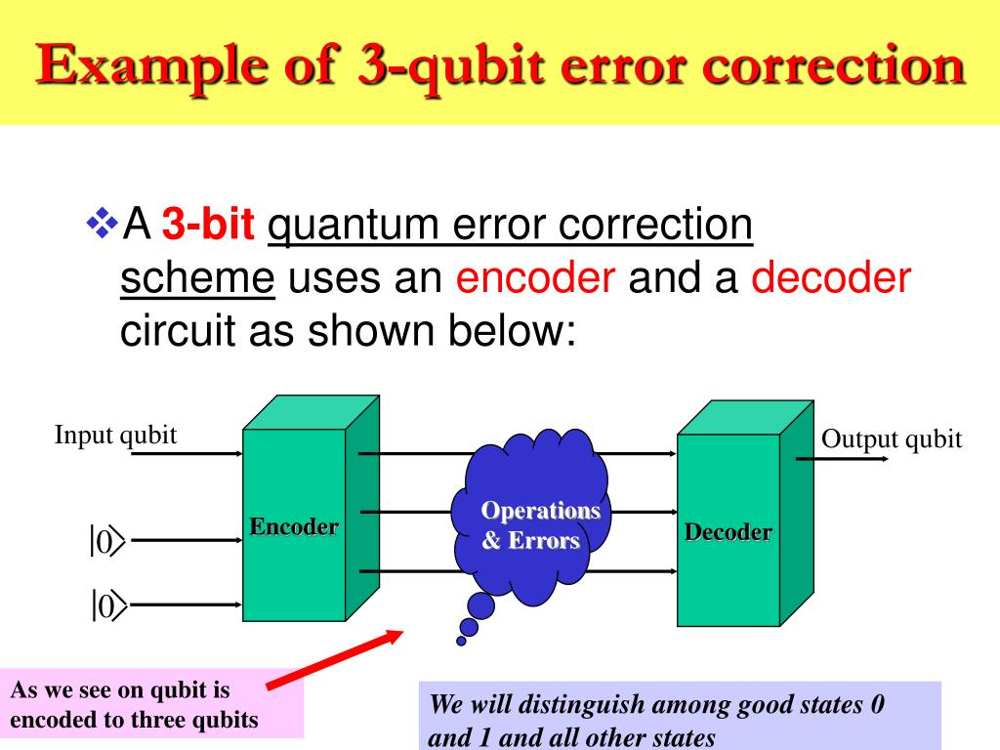

Quantum bits are extremely fragile.

Remember how a qubit can be 0 and 1 at the same time? Well… the universe
**hates** that. Everything—heat, vibration, electromagnetic noise, even cosmic
rays—tries to destroy that delicate superposition.

That’s why **error correction** is one of the biggest challenges in quantum
computing.

Right now:

- **1 logical qubit** (a reliable, error-corrected qubit)
- requires **hundreds to thousands of physical qubits**

Every major company is racing to solve this problem.

### Programming Quantum Computers

So far, we've talked about how quantum computers are powerful but fragile. But
even if someone magically solved all the hardware problems—coherence, noise,
and error correction—we would still have another **huge challenge**:

#### How do we actually program these things?

Programming a quantum computer isn’t like writing JavaScript, Swift, or Python.
It’s more like programming in the 1950s… plus needing a PhD.

Let me explain.

#### A Completely Different Way of Thinking

When we write traditional programs, we think in terms of:

- variables
- loops
- conditions
- functions

We give the computer a sequence of deterministic instructions.

Quantum programming requires thinking in terms of:

- **state vectors**
- **probability amplitudes**
- **unitary gates**
- **superposition**
- **entanglement**
- **interference**

You don’t tell the computer “do this, then that.” Instead, you design how a
**quantum state evolves** through gates and probabilities.

It’s like the difference between:

- **driving a car** (classical computing)
- **surfing waves** (quantum computing), where you guide how the water shapes
  your motion

#### Quantum Algorithms Work Differently

Most classical algorithms cannot be converted into quantum algorithms.

Quantum algorithms rely on strange, non-classical tricks:

- **Grover’s algorithm** — amplitude amplification
- **Shor’s algorithm** — periodicity in superposition
- **Quantum simulation algorithms** — modeling physical systems directly

It’s like learning an entirely new genre of programming.

#### A Very Small Talent Pool

Right now, the people who can write serious quantum programs are mostly:

- physicists
- mathematicians
- quantum information theorists
- a small number of specialized software engineers

## Closing Thoughts

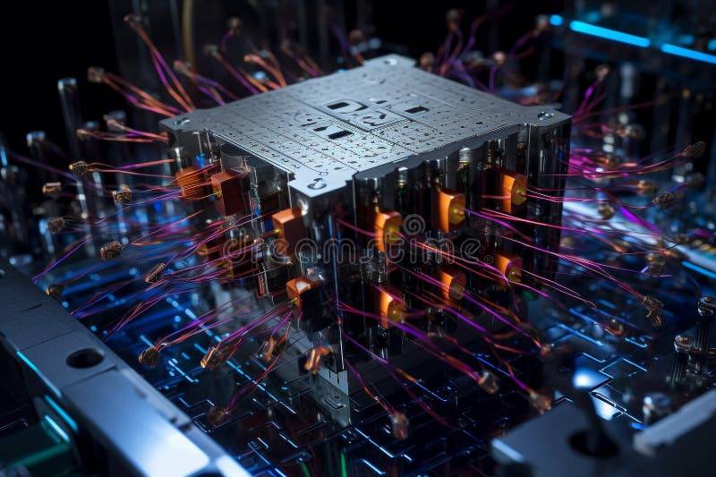

To wrap things up:

Quantum computers won’t replace your laptop or make your browser run faster—
but they **will** let us explore problems that classical computers simply
cannot reach.

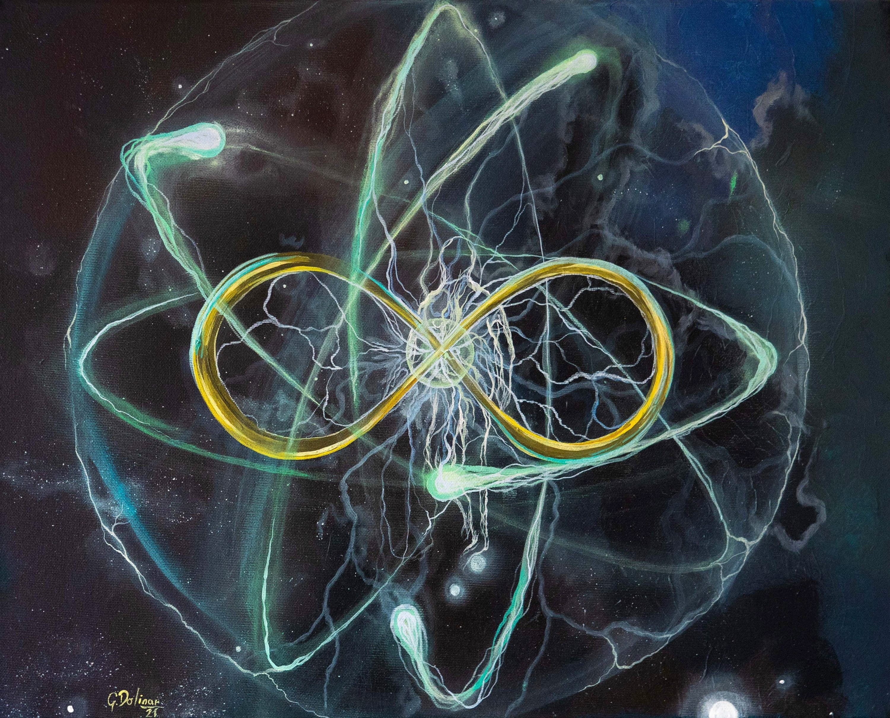

Today’s quantum machines are still noisy, limited, and difficult to program.
But so were the first classical computers. And just like back then, we are
standing at the beginning of a new frontier.

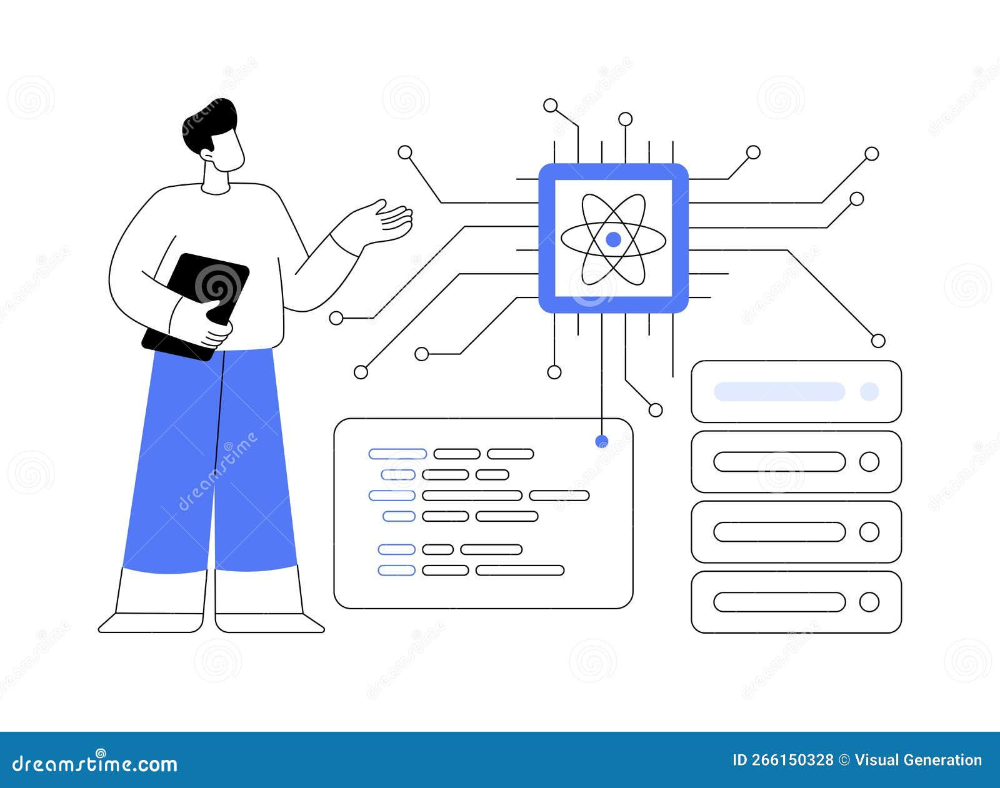

Quantum computing will require new tools, new algorithms, and—most importantly—
**new developers** who can think in this completely different way.

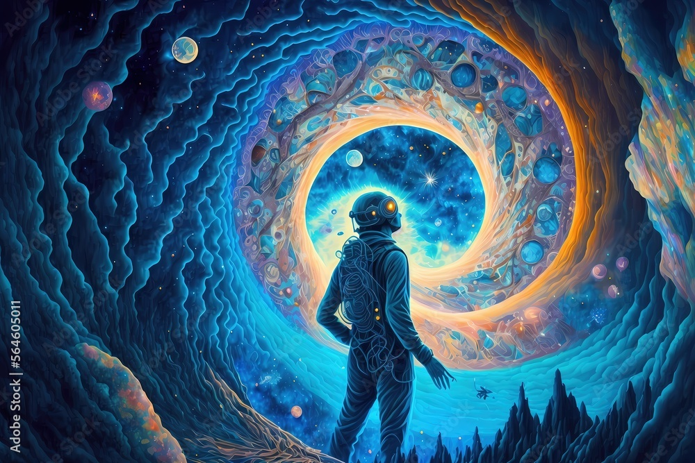

And who knows—if this talk sparked your interest, I hope that some of you will
help shape that future.

**Thank you for listening!**
