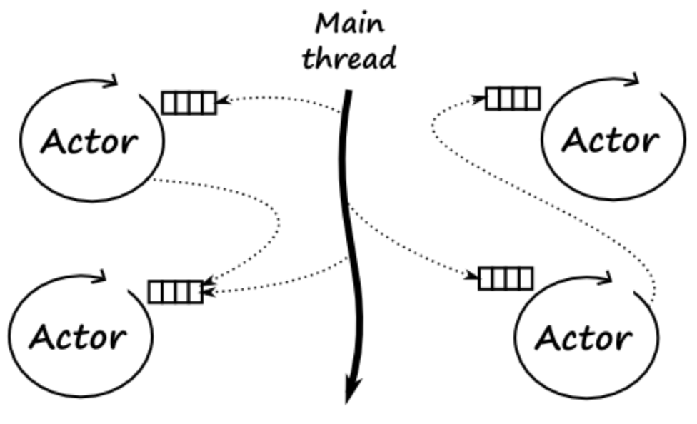

+++
title = "Tech Share: Elixir: A Paradigm Shift for Modern Web Development"
author = ["Chop Tr (chop.dev)"]
summary = "This talk introduces Elixir, a modern programming language designed for building scalable, real-time, and fault-tolerant web applications."
date = 2025-09-22T00:00:00+07:00
tags = ["elixir", "programming", "language", "liveview", "phoenix", "phoenix liveview"]
draft = false
+++

## Slides

TBD

## Introduction: Why Elixir?

Hello everyone! Before we dive in, let me ask: What programming languages do you use?

Maybe you spend lots of time with JavaScript, Typescript right? How about Python, Golang or Rust? How about Haskell, OCaml, or Scala :)?

Today, I'm excited to introduce you to Elixir—a language designed to make building web applications both delightful and powerful. Elixir opens the door to a world where your apps can effortlessly scale to millions of users, run reliably in real time, and remain easy to maintain as your team grows.

You might be wondering: is Elixir just a niche language, or is it battle-tested in the real world? In fact, some of the biggest names in tech rely on Elixir and its ecosystem to power critical parts of their infrastructure. For example, Discord uses Elixir to handle its massive real-time chat system, supporting millions of concurrent users with extremely low latency. Pinterest turned to Elixir to help scale parts of its notification system, sending billions of messages reliably. Even PepsiCo leverages Elixir for building scalable, distributed backends. These companies chose Elixir because it thrives under heavy load, with high concurrency and demanding real-time requirements.

What sets Elixir apart? It's built with functional programming at its core, helping you write clean, concise code that's a joy to work with. It thrives under high concurrency, making it a natural fit for features like chat, live notifications, and collaborative tools—things that feel magical to your users.

Plus, with tools like Phoenix LiveView, Elixir offers a smooth and productive developer experience, enabling rapid development of interactive web applications without the usual complexity.

In talk, I'll walk you through:

- How Elixir's functional approach leads to clearer, safer code,
- How its concurrency model makes real-time and scalable features simple,
- And how the Elixir ecosystem, including Phoenix LiveView, empowers you to build modern apps with confidence.

Let's dive in and discover together what makes Elixir such a compelling choice for developers today!

## The Functional Core

Let's start with what makes Elixir really different from languages you might already know: Elixir is a functional programming language. If you usually work with JavaScript, Python, Java, or Ruby, you might be used to writing code in an object-oriented or imperative style. Functional programming is another way to think about and organize your code.

So, what does "functional" mean? In Elixir, you focus on writing small, simple functions that do one thing, and you try not to change data directly (we call this immutability). This makes your code more predictable and easier to test, because functions always give back the same result for the same input, with no hidden surprises.

Imperative programming is a programming paradigm that focuses on describing how a program operates. It involves writing sequences of commands for the computer to perform, detailing each step needed to achieve a desired outcome. This is in contrast to declarative programming, which focuses on what the outcome should be, rather than how to achieve it.

```js
function doubleNumbers(numbers) {
    for (let i = 0; i < numbers.length; i++) {
        numbers[i] = numbers[i] * 2; // Directly changing the original 'numbers' array!
    }

    return numbers;
}
```

In Elixir, we would use the `Enum.map` method to perform the same task:

```elixir
doubleNumbers = fn numbers ->
    Enum.map(numbers, &(&1 * 2)) # Return new array of doubled numbers
end
```

Let's look at another simple example to illustrate the declarative aspect of functional programming. Imagine you want to take a string, make it uppercase, and then split it into words.

**In an imperative style (almost like JavaScript or Python), it might look like this:**

```python
# Python
text = "hello world"
text = text.upper()
words = text.split()
```

You create variables, change them, and then call functions step by step.

**But in Elixir, with the pipe operator, it looks like this:**

```elixir
"hello world"
|> String.upcase()
|> String.split()
```

With the pipe, you pass the result from one function straight into the next, almost like an assembly line. This makes your code easier to read, especially as the steps become more complex.

Ok now you may think, what so great about these declarative styles?

**[Ask the audience:]**
_Let me ask you, do you know what are the two most difficult things in programming?_
**[Pause and let them think for a moment before continuing with the joke.]**

Well, they say the two hardest things are naming things and cache invalidation. Lucky for us, Elixir helps make code so clear, naming things just become a bit easier. By using the pipe operator, we can focus on the flow of data rather than reading the complexity of function nesting or convoluted naming conventions. This clarity is not only beneficial for us as developers but also for anyone else who might read or maintain our code in the future.

Another cool thing in Elixir is pattern matching. This lets you write functions that look for specific shapes in your data, instead of lots of messy if-else checks. As your projects grow, pattern matching makes your code shorter and your logic easier to follow.

```elixir
# Pattern matching with values
[head | tail] = [1, 2, 3]
# head is 1
# tail is [2, 3]

# Pattern matching in function definitions
defmodule Greeter do
  def greet({:ok, name}), do: "Hello, #{name}!"
  def greet(:error), do: "Oops, something went wrong."
end

Greeter.greet({:ok, "Alice"})  # returns "Hello, Alice!"
Greeter.greet(:error)          # returns "Oops, something went wrong."
```

Compared to other languages, this functional approach helps you avoid bugs that can happen when data changes in unexpected ways. It's a different way of thinking, but once you get used to it, your code can become much cleaner and more reliable.

## Concurrency & Fault Tolerance: The Erlang Advantage (JavaScript version)

Now, let's talk about what truly sets Elixir apart: its approach to handling many things at the same time (concurrency) and making sure your app keeps running smoothly, even when errors pop up (fault tolerance).

If you've built apps with JavaScript—especially Node.js—you've probably used asynchronous code, callbacks, or Promises to deal with multiple tasks running at once. Maybe you've wrestled with `async/await`, event loops, or even worker threads for heavier tasks. While this model works well for many use cases, as things get more complicated (think real-time features, heavy background processing), managing concurrency can still become tricky. You have to keep track of race conditions, shared state, and sometimes—when something crashes—tracking down bugs can be a real headache.

<video src="./javascript-eventloop.mp4" controls autoplay></video>

So how does Elixir do things differently?

Elixir is built on the Erlang VM (BEAM), which uses something called the Actor model. Imagine that instead of writing code that shares memory, you create thousands or even millions of lightweight processes (think of them as "mini-programs"). Each of these processes is isolated—they don’t share data or state. If they need to talk to each other, they send messages, much like JavaScript's `postMessage` when communicating between web workers, but on a much grander scale.


Here’s the cool part: if one of these Elixir processes fails (maybe it crashes or hits an unexpected error), it doesn’t bring down your whole app. Supervisors (special processes) will automatically restart failed processes, keeping your app resilient. In Node.js, an unhandled error in an async function might crash your server or leave it in a weird state; with Elixir, the system is built from the ground up to expect failures and recover from them automatically.

To recap, with Elixir’s concurrency model:

- Each process runs independently—no shared memory, no data races.
- Communication is done by sending messages (not sharing objects or state).
- Supervisors keep everything healthy by restarting only the parts that fail.
- Your app keeps running, even when individual tasks run into problems.

**What does this mean for you as a web developer coming from JavaScript?**

- Real-time features, WebSocket servers, background jobs, chat applications—these become much easier to build and reason about.
- Applications can scale to millions of users and handle massive workloads without special libraries or complicated threading logic.
- You spend less time worrying about crashes and weird bugs from shared state, and more time shipping features.

With Elixir and the BEAM, you get robust concurrency and self-healing fault tolerance out of the box, letting you focus on building what matters—instead of debugging strange async issues!

## Concurrency & Fault Tolerance: The Erlang Advantage (Go version)

Now, let's talk about something that really makes Elixir stand out: How it deals with running many things at the same time (concurrency) and keeping your app running even when something goes wrong (fault tolerance).

If you've ever tried to do a lot of tasks at once in languages like Java or Python, you know it can get complicated. You might worry about threads, locking, or scary bugs where two things try to change the same data at the same time. It's stressful, right?

**[Ask the audience:]**
_Has anyone here worked with Go's concurrency features, like goroutines and channels?_
_(Pause and let them think or answer.)_

Go uses something called the CSP model—Communicating Sequential Processes. In Go, you launch lots of goroutines (which are like lightweight threads), and they talk to each other using channels. It's powerful for running things in parallel, but you still need to be careful about sharing data and managing channels.


Elixir, instead, is based on something called the Actor model (inherited from Erlang and its BEAM virtual machine). Here, you run thousands or even millions of lightweight processes. Each process is totally separate—it doesn't share data with other processes. They only talk to each other by sending messages, not by sharing memory. This means you don't need to worry about weird bugs from two things changing the same data.



**Imagine this:**
Your application is like a big company. Each process is a worker handling one job—maybe messages, logins, emails, anything. If a worker messes up and crashes, no problem! There's a supervisor (another process) that notices and restarts it. This "let it crash" idea means your app can recover automatically from errors, instead of everything breaking at once.

Here's a simple picture:

- Processes work independently and only communicate by sending messages.
- If something fails, a supervisor restarts just that piece.
- The app keeps running, even if small parts fail sometimes.

So, while Go gives you nice tools to work with concurrency, you still have to think a lot about managing the communication channels and data sharing. In Elixir, the Actor model and supervisors make this much simpler and safer from the start.

**What does this mean for you?**

- You can build apps with real-time features, many users, or lots of background tasks.
- Your app is ready to handle failures and keep running, in production and in real life.

With Elixir (and BEAM), you get powerful concurrency and fault tolerance—without all the usual headaches—so you can focus more on building cool features!

## A Thriving Ecosystem for Productivity

Now, let's talk about another great thing about Elixir: its ecosystem. This just means all the helpful tools, libraries, and frameworks that make building apps easier and faster.

Do you remember when you first used something like Rails for Ruby, Laravel for PHP, Django for Python, or Nest.js for JavaScript? Suddenly, many hard web development tasks became much simpler. Elixir also has tools like these! The community constantly creates smart solutions to help you build APIs, real-time apps, or background tasks more productively.

Here are some of the best tools in the Elixir world:

### Phoenix Framework

Phoenix is Elixir's most popular web framework. You can think of it like Rails for Ruby, Laravel for PHP, or Nest.js for Node.js. But Phoenix is special because it uses Elixir's speed and safety to the fullest. With Phoenix, you can build very fast web applications that include real-time features right away. If you want a chat system or live notifications, Phoenix makes it easy.

**[At this point, introduce your Phoenix demo to show the framework in action.]**

### Phoenix LiveView

Have you ever wanted to build interactive web pages—like live updates, forms, or dashboards—without writing a lot of JavaScript? Phoenix LiveView does exactly that! It lets you create these features using mostly Elixir code. This means less JavaScript to write, and fewer bugs to fix.

**[Segue into a LiveView demo to show how real-time features work with little or no JavaScript.]**

[LiveView in production](https://www.wappalyzer.com/technologies/web-frameworks/phoenix-liveview/)

### Ecto

What about working with databases? Ecto is Elixir's tool for talking to databases. You can think of it like an ORM, but it works very well with Elixir's functional style. Ecto helps you write clear and safe database queries. It also makes sure your data is correct and clean before saving it, which makes your app more reliable.

In Elixir, macros are a powerful metaprogramming tool that allow you to inject code at compile time. In your Ecto example, macros make schema definitions more succinct, expressive, and eliminate repetitive boilerplate. Here’s how:

```elixir
defmodule MyApp.Accounts.User do
  use Ecto.Schema

  schema "users" do
    field :name, :string
    field :age,  :integer
  end
end
```

**How macros are useful in the Ecto example:**

- The use of `use Ecto.Schema` is actually invoking the `__using__/1` macro in the Ecto.Schema module. This macro automatically injects functions and imports necessary for schema management into your module (such as `schema/2`), so you don’t have to manually define them every time.
- When you write `schema "users" do ... end`, the `schema/2` macro from Ecto is called. This macro expands to code that handles mapping Elixir structs to database tables, defines fields and their types, and generates useful functions behind the scenes.

**Why this is valuable:**

- **Boilerplate Reduction:** You don't need to write all the database mapping logic or struct code by hand.
- **Code Clarity:** The macro DSL reads almost like plain English, and keeps your schema modules clean and expressive.
- **Extensibility:** You can inject your own domain-specific behaviors with custom macros.

Ref: [Nestjs Database](https://docs.nestjs.com/techniques/database)

### Ash Framework

Many software projects become hard to manage because the code mixes up business rules with how data is saved or shown. Ash Framework helps solve this by using "Domain Driven Design" (DDD). This is a way to build software where you focus on clearly defining your business ideas and rules. Their slogan is "Model your domain, derive the rest".

This approach makes building complex applications much faster. It also makes sure your app always follows your business rules. It removes a lot of manual, repetitive coding.

Remember how Elixir uses macros to make code clean and powerful? Ash uses this a lot. Ash take metaprogramming to another level "extend" the language itself to provide developer with many quality of life features, in ways that many other languages (like Python, JavaScript, or Java) can't easily do. This is why Ash is such a powerful and special tool in Elixir.

**[Then launch your Ash demo, showing its declarative style and macro magic.]**

Demo:

- Ash Resource and Domain
- Ash Admin
-

Ref: [Ash Framework](https://ash-hq.org/)

### Reactor

When building applications, managing complex, multi-step tasks across different services can be a significant challenge.

Reactor is an Elixir library that directly addresses this problem. It allows you to define intricate workflows with built-in mechanisms for fault tolerance and automatic compensation. If any step in a multi-stage process fails, Reactor can execute predefined compensation actions to undo previously completed steps, effectively rolling back the entire operation to a consistent state. This capability makes it much simpler to build resilient business processes and ensures data integrity, even in the face of distributed failures.

You may have work with this concept in saga pattern. Does any body know saga pattern?

Ref: [redux-saga](https://redux-saga.js.org/docs/recipes/#retrying-xhr-calls)

**[Transition to your Reactor demo to show orchestrating complex workflows and sagas.]**

### Broadway

(maybe skip this if don't have enough time)

Do you need to process lots of data from queues like Kafka or RabbitMQ? Broadway lets you build fast, multi-stage data pipelines, handling back-pressure and failures for you.

**[Wrap up with your Broadway demo, highlighting efficient and safe data processing from queues.]**

## Conclusion

Let's quickly review what we've seen:

- **Functional Core:** Elixir helps you write clean and predictable code, making your life easier and helping you avoid those mysterious bugs.
- **Concurrency & Fault Tolerance:** By running on the BEAM (Erlang VM), Elixir makes it simple and safe to handle lots of tasks at once—and to recover from errors automatically, so your app keeps running even when something goes wrong.
- **A Thriving Ecosystem:** From the Phoenix framework to LiveView, Ecto, Ash, Reactor, and Broadway, Elixir has powerful tools to help you build modern web applications with less effort and more fun.

I also have another take on the ecosystem of Elixir is very well prepare for the next wave of AI storm with many tools and technique to help developers speed up the development process. But with the time constraint I will leave it for another time.

Thank you all for listening.
