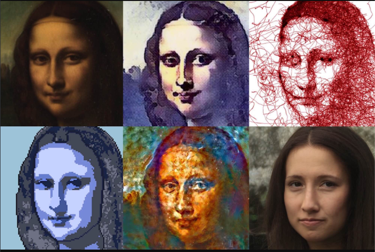
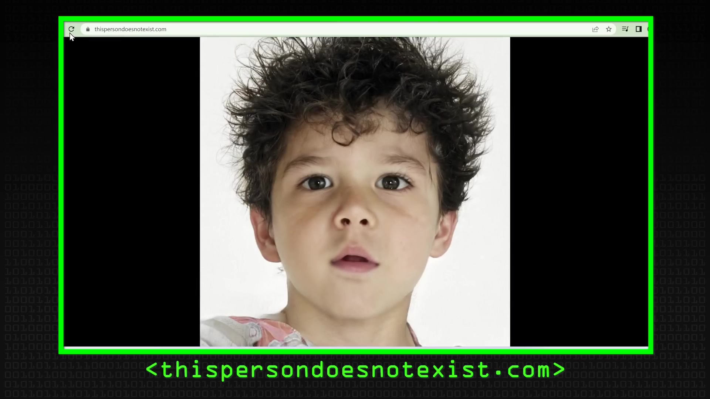
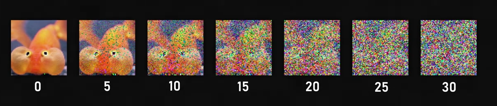
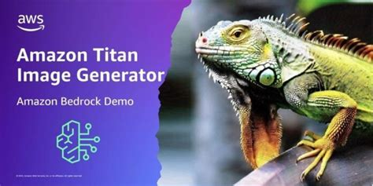
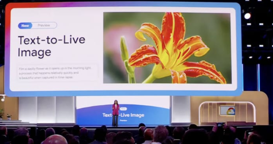
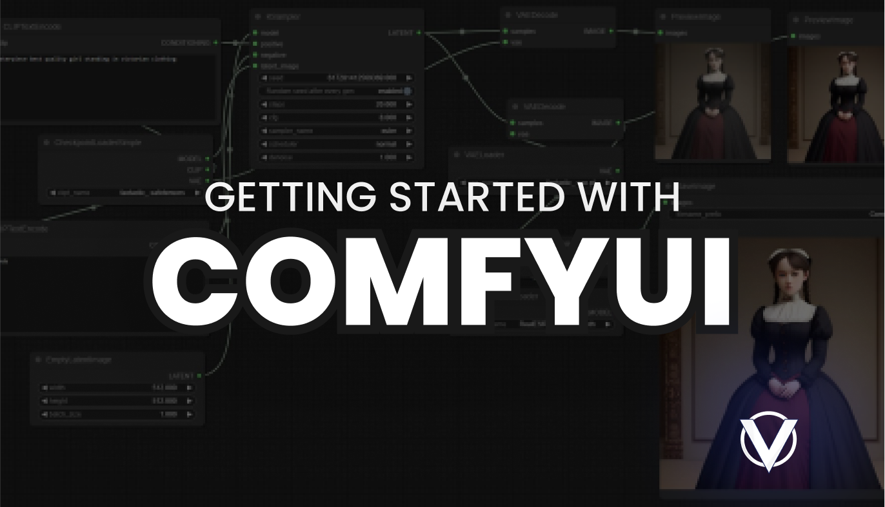
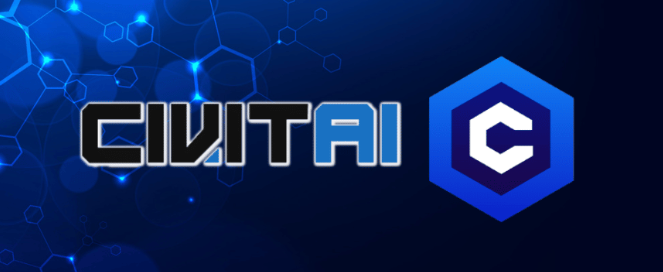

+++
title = "Tech Share: Using MediaPipe in Web Applications"
author = ["Chop Tr (chop.dev)"]
summary = "A tech sharing session in LINE Corporation for Front-End Team."
date = 2024-09-22T00:00:00+07:00
tags = ["media pipe", "tech share"]
draft = false
+++

Tech share: AI Image Generator

 <!-- .element: width="80%" -->

---

#### What are AI Image Generators?

Advanced software systems that use artificial intelligence to create images
from scratch or modify existing ones. Leverage powerful techniques like deep
learning and neural networks.

---

#### Significance in the Industry

-   Marketing
-   Entertainment
-   Design

---

#### Brief History and Evolution of AI Image Generators

---

#### Generative Adversarial Networks (GANs)

-   Groundbreaking

 <!-- .element: width="500" -->

StyleGANs by Nvidia, 2018

---

#### Generative Adversarial Networks (GANs)

BUT

-   Challenges: Mode collapse (limited image variations)

 <!-- .element: width="500" -->

---

#### Today: Stable Diffusion

-   Noise guessing mechanism: Easier to control and refine
-   Highly detailed and diverse image generation

 <!-- .element: width="100%" -->

---

#### Today: Stable Diffusion

<video data-autoplay src="./clip1.mov" ></video>

---

#### Diffusion Models (DALL-E 2, Stable Diffusion)

-   Gradual transformation of noise into coherent images
-   Detailed and diverse images with fewer artifacts

---

#### Transformer-based Models (CLIP)

-   Include natural language processing
-   Uses transformers to understand and generate images from text prompts
-   Integration of language and vision for creative AI applications

---

#### How to Use AI Image Generators

Two main approaches

-   Pre-built systems
-   Self-hosted solutions

Each has its own advantages and disadvantages.

---

#### Pre-built Systems (e.g., AWS Titan, GCP Imagen)

Pre-built systems are ready-made solutions provided by cloud service providers
like Amazon Web Services (AWS) and Google Cloud Platform (GCP).

 <!-- .element: width="40%" -->
 <!-- .element: width="40%" -->

---

#### Pre-built Systems (e.g., AWS Titan, GCP Imagen)

**Advantages:**

-   Ease of Use and Quick Deployment
-   High Scalability and Reliability
-   Integration with Other Cloud Services

---

#### Pre-built Systems (AWS Titan, GCP Imagen)

**Disadvantages:**

-   Cost Considerations and Potential for High Expenses
-   Limited Customization and Control
-   Dependency on Third-party Providers
-   Data Privacy and Security Concerns

---

#### Self-Hosted Image Generators

Self-hosted systems are those that you set up and manage on your own
infrastructure. This approach offers more control and flexibility.

 <!-- .element: width="40%" -->
 <!-- .element: width="40%" -->
 <!-- .element: width="40%" -->
 <!-- .element: width="40%" -->

---

#### Self-Hosted Image Generators

**Advantages:**

-   Full Control Over the System and Customization Options
-   Potentially Lower Long-term Costs
-   Data Privacy and Security
-   Ability to Optimize and Tailor the System to Specific Needs

---

#### Self-Hosted Image Generators

**Disadvantages:**

-   Requires Significant Technical Expertise and Resources
-   Maintenance and Updates are the User's Responsibility
-   Scalability Challenges
-   Initial Setup Can Be Time-consuming and Complex

---

#### Deploying an Image Generator Model Using ComfyUI

**Key Features and Benefits of ComfyUI:**

-   Ease of use and flexibility
-   Tailor the interface to specific needs
-   Seamless experience for deploying and managing AI image generation models

---

#### Demo

-   [ComfyUI](https://github.com/comfyanonymous/ComfyUI)
-   [Compute VM](https://console.cloud.google.com/compute)
-   [Workflow Share](https://openart.ai/workflows/home)
