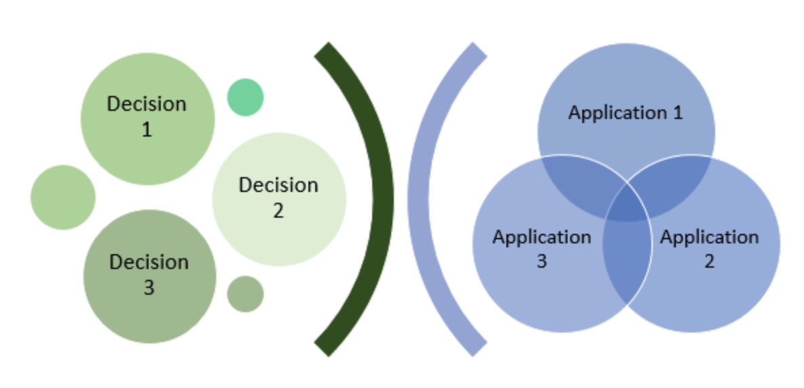
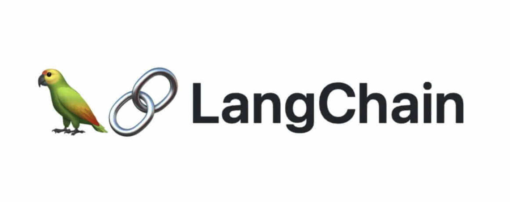
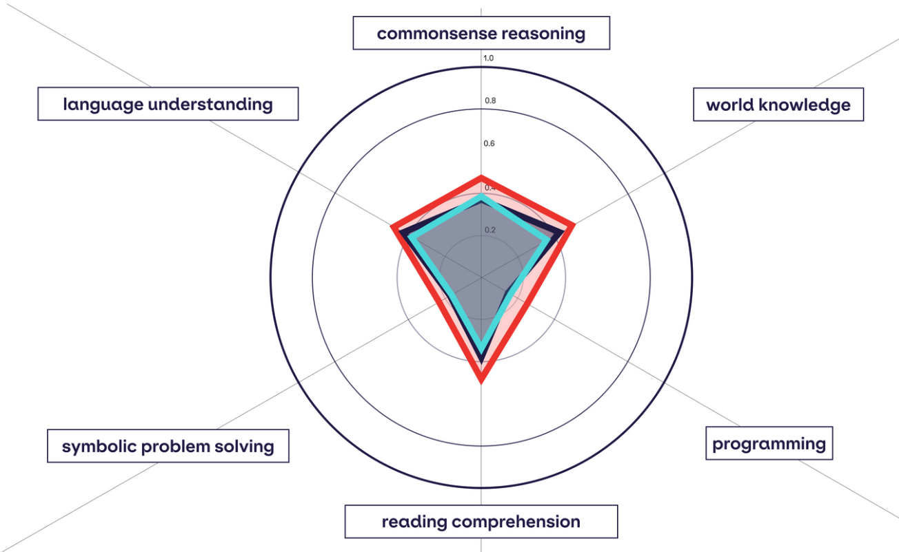
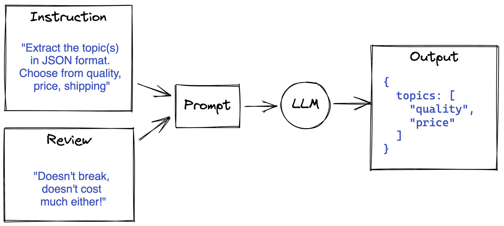
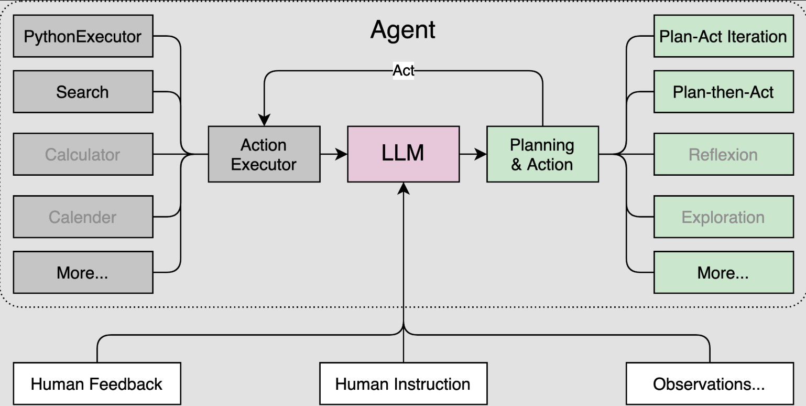
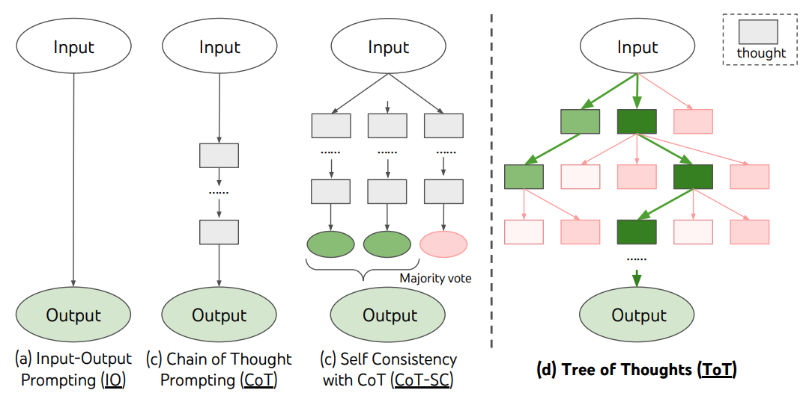
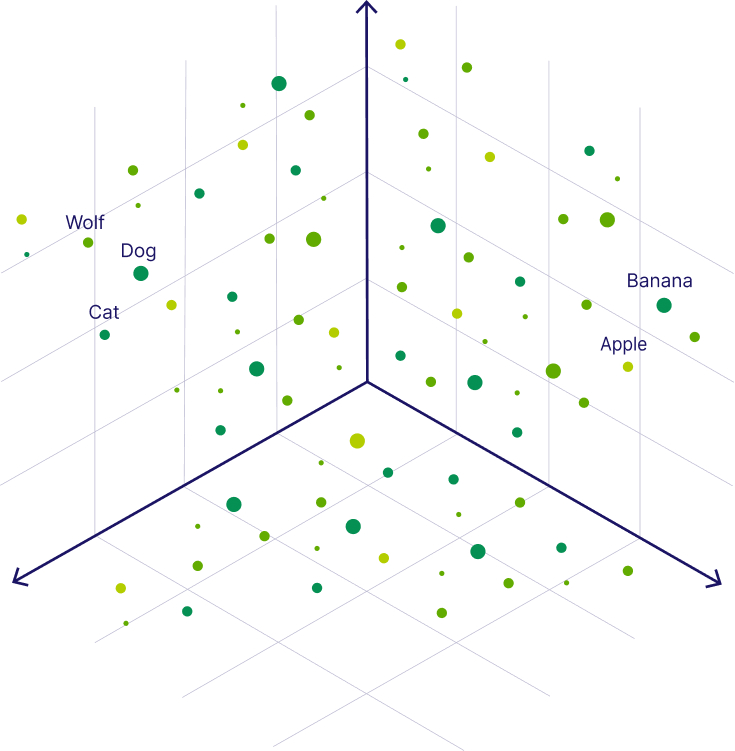
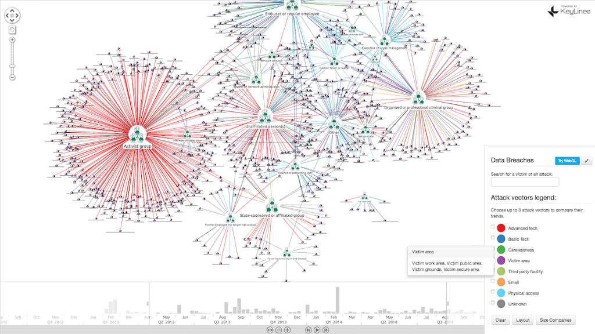
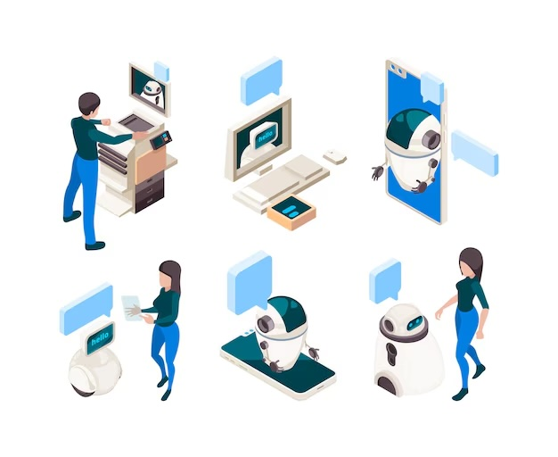

+++
title = "Tech Share: Genius AI Brain"
author = ["Chop Tr (chop.dev)"]
summary = "A tech sharing session in LINE Corporation for Genius AI team about the Brain service."
date = 2024-12-25T00:00:00+07:00
tags = ["ai", "genius ai project", "genius ai brain", "tech share"]
draft = false
+++

Tech Share: Genius AI Brain

 <!-- .element: width="80%" -->

---

### Introduction

- What is Brain Service?
- What are Large Language Model (LLMs) and how to use them?
- Development Plan for the Brain Service

---

#### What Brain Service?

- Focus is on domain experts.
- Enhance interaction with AI or LLMs to make improvement.

 <!-- .element: width="40%" -->
 <!-- .element: width="40%" -->

---

#### Brain Service requirements

- Requires easy maintenance.
- Strong support from the AI community.

=> Python and [Langchain](https://www.langchain.com/)

 <!-- .element: width="60%" -->

---

#### What Can We Expect from the Brain Service?

- Stateless Design (mostly)
- Experts easily changing the prompt and workflow
- AI response records and statistics

 <!-- .element: width="60%" -->

---

#### The Brain Service

- Dedicated platform for AI enhancement
- Streamline development
- Improves the accuracy and quality of AI output.
- Focus on collaboration with domain experts

 <!-- .element: width="40%" -->

---

### What are Large Language Models (LLMs)?

- Introduction to LLMs
- Prompting Strategy
- Database Integration

---

#### Introduction to LLMs

- Core function: understand and generate human-like text or code output
- Simple principle: text in, text out
- Multimodal capabilities: text, images, audio, video

 <!-- .element: width="80%" -->

---

#### Prompting Strategy

- Agents: autonomous entities performing tasks based on prompts

 <!-- .element: width="80%" -->

---

#### Prompting Strategy

- Chain of Thought: prompting model to explain reasoning step-by-step
- Tree of Thought: exploring multiple reasoning paths for solutions

 <!-- .element: width="80%" -->

---

#### Database Integration

- Enhancing LLM functionality with database integration
- Vector Databases: high-dimensional data handling for similarity search and recommendations
- Graph Databases: managing complex relationships for improved contextual understanding

 <!-- .element: width="40%" -->
 <!-- .element: width="40%" -->

---

#### Usages for the Project

- Prompting
    - Code Generation
    - Workflow Automation
    - Error Checking and Exploration

---

#### Usages for the Project

- Knowledge Base
    - Manage data and Retrieval Information
    - Question Answering
    - Self Auto Improve

---

### Development Plan Overview

- Outline the stages for developing the Brain Service
- Focus on how to improve AI and workflow

---

#### Stage One: Initial Workflow

- Domain Experts: QA team
    - Collaboration for insights and feedback
- Integration with [Landpress](https://landpress-content-v2.linecorp.com/projects/mmn2ni86hi6muysnargzn18t/content/collections/test_case_prompts/items) Content Service
    - Easy for changing the application settings and prompt improvement
- Observation Tool: [Langsmith](https://www.langchain.com/langsmith)
    - Monitoring and analyzing AI interactions

---

#### Stage Two: Quality Improvement

- Development of a framework for optimizing prompting strategies
    - Custom workflow for domain experts to manage the pipe line
- Creation of agent tools to automate tasks and improve AI's capabilities

---

#### Stage Three: RAG (Retrieval-Augmented Generation) System

- Implementation of a knowledge base using vector or graph databases
- Enhancement of data storage, retrieval, and contextual understanding
- Empowerment of AI to deliver accurate and insightful user responses

 <!-- .element: width="30%" -->

---

Thank you!
