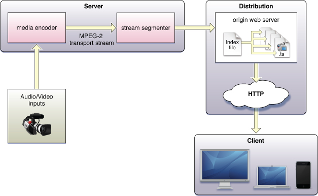

+++
title = "Tech Share: HLS (HTTP Live Streaming)"
author = ["Chop Tr (chop.dev)"]
summary = "A tech sharing session in LINE Corporation for Front-End Team about HLS"
date = 2025-04-22T00:00:00+07:00
tags = ["hls", "tech share"]
draft = false
+++

Introduction to HLS

 <!-- .element: width="450" -->

---

#### Why we need protocols for Streaming?

---

Traditional Blob Storage

---

Streaming

---

#### What is HTTP Live Streaming - HLS?

- Developed by <mark>Apple</mark> (2009) for iOS and QuickTime X
- Streaming over <mark>HTTP</mark> using MPEG-2 Transport Stream (.ts files)
- Improvement over traditional
    - RTSP and RTMP (Adobe Flash)
- Alternative
    - DASH (Dynamic Adaptive Streaming over HTTP)

Note:
HTTP Live Streaming (HLS) is a protocol developed by Apple to facilitate live streaming using HTTP. It addresses the high cost and issues associated with traditional streaming protocols like RTSP or RTMP.

---

#### Why we need protocols for Streaming?

- Adaptive Bitrate Streaming (ABS)
- Improves user experience on slow networks with seamless transitions
- Scalability for servers
- Cost savings

Note:

1. **Adaptive Bitrate Streaming (ABS):**

    - **Dynamic Quality Adjustment:** Protocols like HTTP Live Streaming (HLS) and Dynamic Adaptive Streaming over HTTP (DASH) enable ABS, which adjusts the video quality in real-time based on the viewer's internet connection. This ensures that users experience the best possible quality without buffering interruptions.
    - **Optimized Bandwidth Usage:** By dynamically altering the bitrate, ABS helps in utilizing the available bandwidth more efficiently, reducing the strain on network resources.

2. **Improved User Experience on Slow Networks:**

    - **Seamless Transitions:** Streaming protocols facilitate smooth transitions between different quality levels, ensuring that users on slower networks can still enjoy uninterrupted content without noticeable quality drops.
    - **Buffer Management:** Protocols help manage buffering effectively, minimizing playback delays and enhancing the viewing experience even under suboptimal network conditions.

3. **Scalability for Servers:**

    - **Efficient Resource Allocation:** Streaming protocols enable servers to handle a large number of concurrent users by efficiently distributing content. This scalability is crucial for handling peak loads, such as during live events.
    - **Load Balancing:** Protocols support load balancing techniques, distributing user requests across multiple servers, which helps in maintaining performance and reliability.

4. **Cost Savings:**
    - **Reduced Data Costs:** By optimizing the delivery of content based on network conditions, streaming protocols help in reducing the data costs for both providers and consumers.
    - **Infrastructure Efficiency:** Protocols enable the efficient use of server infrastructure, reducing the need for additional hardware and associated maintenance costs.

---

#### How HLS works?

---

Note:
Start from Recorder we will have the Raw files from Camera or such source
Encoder is transform it in to digital encapsulation or put in container MPEG-2 Transport Stream (TS)
Then we have Stream Segmentation

Then User or Client can consume the files using their Player. In our case it is UVP, using UVP HLS plugin.

---

Note:

Closer look what we have in the process of Segmentation

In order for the player to know where are all the files. We have a Master Playlist file or some place call it the Manifest file.
By the way, the file type for all manifest files are m3u8.

Fun fact: MP3 URL and 8 is UTF-8 encoding.

For each resolution or bitrate we will have separate files.

Now is good time to explain about what inside these files. The file contain the information about the media stream. And as you can guess, it has the information about the Bandwidth, the Resolution and the Codec. So that the UVP Player can understand and choose which one is suitable for the user at the moment.

The format to indicate these information is the directives for example: (Show the files)

---

---

---

#### DEMO

[hls.js](https://hlsjs.video-dev.org/demo/?src=https%3A%2F%2Fstorage.googleapis.com%2Fyt_dev%2Ftest-hls%2Fmaster.m3u8&demoConfig=eyJlbmFibGVTdHJlYW1pbmciOnRydWUsImF1dG9SZWNvdmVyRXJyb3IiOnRydWUsInN0b3BPblN0YWxsIjpmYWxzZSwiZHVtcGZNUDQiOmZhbHNlLCJsZXZlbENhcHBpbmciOi0xLCJsaW1pdE1ldHJpY3MiOi0xfQ==)
