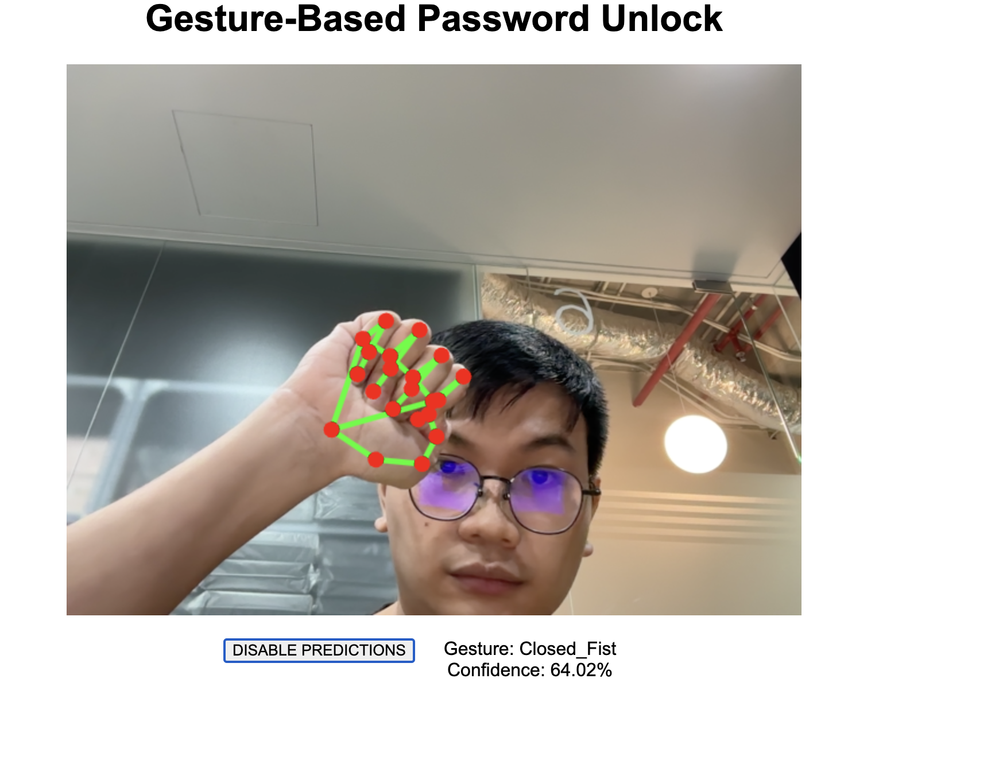

+++
title = "Tech Share: Using MediaPipe in Web Applications"
author = ["Chop Tr (chop.dev)"]
summary = "A tech sharing session in LINE Corporation for Front-End Team."
date = 2024-09-22T00:00:00+07:00
tags = ["media pipe", "tech share"]
draft = false
+++

Introduction to Google MediaPipe

 <!-- .element: width="450" -->

---

#### Why MediaPipe?

-   Efficiency <!-- .element: class="fragment" -->
-   Flexibility <!-- .element: class="fragment" -->
-   Portability <!-- .element: class="fragment" -->
-   Community and Support <!-- .element: class="fragment" -->

---

#### Why Use MediaPipe in Web Application?

-   Simplifies Integration of Complex ML Models <!-- .element: class="fragment" -->
-   Enhances User Experience with Real-Time Processing <!-- .element: class="fragment" -->
-   Supports a Variety of Media Inputs <!-- .element: class="fragment" -->

---

#### Common Use Cases

Real-Time Face and Pose Tracking

 <!-- .element: width="450" -->

---

#### Common Use Cases

Gesture Recognition

 <!-- .element: width="450" -->

---

#### Common Use Cases

Augmented Reality Effects

 <!-- .element: width="450" -->

---

#### Setting Up MediaPipe for Web

```bash
npm install @mediapipe/tasks-vision
```

```html
<head>
    <script
        src="https://cdn.jsdelivr.net/npm/@mediapipe/tasks-vision/vision_bundle.js"
        crossorigin="anonymous"
    ></script>
</head>
```

---

Initialize MediaPipe recognition module

```js [3,4,5|8,9|10]
const createGestureRecognizer = async () => {
    creatingRecognizer = true;
    const vision = await FilesetResolver.forVisionTasks(
        'https://cdn.jsdelivr.net/npm/@mediapipe/tasks-vision@0.10.3/wasm'
    );
    gestureRecognizer = await GestureRecognizer.createFromOptions(vision, {
        baseOptions: {
            modelAssetPath:
                'https://storage.googleapis.com/mediapipe-models/gesture_recognizer/gesture_recognizer/float16/1/gesture_recognizer.task',
            delegate: 'GPU',
        },
        runningMode: 'VIDEO',
    });
    creatingRecognizer = false;
};
```

---

Capturing video input from webcam

```js
navigator.mediaDevices.getUserMedia(constraints).then(function (stream) {
    videoElement.srcObject = stream;
    videoElement.addEventListener('loadeddata', predictWebcam);
    videoElement.style.display = 'block';
    canvasElement.style.display = 'block';
});
```

---

Processing video stream with MediaPipe

```js [4]
let nowInMs = Date.now();
if (videoElement.currentTime !== lastVideoTime) {
    lastVideoTime = videoElement.currentTime;
    results = gestureRecognizer.recognizeForVideo(videoElement, nowInMs);
}
```

---

Display result on the web page

```js [1,5-12]
const drawingUtils = new DrawingUtils(canvasCtx);

if (results.landmarks) {
    for (const landmarks of results.landmarks) {
        drawingUtils.drawConnectors(landmarks, GestureRecognizer.HAND_CONNECTIONS, {
            color: '#00FF00',
            lineWidth: 5,
        });
        drawingUtils.drawLandmarks(landmarks, {
            color: '#FF0000',
            lineWidth: 2,
        });
    }
}
```

---

 <!-- .element: width="450" -->

---

#### Example Use Case: Hand Gesture Recognition

Live Demo
