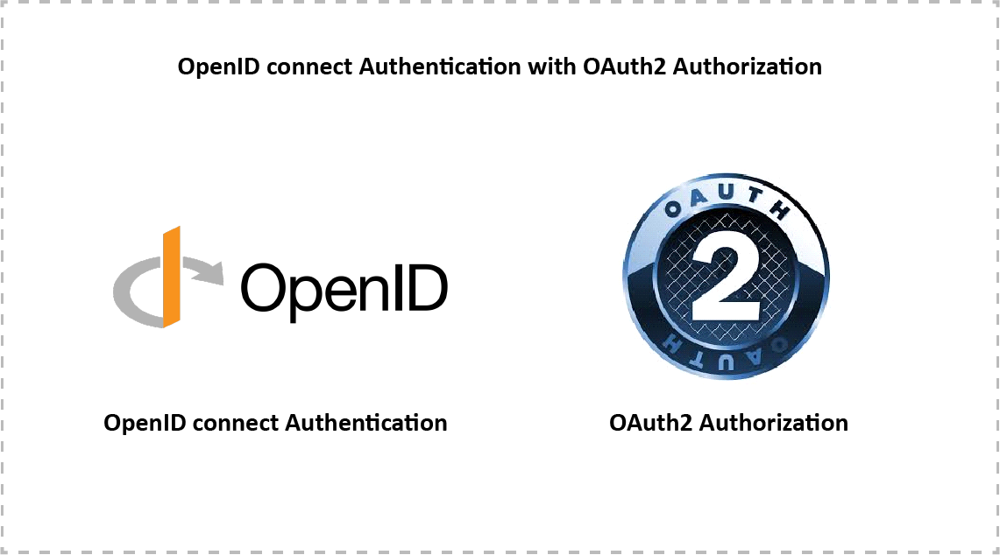
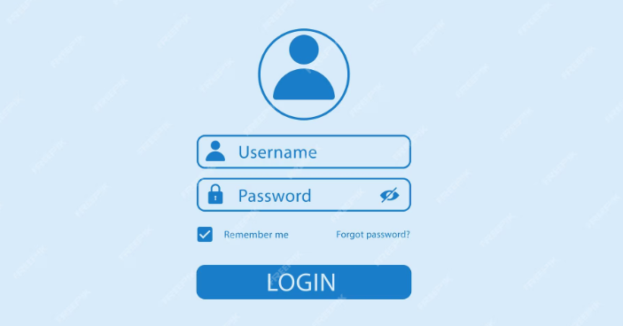
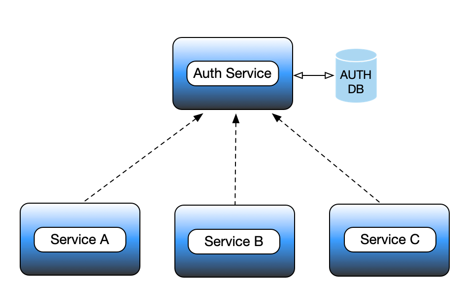

+++
title = "Tech Share: Open ID connect"
author = ["Chop Tr (chop.dev)"]
summary = "Introduction about OAuth 2.0 and OpenID Connect"
date = 2025-07-06T00:00:00+07:00
tags = ["oidc", "open-id-connect", "authentication", "tech-share"]
draft = false
+++

Tech Share: Open ID connect

---

#### Authentication

 <!-- .element: style="margin: auto" -->

---

#### Authentication

 <!-- .element: style="margin: auto" -->

---

#### Authentication

- Why you think we need third-party Authentication? <!-- .element: class="fragment" -->
- Why do we need a method that the resource provider can authenticate the user without rely on the Authentication Provider? <!-- .element: class="fragment" -->

---

#### Understanding OAuth 2.0

- OAuth Flow
- Demo with real word scenario

---

#### OAuth Flow

1. **Authorization Request**

    The process begins when a user tries to access a resource or service that requires authentication.

2. **User Authentication**

    The authorization server then prompts the user to authenticate themselves.

3. **Authorization Grant**

    Once the user is authenticated, the authorization server asks the user to grant or deny permission for the requested access.

---

#### OAuth Flow

4. **Access Token Request**

    The client then sends a request to the
    authorization server to exchange the authorization code for an access token.

5. **Access Token Response**

    If the authorization server validates the
    request, it issues an access token to the client.

---

#### OAuth Flow

6. **Access Resource**:

    The client uses the access token to request resources
    from the resource server.

7. **Refresh Token (Optional)**

    In some cases, the authorization server may
    also issue a refresh token alongside the access token.

---

#### OAuth Flow

1. **Backchannel Flow**: Also known as the Authorization Code Flow, this is
   used for server-side applications where an authorization code is first
   returned and then exchanged for an access token.
2. **Implicit Flow**: This is typically used for client-side applications where
   the access token is returned directly to the client without an intermediate
   authorization code.

---

#### Demo OAuth flow

[Miro](https://miro.com/app/board/uXjVIgkehRc=/)

[Diagram](https://chop.dev/posts/tech-share--open-id-connect/)

---

#### OpenID Connect

> A fun fact about OAuth 2.0 is that it was not designed with Authentication focus.
> It mainly about delegated Authorization.

---

#### OpenID Connect

1. **Identity Tokens**

    OpenID Connect introduces the concept of an ID token,
    which contains information about the user, such as their unique identifier,
    name, and email address. This token is encoded as a JSON Web Token (JWT).

2. **UserInfo Endpoint**

    OpenID Connect provides a UserInfo endpoint that
    allows clients to retrieve additional information about the user, such as
    profile details, after they have authenticated.

---

#### OpenID Connect

3. **Standardized Scopes**

    OpenID Connect defines standard scopes like
    `openid`, `profile`, `email`, etc., which specify the level of access and
    information the client is requesting.

4. **Discovery and Dynamic Registration**

    OpenID Connect supports discovery,
    allowing clients to dynamically discover information about the OpenID
    Provider (OP), such as its endpoints and supported features.

---

#### OpenID Connect

5. **Session Management**

    OpenID Connect provides mechanisms for managing user
    sessions, allowing clients to detect when a user logs out or when their
    session expires.

---

#### JSON Web Token (JWT)

1.  **Header**:

    The header typically consists of two parts: the type of the
    token, which is JWT, and the signing algorithm being used, such as HMAC
    SHA256 or RSA.

        Example:

        json { "alg": "HS256", "typ": "JWT" }

---

#### JSON Web Token (JWT)

2.  **Payload**:

    The payload contains the claims. Claims are statements about an
    entity (typically, the user) and additional data. There are three types of
    claims: registered, public, and private claims.

        Example:

        json { "sub": "1234567890", "name": "John Doe", "admin": true }

---

#### JSON Web Token (JWT)

3.  **Signature**:

    To create the signature part, you have to take the encoded
    header, the encoded payload, a secret, the algorithm specified in the
    header, and sign that.

        Example:

        HMACSHA256( base64UrlEncode(header) + "." + base64UrlEncode(payload), secret)

---

#### Conclusion

> Why do you think we need third-party authentication?

- **Separation of Concerns**

- **Ease of Implementation**

- **Standardization**

---

#### Conclusion

> Why do we need a method that the resource provider can authenticate the user
> without rely on the Authentication Provider?

- **Reduced Load on Authentication Servers**

- **Improved Performance**

- **Resilience and Availability**

---

#### Reference resource

[crate:firebase-auth](https://crates.io/crates/firebase-auth)

[github:firebase-auth](https://github.com/trchopan/firebase-auth)

 <!-- .element: style="margin: auto" width="450" -->
