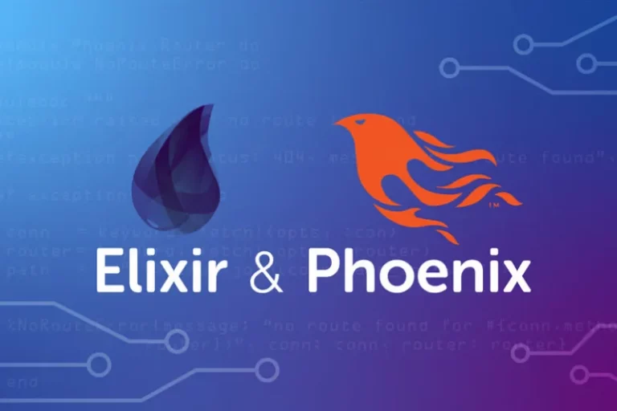

+++
title = "Tech Share: Elixir: A Paradigm Shift for Modern Web Development"
author = ["Chop Tr (chop.dev)"]
summary = "This talk introduces Elixir, a modern programming language designed for building scalable, real-time, and fault-tolerant web applications."
date = 2025-09-22T00:00:00+07:00
tags = ["elixir", "programming", "language", "liveview", "phoenix", "phoenix liveview"]
draft = false
+++

Elixir: A Paradigm Shift for Modern Web Development

---

#### Introduction: Why Elixir?

##### Hello Everyone!

---

##### What Languages Do You Use?

- JavaScript / TypeScript?<!-- .element: class="fragment" -->
- Python / Golang / Rust?<!-- .element: class="fragment" -->
- Haskell / OCaml / Scala?<!-- .element: class="fragment" -->

---

#### Why Elixir?

Delightful & Powerful Web Apps

- **Effortless Scale:**
    - Handle millions of users
- **Real-time Reliability:**
    - Always on, always responsive
- **Easy Maintenance:**
    - As your team grows, your code stays clear

---

##### Elixir Is Battle-Tested

Powering Critical Infrastructure for Tech Giants

- **Discord:**
    - Massive real-time chat (millions of concurrent users, low latency)
- **Pinterest:**
    - Scaled notification system (billions of reliable messages)
- **PepsiCo:**
    - Scalable, distributed backends

Note:
**Image Keywords:** "Discord logo, Pinterest logo, PepsiCo logo, tech infrastructure, high concurrency, real-time systems"
**AI Image Prompt:** "A futuristic, interconnected network diagram with glowing nodes, subtly incorporating logos of Discord, Pinterest, and PepsiCo, symbolizing robust, scalable backend infrastructure. The style should be clean and digital."

---

##### What Makes Elixir Stand Out?

- **Functional Programming at its Core:**
    - Clean, concise, and enjoyable code
    - Predictable and easier to reason about
- **Thrives Under High Concurrency:**
    - Natural fit for chat, live notifications, collaborative tools
    - Delivers magical real-time user experiences

---

##### Productive Developer Experience

- **Phoenix LiveView:**
    - Build interactive web apps with minimal JavaScript
    - Rapid development and smooth workflows
    - Significantly reduces complexity

---

#### What We'll Explore Today

In this talk, we'll walk through:

- **Clearer, Safer Code:**
    - How Elixir's functional approach achieves this.
- **Simple Scalability:**
    - Its concurrency model for real-time features.
- **Modern Apps with Confidence:**
    - The Elixir ecosystem, including Phoenix LiveView.

---

#### The Functional Core

A Different Way to Think About Code

---

##### What is Functional Programming?

It's a different approach compared to object-oriented or imperative styles (like in JavaScript, Python, or Java).

- **Focus on Small, Simple Functions:**
    - Each function does one thing well.
- **Immutability:**
    - Don't change data directly. Create new data instead.
- **Predictable Code:**
    - Functions always return the same result for the same input. No hidden surprises!

Note:
**Image Keywords:** "functional programming diagram, input output function, data flow"
**AI Image Prompt:** "A clean, minimalist diagram illustrating the concept of functional programming. Show an 'input' shape on the left, feeding into a pure, transparent box labeled 'Function', which then produces a distinct 'output' shape on the right. The style should be abstract and clear."

---

##### Imperative vs. Declarative

- **Imperative:** Focuses on **how** a program operates.
    - A sequence of commands detailing each step.
- **Declarative:** Focuses on **what** the outcome should be.
    - Describes the logic without describing the control flow.

---

##### Imperative Example: Modifying Data

**JavaScript**

```javascript
function doubleNumbers(numbers) {
    for (let i = 0; i < numbers.length; i++) {
        // Directly changing the original 'numbers' array!
        numbers[i] = numbers[i] * 2;
    }

    return numbers;
}
```

Here, the original `numbers` array is changed in place. This can lead to unexpected side effects elsewhere in your code.

---

##### Declarative Elixir: Transforming Data

**Elixir**

```elixir
doubleNumbers = fn numbers ->
    # Returns a NEW list of doubled numbers
    Enum.map(numbers, &(&1 * 2))
end
```

We describe the transformation we want. The original data is untouched, making the code safer and more predictable.

---

##### The Pipe Operator: `|>`

Let's make a string uppercase, then split it into words.

<!-- .slide: class="two-column" -->

<div class="columns">

<div class="column">

**Imperative (Python/JS):**

```python
# Python
text = "hello world"
text = text.upper() # a new variable is created
words = text.split() # and another one...
```

</div>

<div class="column">

**Declarative Elixir**

```elixir
"hello world"
|> String.upcase()
|> String.split()
```

</div>

</div>

Note:
**Image Keywords:** "pipeline, assembly line, data flow pipe"
**AI Image Prompt:** "A simple and elegant visual of a pipeline. Data enters on the left, flows through two connected pipes labeled 'UPCASE' and 'SPLIT', and exits on the right, transformed. The style should be clean and illustrative."

---

##### What's so great about this style?

Let me ask you:

**What are the two most difficult things in programming?**

_(... Naming things and cache invalidation.)_

<!-- .element: class="fragment" data-fragment-index="3" -->

Note:
**Image Keywords:** "programmer thinking, confused developer, naming variables funny"
**AI Image Prompt:** "A humorous, cartoon-style illustration of a programmer scratching their head, looking at a screen filled with confusingly named variables like 'data1', 'temp_final_data', and 'x'. The style should be lighthearted and relatable."

---

#### Another Cool Thing: Pattern Matching

Instead of messy `if-else` checks, you can match against the "shape" of your data.

It makes your code shorter and logic easier to follow.

Note:
**Image Keywords:** "shape sorting toy, pattern recognition, data structure puzzle"
**AI Image Prompt:** "An abstract visual representing pattern matching. On one side, show a complex data structure (like a key). On the other side, show several different function signatures (like locks). The correct function 'lock' is highlighted as the data 'key' fits perfectly into it."

---

##### Pattern Matching: Examples

**Destructuring a list:**

```elixir
[head | tail] = [1,2,3]

# head is 1
# tail is [2,3]
```

<!-- .element: class="fragment" -->

**In function definitions:**

```elixir
defmodule Greeter do
  def greet({:ok, name}), do: "Hello, #{name}!"
  def greet(:error), do: "Oops, something went wrong."
end

Greeter.greet({:ok, "Alice"}) # returns "Hello, Alice!"
Greeter.greet(:error)         # returns "Oops, something went wrong."
```

<!-- .element: class="fragment" -->

---

##### Why It Matters

This functional approach helps you:

- **Avoid bugs** from data changing unexpectedly.
- Write **cleaner and more reliable** code.
- Think about problems in a **clearer, more direct way**.

---

#### Concurrency & Fault Tolerance

The Erlang Advantage (JavaScript Version)

---

##### Concurrency in the JavaScript World

<!-- .slide: class="two-column" -->

<div class="columns">

<div class="column">

<video controls autoplay>
  <source src="/posts/tech_share--elixir_a_paradigm_shift_for_modern_web_development/javascript-eventloop.mp4" type="video/mp4">
</video>

</div>

<div class="column">

- `async/await`
- Callbacks & Promises
- The Event Loop
- Worker Threads

</div>

</div>

**The Challenge:** As apps get complex (real-time features, heavy processing), managing race conditions, shared state, and crashes can become a headache.

---

##### How Does Elixir Do It Differently?

Elixir is built on the Erlang VM (BEAM), which uses the **Actor Model**.

- Instead of sharing memory, you create thousands (or millions!) of lightweight, isolated processes.
- Think of them as "mini-programs" that run concurrently.

---

##### The Actor Model

Each process is completely isolated.

- **No Shared Data:** They don't share memory or state.
- **Message Passing:** To communicate, they send messages to each other.
    - (Similar to `postMessage` with Web Workers, but on a massive scale)

<div style="background: white; max-width: 550px; margin: auto;">
    
</div>

---

##### The Magic of Fault Tolerance

- **What if a process crashes?**
    - It **doesn't** bring down your whole application!
- **Supervisors:**
    - Special processes whose only job is to watch other processes.
    - If a process fails, its supervisor automatically restarts it.
    - The system is built to expect and recover from failure.

Note:
**Image Keywords:** "supervisor process, self-healing system, process tree erlang"
**AI Image Prompt:** "An illustration of a 'supervisor' robot calmly watching over a group of smaller 'worker' robots. One of the worker robots has sparks coming out of it. The supervisor robot is deploying a brand new, identical worker robot to take its place seamlessly, without the other workers stopping."

---

##### Elixir's Concurrency Model: A Recap

- **Independent Processes:** No shared memory, no data races.
- **Message-Based Communication:** No shared objects or state.
- **Supervisors Keep Things Healthy:** Restarting only the parts that fail.
- **Resilient Applications:** Your app keeps running, even when individual tasks hit errors.

---

##### What This Means for a JS Developer

Building these becomes much easier to reason about:

- Real-time features
- WebSocket servers
- Background jobs
- Chat applications

You can scale to millions of users without complex threading logic and spend less time debugging weird bugs from shared state.

---

##### The Elixir Advantage

You get robust concurrency and self-healing fault tolerance **out of the box**.

Focus on building what matters, not on debugging strange async issues!

Note:
**Image Keywords:** "developer relaxing, automated system, robust software"
**AI Image Prompt:** "A developer leaning back in their chair, relaxed and confident. In the background, a complex, glowing digital diagram of interconnected processes is shown, with a few nodes briefly flashing red before being instantly repaired and turning green again, illustrating a self-healing system."

---

#### A Thriving Ecosystem for Productivity

Helpful tools, libraries, and frameworks to make building apps easier and faster.

---

##### Familiar Concepts, New Power

Remember the productivity boost from frameworks like:

- **Rails** for Ruby?
- **Laravel** for PHP?
- **Django** for Python?
- **Nest.js** for JavaScript?

Elixir has a powerful and modern ecosystem designed for the same kind of productivity, but built on a foundation of scalability and fault tolerance.

Note:
**Image Keywords:** "toolbox, ecosystem diagram, logos of Rails, Laravel, Django, Nest.js"
**AI Image Prompt:** "A vibrant, interconnected ecosystem map. In the center, a large, glowing Elixir logo is connected to smaller nodes representing Phoenix, LiveView, Ecto, and Ash. The style should be clean, modern, and tech-focused."

---

#### **Phoenix Framework**

 <!-- .element: style="margin: auto" width="250" -->

The heart of Elixir's web development.

- **Like Rails, Laravel, or Nest.js:** A full-featured framework for building web apps.
- **Built for Speed & Concurrency:** Leverages the full power of the Erlang VM.
- **Real-Time Features Out of the Box:** Perfect for chat, live notifications, and dashboards.

Note:
**Image Keywords:** "Phoenix bird logo, high-speed train, real-time dashboard UI"
**AI Image Prompt:** "An abstract image of a mythical phoenix with its wings creating streams of data, symbolizing speed and resilience. The background should be a modern, digital interface."

---

#### **Phoenix LiveView**

Rich, real-time user experiences with server-rendered HTML.

- **The Big Idea:** Build interactive UIs with one stack of programming paradigm.
- **How it Works:** Maintain state on the server and push diffs over WebSockets.
- **Benefits:**
    - Less JavaScript to write and maintain.
    - Faster development cycles.
    - Simpler codebase.

**[Segue to LiveView Demo]**

Note:
**Image Keywords:** "interactive web UI, updating chart, real-time form validation"
**AI Image Prompt:** "A diagram showing a server on one side and a web browser on the other, connected by a WebSocket. The server is sending small HTML fragments to the browser, which intelligently updates the page without a full reload. The style should be clear and illustrative."

---

#### **Ecto:** Data, The Functional Way

Elixir's powerful tool for working with databases.

- **More than an ORM:** It's a language-integrated query builder and data mapper.
- **Functional Style:** Promotes clear, explicit data transformations.
- **Built-in Validation:** Ensures your data is clean and correct _before_ it hits the database.

---

##### Metaprogramming

Elixir macros write boilerplate code at compile time.

```elixir
defmodule MyApp.Accounts.User do
  use Ecto.Schema # <-- This macro injects helpful functions

  # This macro defines a clean, readable schema
  schema "users" do
    field :name, :string
    field :age,  :integer
  end
end
```

Why this is valuable:

- **Less Boilerplate:** You write less repetitive code.
- **Clarity:** The code is declarative and easy to read.
- **Power:** The framework handles the complex mapping logic for you.

---

#### **Ash Framework:** Model Your Domain

A resource-oriented framework built on Elixir.

- **Slogan:** "Model your domain, derive the rest."
- **Domain-Driven Design (DDD):** Focus on your business rules, not just database tables.
- **Benefits:**
    - Radically faster development for complex applications.
    - Enforces business logic consistency.
    - Removes mountains of repetitive code.

Note:
**Image Keywords:** "domain-driven design diagram, business logic blueprint, software architecture"
**AI Image Prompt:** "An architectural blueprint of a software application. A central, well-defined 'Domain Model' core is shown, with arrows pointing outwards to automatically generated components labeled 'API', 'Admin UI', and 'Database Logic'."

**[Launch Ash Demo]**

---

#### **Reactor:** Resilient Workflows

Orchestrate complex, multi-step tasks with ease.

- **The Problem:** Managing long-running processes that span multiple services.
- **The Solution:** Define workflows with built-in fault tolerance and compensation.
- **The Saga Pattern:** If a step fails, Reactor can automatically run "undo" actions for the completed steps, ensuring data consistency.

Does anyone know the **saga pattern**?

Note:
**Image Keywords:** "saga pattern diagram, workflow orchestration, transaction rollback"
**AI Image Prompt:** "A visual flowchart of a business process (e.g., ordering a product). Show several steps in a sequence. One step fails (marked with a red 'X'), and arrows automatically trace back through the previous steps, showing them being 'undone' or compensated for."

**[Transition to Reactor Demo]**

---

#### **Broadway:** Data Processing Pipelines

Build concurrent, multi-stage data-processing pipelines.

- **Use Case:** Efficiently process data from queues like **Kafka**, **RabbitMQ**, or **SQS**.
- **Key Features:**
    - Handles back-pressure automatically.
    - Manages batching and concurrency.
    - Graceful failure handling and retries.

Note:
**[Wrap up with Broadway Demo]**

---

#### Conclusion

---

##### What We've Seen Today: A Quick Review

- **Functional Core:**
    - Clean, predictable code that's easier to reason about and less prone to bugs.
- **Concurrency & Fault Tolerance:**
    - The BEAM makes it simple to handle massive scale and build self-healing applications.
- **A Thriving Ecosystem:**
    - Powerful tools like Phoenix, LiveView, Ash, and Reactor help you build modern apps with less effort and more fun.

Note:
**Image Keywords:** "Elixir logo, checkmark list, summary, presentation recap"
**AI Image Prompt:** "A clean, modern summary slide layout with three distinct icons. The first icon represents functional programming (like a simple data flow diagram). The second represents concurrency (like multiple gears turning together smoothly). The third represents an ecosystem (like a toolbox or a vibrant network). Each icon is next to a short, clear summary point."

---

#### The Next Wave: AI and Elixir

The Elixir ecosystem is uniquely prepared for the coming AI storm.

With its powerful metaprogramming, concurrency, and tools for rapid development, it provides a solid foundation for building the next generation of AI-powered applications.

*(But that's a topic for another time...)*

Note:
**Image Keywords:** "AI brain, Elixir logo integration, futuristic technology, neural network"
**AI Image Prompt:** "A futuristic image combining the Elixir logo with glowing neural network patterns, suggesting a powerful synergy between the language and artificial intelligence. The style should be sleek, digital, and forward-looking."

---

## Thank You!

Questions?
